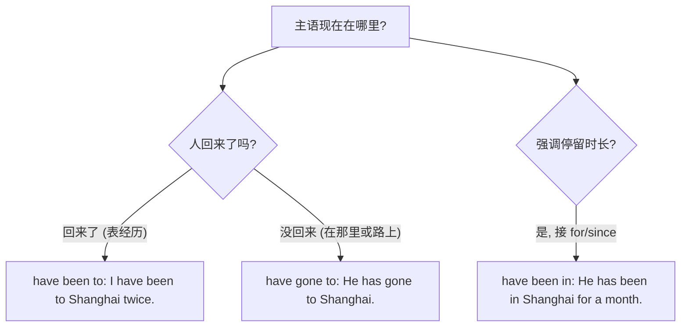

# Unit 3 Language in use

标签：#Module7 #语法总结 #现在完成时 #havebeento

## 一、模块语法概览

本单元系统总结 Module 7 English for you and me 的核心语法：**现在完成时表经历**，重点辨析 have been to / have gone to / have been in，并复习 ever, never, just, already, yet, for, since 等标志词的用法。同时整合本模块"语言学习"话题的功能表达。

## 二、语法讲解

### 1. 现在完成时四大用法回顾

| 用法 | 标志词 | 例句 |
| --- | --- | --- |
| 经历 | ever, never, twice, before | Have you ever been to Beijing? |
| 结果影响 | just, already | I have just finished the book. |
| 未完成 | yet | He hasn't come back yet. |
| 延续 | for + 时间段, since + 时间点 | I have learned English for six years. |

### 2. been to / gone to / been in 终极辨析

### 3. for 与 since

- for + 时间段：for two years, for a long time。
- since + 时间点 / 一般过去时从句：since 2020, since he came here。
- How long...? 提问延续时间，谓语须是**延续性动词**。

### 4. 短暂动词转换（延续时间时）

come/arrive → be here；go → be away；buy → have；join → be in/a member of；die → be dead；borrow → keep。

## 三、易错点

1. ❌ He has **joined** the club for two years. → ✅ has **been in** the club for two years.
2. ❌ I have been to Beijing **since** three years. → ✅ **for** three years。
3. have gone to 主语一般不是 I/we/you。
4. yet 放句末用于否定、疑问句；already 多用于肯定句。
5. It is/has been + 时间段 + since + 过去时从句：It's three years since he left.

## 四、背记要点

- 口诀：been to 去过已回，gone to 去了没回，been in 待了多久。
- for 接段，since 接点；How long 配延续。
- 完成时结构自查：have/has 与主语一致 + 过去分词正确形式。

## 五、自测题

1. 单选：—Is your father in? —No, he ______ Hong Kong on business.（A. has been to  B. has gone to  C. went  D. has been in）
2. 单选：Mr. Smith ______ China since five years ago.（A. has come to  B. came to  C. has been in  D. has been to）
3. 单选：I have kept the book ______ two weeks.（A. since  B. for  C. in  D. from）
4. 同义句：He joined the army three years ago. → He ______ ______ ______ the army for three years.
5. 语法填空：—Have you ______ (see) the film yet? —Yes, I saw it last Sunday.

**答案**：1. B  2. C  3. B  4. has been in  5. seen

## 六、话题功能整合

谈学习经历常用完成时：I have learned English for six years. / I have made great progress. / I have never given up.——写作中用两三句完成时可有效提升表达档次。

## 相关知识点

[[Unit 1]] ｜ [[Unit 2]]
