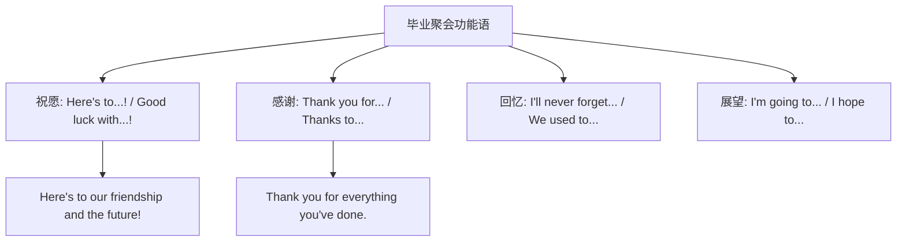

# Unit 1

标签：#Module8 #MyFutureLife #毕业感恩 #听说课 ｜ 课文：Here's to our friendship and the future

## 一、课文精讲

本单元是 Module 8 My future life 的听说课。毕业前夕，同学们在聚会上**举杯祝愿**：回顾三年初中生活的美好瞬间，感谢老师和朋友的帮助，畅想高中和未来的生活，并互相祝福——Here's to our friendship and the future!（为我们的友谊和未来干杯！）

语言重点：**表达祝愿与感谢**的功能句（Here's to... / Thank you for... / Good luck with...），以及**一般将来时**谈未来打算（I'm going to... / I will...）。"毕业感言、感谢祝福"是北京中考听说与书面表达的热点情境。

关键句：
- **Here's to** our friendship and the future! 为我们的友谊和未来干杯！
- **Thank you for** everything you've done for us. 感谢你们为我们所做的一切。
- I'**ll never forget** the days we spent together. 我永远不会忘记我们一起度过的日子。
- **Good luck with** your exams! 祝你们考试顺利！

## 二、重点词汇与短语

| 词汇 | 词性 | 释义 | 例句 |
| --- | --- | --- | --- |
| gift | n. | 礼物；天赋 | Thanks for the lovely gift. |
| handbag | n. | 手提包 | She got a handbag as a gift. |
| scarf | n. | 围巾 | The scarf is a goodbye gift. |
| wallet | n. | 钱包 | He lost his wallet at the party. |
| brainy | adj. | 聪明的 | Lingling is brainy and kind. |
| Here's to... | 句式 | 为……干杯 | Here's to our friendship! |
| thanks to | 短语 | 多亏 | Thanks to you, we improved. |
| in future | 短语 | 今后 | Work harder in future. |

## 三、重点句型

1. **Here's to...!**（祝酒/祝愿句，to 为介词，后接名词）
2. **Thank you for doing** sth.：Thank you for helping us.
3. **I will / I'm going to + do**：I'm going to study in a senior high school.
4. **I hope / wish...**：I wish you success in the future!

## 四、功能句型导图

## 五、易错点

1. Here's to... 中 to 是介词，后接名词/代词：Here's to **you**!
2. Thank you for + **doing/名词**：for your help / for helping me。
3. forget to do（忘记去做）≠ forget doing（忘记做过）；"难忘的日子"用定语从句：the days (that) we spent together。
4. in future（从今以后）与 in the future（在将来）含义略不同。

## 六、背记要点

- 感谢三式：Thank you for... / Thanks to... / I'm grateful to sb. for...
- 祝愿三式：Good luck with...! / Wish you...! / Here's to...!
- 展望常用：I'm going to... / I hope to... / My dream is to be...

## 七、自测题

1. 单选：Thank you ______ us so well these three years.（A. to teach  B. for teaching  C. teach  D. taught）
2. 单选：—______ our friendship! —Cheers!（A. Here's to  B. Here is  C. That's to  D. This is）
3. 完成句子：我永远不会忘记我们一起度过的日子。I'll never forget the days we ______ ______.
4. 情景表达：毕业聚会上，用两句话感谢老师并送上祝福。

**答案**：1. B  2. A  3. spent together  4. 示例：Thank you for everything you've done for us. Wish you health and happiness!

## 相关知识点

[[Unit 2]] ｜ [[Unit 3 Language in use]]
