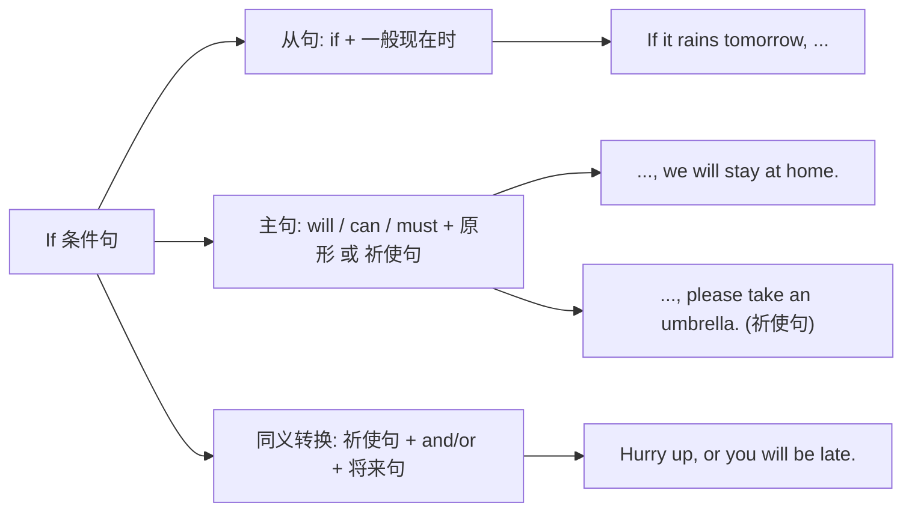

# Unit 2

标签：#Module8 #MyFutureLife #条件状语从句 #读写课 ｜ 课文：You only really lose if you give up!

## 一、课文精讲

本单元是 Module 8 My future life 的读写课。课文是一篇**毕业演讲**：演讲者回顾初中生活，勉励毕业生面对未来——人生路上会有成功也会有失败，但"只有放弃才是真正的失败"（You only really lose **if you give up**!）。演讲鼓励大家坚持梦想、勇敢尝试：If you work hard, your dreams will come true.

语言重点是 **if 引导的条件状语从句**："主将从现"原则（主句一般将来时，从句一般现在时）。演讲文体的排比、呼告等语言特点也值得学习，可迁移到中考"梦想与坚持"类作文。

关键句：
- **You only really lose if you give up!** 只有放弃才是真正的失败！
- **If you work hard, you will succeed.** 如果努力，你就会成功。
- **If you don't try, you will never know** what you can do.
- Whatever happens, **don't lose heart**. 无论发生什么，都不要灰心。

## 二、重点词汇与短语

| 词汇 | 词性 | 释义 | 例句 |
| --- | --- | --- | --- |
| speech | n. | 演讲 | She gave a wonderful speech. |
| effort | n. | 努力 | Success needs great effort. |
| succeed | v. | 成功 | If you try, you will succeed. |
| challenge | n. | 挑战 | Face the challenge bravely. |
| give up | 短语 | 放弃 | Never give up your dream. |
| come true | 短语 | 实现 | My dream came true at last. |
| lose heart | 短语 | 灰心 | Don't lose heart when you fail. |
| at the end of | 短语 | 在……结束时 | At the end of the speech, we cheered. |

## 三、重点句型

1. **If + 一般现在时, 主句 will do**：If you keep trying, you will make it.
2. **You only... if...**：You only really lose if you give up.
3. **祈使句 + and/or + 将来时句**：Work hard, and your dream will come true.
4. **Whatever happens, ...**：Whatever happens, believe in yourself.

## 四、语法讲解：if 条件状语从句"主将从现"

注意区分：if 引导**宾语从句**时意为"是否"，时态按需要用将来时（I don't know if he **will come**）；引导**条件状语从句**时"主将从现"（If he **comes**, I will tell him）。

## 五、易错点

1. ❌ If it **will rain** tomorrow, we won't go. → ✅ If it **rains** tomorrow...
2. 主句也可用祈使句或情态动词：If you see him, **please tell** him.
3. 祈使句 + and（就）/ or（否则）：Hurry up, **or** you'll miss the bus.
4. give up doing sth.：Never give up **learning**.

## 六、背记要点

- 口诀：主将从现——if 从句用现在，主句 will 说将来。
- 一句两用辨 if："是否"看动词（wonder, know, ask 后是宾从）；"如果"看逗号结构。
- 励志表达：Never give up. / Believe in yourself. / Where there is a will, there is a way.

## 七、自测题

1. 单选：If it ______ tomorrow, we will put off the sports meeting.（A. rains  B. will rain  C. rain  D. rained）
2. 单选：I don't know if he ______ tomorrow. If he ______, I'll call you.（A. comes; comes  B. will come; comes  C. comes; will come  D. will come; will come）
3. 单选：______ harder, and your dream will come true.（A. Working  B. Work  C. To work  D. Worked）
4. 汉译英：只有放弃，你才真正失败。

**答案**：1. A  2. B  3. B  4. You only really lose if you give up.

## 相关知识点

[[Unit 1]] ｜ [[Unit 3 Language in use]]
