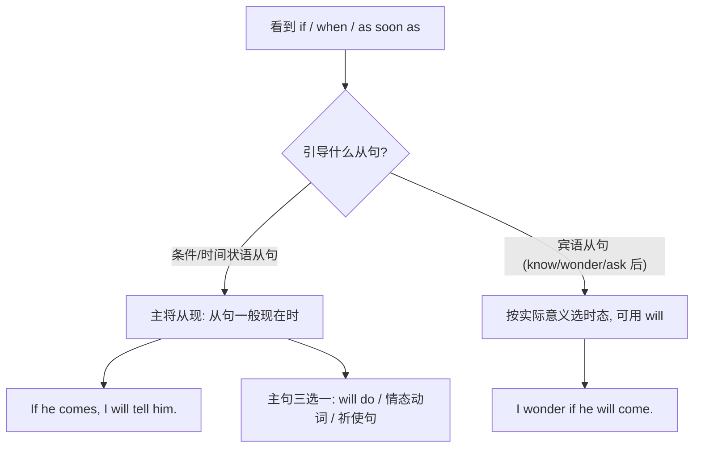

# Unit 3 Language in use

标签：#Module8 #语法总结 #条件状语从句 #一般将来时

## 一、模块语法概览

本单元系统总结 Module 8 My future life 的核心语法：**if 引导的条件状语从句与一般将来时**的配合使用（"主将从现"），并梳理谈论未来的多种表达（will / be going to / 现在进行时表将来）。该考点在北京中考单选和语法填空中出现率极高。

## 二、语法讲解

### 1. "主将从现"结构

| 成分 | 时态/形式 | 例句 |
| --- | --- | --- |
| if 从句 | 一般现在时 | If it is sunny tomorrow, |
| 主句（陈述） | will/shall + 原形 | we will go for a picnic. |
| 主句（情态） | can/must/may + 原形 | you can join us. |
| 主句（祈使） | 动词原形 | please come with us. |

同类"主将从现"的还有 when, as soon as, before, after, until 引导的时间状语从句：I'll call you **as soon as I arrive**.

### 2. 判断流程

### 3. 谈论未来的三种方式

1. **will + 原形**：临时决定、预测——I think it will rain.
2. **be going to + 原形**：计划打算、有迹象——I'm going to be a doctor.
3. **现在进行时表将来**：已安排好的近期计划（come, go, leave 等）——We are leaving tomorrow.

## 三、易错点

1. ❌ If I **will have** time, I will visit you. → ✅ If I **have** time...
2. 时间/条件状语从句同样"主将从现"：I'll wait until he **comes** back.
3. There be 的将来时：There **will be** a meeting.（❌ will have）
4. 否定转移到主句更自然：If you don't hurry, you **will miss** the train. = Hurry up, or you'll miss the train.
5. wonder/know/ask + if（是否）是宾语从句，可以用 will。

## 四、背记要点

- 口诀：条件时间状语从句，主句将来从句现在。
- 五个"主将从现"引导词：if, when, as soon as, until, after/before。
- 将来时三兄弟：will（预测/临时）、be going to（计划/迹象）、进行时（既定安排）。

## 五、自测题

1. 单选：I'll tell Mary the news as soon as she ______ back.（A. comes  B. will come  C. came  D. is coming）
2. 单选：—Do you know if he ______ to the party? —If he ______, I'll be very happy.（A. comes; will come  B. will come; comes  C. comes; comes  D. will come; will come）
3. 单选：There ______ a football match in our school next week.（A. will have  B. will be  C. is going to have  D. has）
4. 语法填空：If you ______ (not hurry), you will be late for the graduation ceremony.
5. 改错：When I will grow up, I will be an engineer.

**答案**：1. A  2. B  3. B  4. don't hurry  5. 去掉第一个 will（When I grow up）

## 六、写作运用

"未来生活"作文黄金句：If I work hard, my dream will come true. / I'm going to study science in senior high. / As soon as I enter high school, I will make a new plan.——条件句 + 将来时组合能显著提升作文语法档次。

## 相关知识点

[[Unit 1]] ｜ [[Unit 2]]
