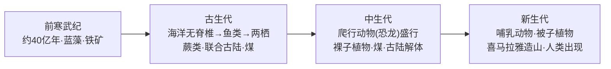

# 第三节 地球的历史

## 概念定义

**地层**：具有时间顺序的层状岩石，是记录地球历史的"书页"。沉积地层的规律：正常情况下**下老上新**；同一时代地层往往含相同或相近的化石。

**化石**：保存在地层中的古生物遗体或遗迹，是确定地层时代、恢复古地理环境的重要依据。

**地质年代表**：依据地层顺序、生物演化阶段等，把地球历史划分为宙、代、纪等单位。

## 知识梳理

## 地质年代与生物演化表

| 时代 | 动物界 | 植物界 | 重大事件 |
| --- | --- | --- | --- |
| 前寒武纪 | 原核→真核、多细胞 | 蓝藻繁盛 | 大气成分改变、铁矿成矿期 |
| 古生代 | 无脊椎→鱼类→两栖类 | 蕨类繁盛 | 联合古陆形成、末期物种大灭绝 |
| 中生代 | 爬行动物（恐龙）盛行 | 裸子植物 | 主要成煤期、末期恐龙灭绝 |
| 新生代 | 哺乳动物繁盛、人类出现 | 被子植物 | 造山运动、第四纪冰期 |

## 典型例题

**例 1**：某地层中发现三叶虫化石，判断该地层的时代及当时的环境。

**解**：三叶虫是古生代早期海洋无脊椎动物，故该地层属于古生代（早期），当时该地为**海洋环境**。

**例 2**：说明恐龙繁盛的地质年代及同期主要植物类型。

**解**：恐龙繁盛于中生代；同期陆地上裸子植物极度兴盛，是重要的成煤期之一。

## 易错点

- 地层"下老上新"仅适用于未发生倒转的正常沉积地层。
- 两次主要成煤期：古生代（蕨类）和中生代（裸子植物），别记混。
- 人类出现在新生代**第四纪**，不是整个新生代之初。
- 前寒武纪约占地球历史 90%，不是"很短的开端"。

## 背记要点

1. 研究地球历史的依据：地层和化石。
2. 生物演化：由低级到高级、由简单到复杂；动物：海洋无脊椎→鱼类→两栖→爬行→哺乳→人类。
3. 植物演化：藻类→蕨类→裸子→被子。
4. 两次大灭绝：古生代末（三叶虫等）、中生代末（恐龙）。
5. 高考视角：常给化石或地层剖面材料判断时代与环境，重要度★★★。

## 自测题

1. 地质年代表中最大的时间单位是____。
2. 蕨类植物繁盛并形成大量煤炭的时代是____。
3. 被子植物繁盛于____代。
4. 恐龙灭绝发生在____代末期。

## 相关知识点

地球的内部结构划分见 [[第四节 地球的圈层结构]]；生物与地理环境的关系可联系 [[第一节 植被]]。
