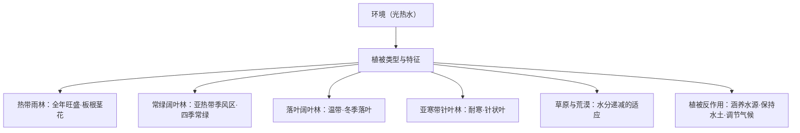

# 第一节 植被

## 概念定义

**植被**：自然界成群生长的各种植物的整体，分**天然植被**（森林、草原、荒漠等）和**人工植被**（农作物、人工林等）。

**垂直结构**：稳定的植被形成分层明显的垂直结构，一般气温越高、降水越多，植被高度越大，**垂直结构越丰富**。

## 知识梳理

## 主要植被类型表

| 植被类型 | 对应气候 | 典型特征 |
| --- | --- | --- |
| 热带雨林 | 热带雨林气候 | 全年生长、种类丰富，有藤本、附生、茎花、板根 |
| 常绿阔叶林 | 亚热带季风气候 | 终年常绿，花期集中春末夏初 |
| 落叶阔叶林 | 温带季风/海洋性气候 | 夏季盛叶，冬季落叶避寒 |
| 亚寒带针叶林 | 亚寒带气候 | 针状叶抗寒抗旱，以松杉为主 |
| 温带草原 | 半干旱区 | 夏绿冬枯，草层低矮 |
| 荒漠植被 | 干旱区 | 叶小或退化为刺、根系发达、耐旱 |

## 典型例题

**例 1**：热带雨林中乔木常具板状根，分析其适应意义。

**解**：雨林乔木高大，土层湿软且根系浅，板根扩大支撑面积，稳固树体；同时增大吸收面积，是对高温多雨环境的形态适应。

**例 2**：我国西北荒漠植物叶片多退化为刺、根系深长，说明原因。

**解**：西北干旱少雨，叶退化为刺可减少蒸腾失水；深长根系可吸收深层地下水，两者都是对**水分不足**环境的适应。

## 易错点

- 常绿阔叶林与常绿硬叶林不同：后者对应地中海气候，叶硬有蜡质。
- 落叶是对**寒冷（或干季）**的适应，不代表植物死亡。
- 植被破坏后恢复困难的地区，关键限制是水分或土层，而非仅温度。
- "植被覆盖率高→降水多"因果不能倒置：是环境决定植被，植被再反作用于环境。

## 背记要点

1. 森林分布于湿润半湿润区；草原、荒漠分布于半干旱、干旱区。
2. 从赤道到两极：雨林→常绿阔叶林→落叶阔叶林→针叶林→苔原（纬度地带性）。
3. 植被特征答题三角度：形态（叶、根）、生长节律（常绿/落叶）、结构（分层）。
4. 高考视角：以植物形态适应性分析环境特征是热门题型，重要度★★★★。

## 自测题

1. 板根、茎花现象常见于____植被。
2. 温带季风气候对应的典型植被是____。
3. 垂直结构最丰富的森林是____。
4. 荒漠植物根系发达是为了适应____的环境。

## 相关知识点

植被生长的物质基础见 [[第二节 土壤]]；坡向对植被分布的影响见 [[第二节 地貌的观察]]。
