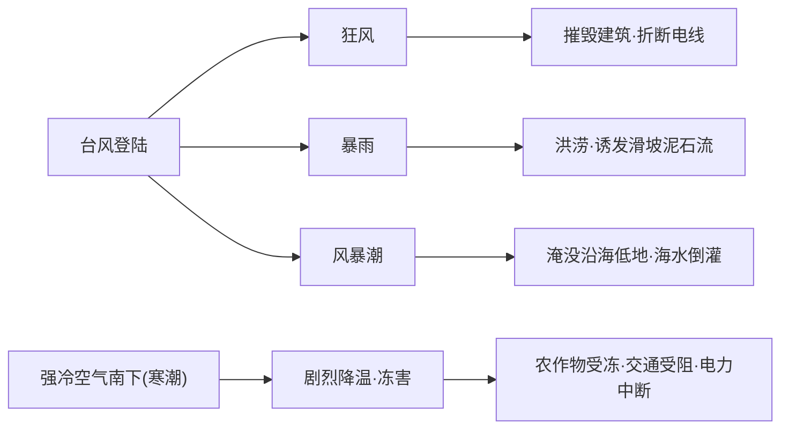

# 第一节 气象灾害

## 概念定义

**气象灾害**：因大气异常变化造成的灾害，主要有**洪涝、干旱、台风、寒潮**四类。

**台风**：西北太平洋上中心附近最大风力 12 级及以上的热带气旋，灾害由**狂风、暴雨、风暴潮**"三兄弟"造成。**寒潮**：强冷空气迅速入侵造成大范围**剧烈降温**，伴有大风、雨雪、冻害。

## 知识梳理

## 四大气象灾害对比表

| 灾害 | 我国多发时空 | 主要危害 | 主要防御 |
| --- | --- | --- | --- |
| 洪涝 | 夏秋季，东部季风区（江淮、华南） | 淹没农田城镇、引发疫病 | 修水库堤坝、蓄滞洪区、监测预警 |
| 干旱 | 华北春旱、长江流域伏旱 | 减产、缺水、易引发蝗灾 | 节水灌溉、跨流域调水、人工增雨 |
| 台风 | 夏秋季，东南沿海 | 狂风、暴雨、风暴潮 | 及时预报、船只回港、加固设施 |
| 寒潮 | 冬半年，除青藏滇南外大部 | 冻害、大风雪、交通电力受损 | 预警、农田覆盖、牲畜防寒 |

**辩证看待**：台风可缓解伏旱与高温；寒潮可冻杀害虫、带来降雪保墒。

## 典型例题

**例 1**：华北地区春旱严重，试分析自然原因。

**解**：春季华北雨带未到、降水稀少；升温快、多大风，蒸发旺盛；正值冬小麦返青需水期，加剧供需矛盾，故春旱严重。

**例 2**：台风"梅花"沿东南沿海北上，说明沿海城市应采取的防御措施。

**解**：加强监测预报，及时发布预警；组织渔船回港、危险区人员转移；加固广告牌、堤防等设施；储备排涝设备，防范城市内涝与风暴潮叠加。

## 易错点

- 干旱是长期降水异常偏少的现象，"旱灾"强调造成损失，两者有区别。
- 寒潮影响范围几乎全国，但**青藏高原、滇南**受影响小（地势高/纬度低距离远）。
- 台风中心（台风眼）风平浪静，最强风雨在眼壁附近。
- 洪涝多发不只因降水集中，还与地势低平、排水不畅有关，答题要多角度。

## 背记要点

1. 四大灾害：洪涝、干旱、台风、寒潮，各记"时空+危害+防御"三件套。
2. 台风三害：狂风、暴雨、风暴潮。
3. 我国旱涝多发的根本背景：季风气候降水年际、季节变化大。
4. 高考视角：结合天气系统与区域图分析灾害成因和防御，重要度★★★★★。

## 自测题

1. 台风灾害主要由狂风、暴雨和____造成。
2. 寒潮最基本的天气特征是剧烈____。
3. 华北平原的旱灾多发生在____季。
4. 受寒潮影响较小的高原是____。

## 相关知识点

由暴雨诱发的滑坡、泥石流见 [[第二节 地质灾害]]；灾害防御的系统措施见 [[第三节 防灾减灾]]。
