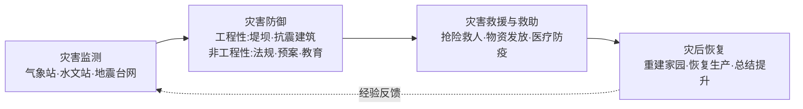

# 第三节 防灾减灾

## 概念定义

**防灾减灾工作指导方针**："以防为主，防抗救相结合"。主要内容包括**灾害监测、灾害防御、灾害救援与救助、灾后恢复**四大环节。

**自救与互救**：灾前准备（应急包、演练）、灾中救助（正确避险）、灾后自我保护（防疫、防次生灾害），是减轻人员伤亡的关键。

## 知识梳理

## 四环节与避险要点表

| 环节 | 核心内容 | 举例 |
| --- | --- | --- |
| 监测 | 自然灾害监测系统"哨兵" | 气象卫星监测台风路径 |
| 防御 | 工程性+非工程性措施 | 修建三峡防洪、颁布防震减灾法 |
| 救援救助 | 救人第一、防疫跟上 | 国家救灾物资储备库调运 |
| 恢复 | 重建并增强抗灾能力 | 汶川灾后按高抗震标准重建 |

**地震避险**：室内"伏地、遮挡、手抓牢"，躲坚固桌旁或承重墙角；室外远离建筑、电线。**洪水互救**：抛救生圈、划船筏救人；"先近后远、先易后难"。

## 典型例题

**例 1**：区分防洪的工程性措施与非工程性措施各举两例。

**解**：工程性：修建水库、加固堤坝（或整治河道、建蓄滞洪区）；非工程性：建立洪水预警系统、制定应急预案（或宣传教育、洪水保险）。两类措施须配合使用。

**例 2**：地震发生时你正在教室上课，应如何避险？

**解**：立即蹲到课桌旁，用书包护住头颈（伏地、遮挡、手抓牢）；不跳楼、不乘电梯；震动停止后在老师组织下有序沿安全通道撤到空旷场地。

## 易错点

- 方针是"以**防**为主"，不是"以救为主"。
- 工程性措施是"硬件"建设，法规、预案、演练属**非工程性**措施，分类别答。
- 地震时高层住户不能乘电梯、不能跳楼；来不及外逃应就近躲避。
- 灾后要防疫："大灾之后防大疫"属于救援救助与恢复环节的重要内容。

## 背记要点

1. 四环节：监测→防御→救援救助→恢复。
2. 两类防御措施：工程性（建）与非工程性（管）。
3. 自救三阶段：灾前准备、灾中避险、灾后保护。
4. 高考视角：给具体灾害情境设计防御措施，答题分"监测预警/工程/管理/教育"层次，重要度★★★★。

## 自测题

1. 我国防灾减灾工作的指导方针是"以防为主，____相结合"。
2. 修建抗震建筑属于____性防御措施。
3. 地震室内避险口诀是"伏地、遮挡、____"。
4. 洪水中救助他人应遵循"先近后远、____"原则。

## 相关知识点

各类灾害的成因见 [[第一节 气象灾害]] 与 [[第二节 地质灾害]]；技术手段支撑见 [[第四节 地理信息技术在防灾减灾中的应用]]。
