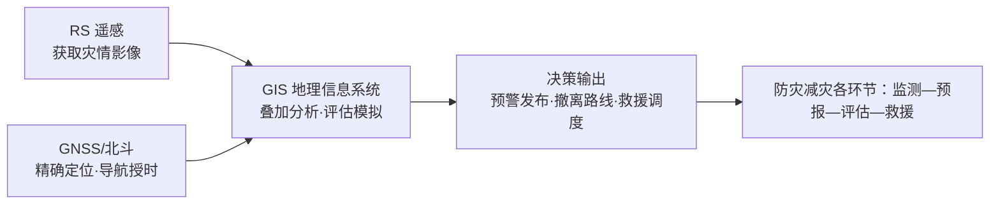

# 第四节 地理信息技术在防灾减灾中的应用

## 概念定义

**遥感（RS）**：利用装在航空器或航天器上的传感器**获取**地物电磁波信息，实现对地表的远距离感知——"看"。

**全球卫星导航系统（GNSS）**：利用卫星进行**定位、导航、授时**，我国自主系统为**北斗（BDS）**——"定位"。

**地理信息系统（GIS）**：对地理数据进行输入、管理、**分析**和表达的计算机系统——"算"。

## 知识梳理

## 三大技术应用对比表

| 技术 | 核心功能 | 防灾减灾应用举例 |
| --- | --- | --- |
| RS | 面状信息获取，范围大、速度快、可重复 | 监测台风云系、洪水淹没范围、火点识别 |
| GNSS | 点位信息：定位、导航、授时 | 北斗短报文求救、滑坡位移监测、救援车导航 |
| GIS | 空间查询、叠加分析、模拟表达 | 灾害风险区划、撤离路线规划、损失评估 |

**选用口诀**："看"用 RS，"定位"用 GNSS，"分析规划"用 GIS。数字地球是三者集成的虚拟地球。

## 典型例题

**例 1**：洪涝发生后，说明 RS 与 GIS 如何配合评估灾情。

**解**：RS 快速获取灾区影像，提取洪水淹没范围；GIS 将淹没图层与土地利用、人口分布图层**叠加分析**，计算受淹农田面积与受灾人口，输出灾情评估报告，为救援决策提供依据。

**例 2**：野外科考队在无手机信号山区遇险，可借助北斗系统的什么功能求救？

**解**：可利用北斗特有的**短报文通信**功能，在无地面通信网络时发送带有精确位置信息的求救短信，实现定位与通信一体化求援。

## 易错点

- RS 只能"获取"信息，不能分析处理；分析规划是 GIS 的职能。
- GNSS 提供的是**点**的位置数据，不能获取面状影像。
- 北斗独有优势：短报文通信；不要与 GPS 混同。
- "数字地球" ≠ GIS：它是 3S 等技术的集成应用与地球虚拟表达。

## 背记要点

1. 3S 分工：RS 看、GNSS 定、GIS 算。
2. RS 三优点：范围广、周期短、受地面限制少。
3. GIS 核心能力：图层叠加分析。
4. 防灾流程：RS/GNSS 获取数据→GIS 分析→发布预警与调度。
5. 高考视角：给情境判断"该用哪种技术"是选择题高频套路，重要度★★★★。

## 自测题

1. 获取台风云图主要依靠____技术。
2. 规划救灾物资运输最优路线应使用____。
3. 我国自主建设的卫星导航系统是____。
4. 北斗系统区别于其他导航系统的特色功能是____通信。

## 相关知识点

防灾减灾的总体框架见 [[第三节 防灾减灾]]；被监测的灾害类型见 [[第一节 气象灾害]] 与 [[第二节 地质灾害]]。
