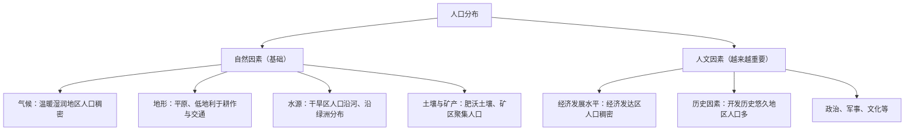

# 第一节 人口分布

## 核心概念

- **人口分布**：一定时期人口在一定地区范围的空间分布状况，常用**人口密度**（人/平方千米）衡量。
- **胡焕庸线**：黑河—腾冲一线，1935年由地理学家胡焕庸提出。此线东南侧约占全国面积43%，却集中了全国94%左右的人口，是我国人口分布的基本地理界线。
- **世界人口分布大势**：近90%的人口居住在北半球中低纬度；约60%的人口居住在离海岸200千米以内的沿海地区；近80%的人口居住在海拔500米以下的低平地区。

## 知识梳理

| 世界人口稠密区 | 主要原因 |
| --- | --- |
| 东亚、南亚 | 季风气候雨热同期，平原广阔，农业发达，历史悠久 |
| 西欧 | 气候温和湿润，工业化早，经济发达 |
| 北美东部 | 工业、金融、贸易发达，城市密集 |
| 人口稀疏区 | 干旱（撒哈拉）、湿热（亚马孙）、寒冷（西伯利亚）、高寒（青藏高原） |

## 重点精讲

1. **自然因素分析思路**（高考高频）：从气候（气温+降水）、地形、水源、土壤四要素入手。注意特殊区域：热带地区人口多分布在**较凉爽的高原、山地**（如东非高原、巴西高原），因低地湿热、疟疾多发。
2. **干旱地区**人口呈**点状（绿洲）、线状（河流沿岸）**分布，如我国塔里木盆地、埃及尼罗河谷地（约96%人口集中于谷地和三角洲）。
3. **人文因素**中经济发展水平影响最显著：工业化、城镇化吸引人口向城镇集聚；开发历史长短决定人口积累的基数。
4. **胡焕庸线两侧差异的成因**：东南侧季风气候、平原丘陵、耕地多、开发早、经济发达；西北侧干旱高寒、生态脆弱、经济落后。该线长期稳定，体现自然环境的基础性制约。

## 典型例题

**例1（选择题）** 巴西人口集中分布在东部沿海而非亚马孙平原，主要原因是（　）
A. 亚马孙平原矿产贫乏　B. 东部沿海开发历史早、气候较适宜　C. 平原地区交通便利　D. 沿海渔业资源丰富
**解析**：亚马孙平原为热带雨林气候，湿热不宜居；东部沿海（含巴西高原东南缘）气候相对凉爽宜人，且为殖民开发最早、经济最发达地区。选 **B**。

**例2（综合题）** 读中国人口分布图，说明胡焕庸线东南侧人口稠密的自然与人文原因。
**解析**：自然：①位于季风气候区，雨热同期，水热条件好；②以平原、丘陵为主，地形平坦；③河网密布，水源充足；④土壤肥沃，耕地面积广。人文：①农业开发历史悠久，人口基数大；②经济发达，工商业、城镇密集；③交通便利，对外联系方便。

## 易错点

- 影响人口分布的因素要**具体区域具体分析**，不能笼统套用"气候适宜"；如青藏高原人口稀少的主导因素是**高寒（热量不足）**而非干旱。
- 热带地区人口分布在高原山地，是"避热趋凉"，与温带"平原指向"相反。
- 胡焕庸线是**人口地理分界线**，不要与季风区界线、地势阶梯界线混淆（虽有一定重合）。
- 人口密度相同的地区，人口分布格局（均匀/集中）可能不同。

## 背记要点

1. 世界人口分布：中低纬、近海岸、低平原"三趋向"
2. 四大稠密区：东亚、南亚、西欧、北美东部
3. 自然因素：气候、地形、水源、土壤；人文因素：经济、历史、政治文化
4. 胡焕庸线：黑河—腾冲，东南密、西北疏
5. **高考视角**：常以区域人口分布图为载体，考查"描述分布特点（疏密+方位+沿线沿点）+分析成因（自然+人文）"的答题模板。

## 自测题

1. 描述世界人口分布的三大趋向并各举一例。
2. 分析东非高原人口较多而刚果盆地人口稀少的原因。
3. 胡焕庸线两侧人口分布差异的自然原因有哪些？
4. 干旱地区人口分布有何特点？以我国新疆为例说明。

## 相关知识点

人口的空间移动见 [[第二节 人口迁移]]；区域可承载的人口数量见 [[第三节 人口容量]]。
