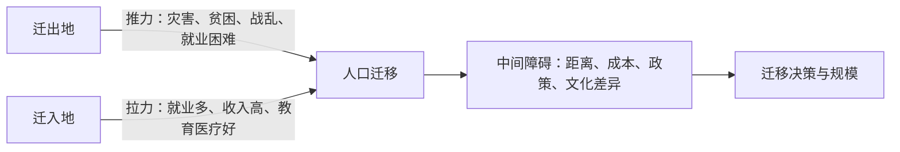

# 第二节 人口迁移

## 核心概念

- **人口迁移**：涉及人口居住地发生**长期或永久**改变的人口移动，需同时满足"跨越行政区界线+居住地变更+时间较长（通常1年以上）"三个条件。
- **人口机械增长**：因人口迁移引起的区域人口增减（迁入-迁出）；与出生死亡引起的**自然增长**共同决定区域人口数量变化。
- **推拉理论**：迁出地的推力（排斥力）与迁入地的拉力（吸引力）共同作用促成人口迁移。

## 知识梳理

| 类型 | 阶段 | 方向与特点 |
| --- | --- | --- |
| 国际迁移 | 19世纪以前 | 旧大陆→新大陆（欧洲→美洲、非洲黑奴贸易） |
| 国际迁移 | 二战后 | 发展中国家→发达国家；定居移民减少，外籍劳工增多 |
| 国内迁移（中国） | 改革开放前 | 有计划、有组织（支边、知青） |
| 国内迁移（中国） | 改革开放后 | 自发为主，规模大：中西部→东部沿海，乡村→城镇 |

## 重点精讲

1. **影响因素**：经济因素往往起**主导作用**（就业与收入差距）；自然因素（气候、水、灾害）、政治因素（政策、战争）、社会文化因素（家庭婚姻、宗教、教育）在特定条件下可成为主要原因。
2. **对迁出地影响**：利——缓解人地矛盾、增加汇款收入、加强对外联系；弊——劳动力和人才流失、留守儿童与空巢老人问题。
3. **对迁入地影响**：利——补充劳动力、促进经济发展与城镇化；弊——加大住房、交通、公共服务压力，可能带来社会治安与环境问题。
4. **我国"民工流"成因**：①农村剩余劳动力多（推力）；②城乡、区域经济差距大（根本原因）；③户籍等政策放宽（保障条件）。近年出现部分**回流**：中西部经济发展、沿海产业向内地转移、生活成本差异。

## 典型例题

**例1（选择题）** 20世纪80年代以来，我国人口大规模从中西部流向东部沿海，其根本原因是（　）
A. 东部气候优越　B. 区域经济发展水平差异　C. 国家移民政策推动　D. 东部资源丰富
**解析**：改革开放后迁移以自发性为主，动力来自城乡与区域间的经济收入差距，经济因素占主导。选 **B**。

**例2（综合题）** 近年来，部分农民工从珠三角回流至四川、湖南等省。分析这一现象的原因及其对珠三角的影响。
**解析**：原因：①东部产业升级，劳动密集型产业向中西部转移，家乡就业机会增多；②中西部经济发展，收入差距缩小；③沿海生活成本（房价等）高；④照顾家庭、乡土情结。对珠三角影响：①缓解人口与公共服务压力；②出现"用工荒"，劳动力成本上升；③倒逼产业转型升级，发展技术、资金密集型产业。

## 易错点

- 人口**流动**（旅游、探亲、通勤）不改变长期居住地，不属于人口迁移。
- 经济因素是"往往起主导作用"，并非所有迁移都因经济——战争难民、生态移民的主导因素分别是政治、自然因素。
- 区域人口数量变化=自然增长+机械增长，人口迁移只改变机械增长。
- 评价迁移影响必须**分迁入地/迁出地、利/弊**四个维度作答。

## 背记要点

1. 迁移三条件：跨界线、变居所、时间长
2. 推拉理论：推力+拉力+中间障碍
3. 主导因素：经济为主，自然、政治、社会文化为辅
4. 我国改革开放后：中西部→东部，乡村→城镇，自发性强
5. **高考视角**：常结合"民工回流""国际难民""东北人口外流"等热点，考查迁移原因与影响评价，答题须"分主体、分利弊"。

## 自测题

1. 判断：大学生异地求学四年属于人口迁移吗？为什么？
2. 用推拉理论分析二战后西欧由人口迁出区变为迁入区的原因。
3. 简述人口大量迁出对我国东北地区的不利影响。
4. 列举影响人口迁移的政治因素并各举一例。

## 相关知识点

人口分布格局是迁移的背景见 [[第一节 人口分布]]；迁移与区域承载力的关系见 [[第三节 人口容量]]；人口向城镇集聚推动 [[第二节 城镇化]]。
