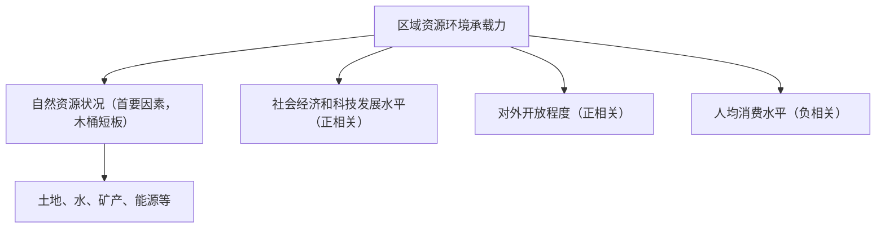

# 第三节 人口容量

## 核心概念

- **区域资源环境承载力**：在保证资源合理开发利用和保护良好生态环境的前提下，区域的资源环境条件所能承载的**最大人口数量**（极限值、警戒值）。
- **人口合理容量**：按照合理的生活方式，保障健康的生活水平，同时不妨碍未来人口生活质量的前提下，一个国家或地区**最适宜的人口数量**（理想值）。
- **木桶效应（短板效应）**：区域资源环境承载力取决于当地**数量最少（最短缺）的自然资源**。

## 知识梳理

| 比较项 | 资源环境承载力 | 人口合理容量 |
| --- | --- | --- |
| 含义 | 能承载的最大人口数 | 最适宜的人口数 |
| 性质 | 警戒值、极限值 | 理想值、目标值 |
| 数量关系 | 大 | 小（小于承载力） |
| 共同点 | 均具有不确定性（因素变化）与相对确定性（一定时期内） |  |

## 重点精讲

1. **影响因素方向判断**（高考高频）：资源越丰富、科技越发达、开放程度越高→承载力越**大**；人均消费水平越高→承载力越**小**。唯一负相关的是消费水平。
2. **对外开放的作用**：可通过贸易输入本地短缺资源（如日本进口矿产粮食），突破本地资源"短板"，提高承载力；封闭地区承载力受本地资源严格限制。
3. **我国谋求人口合理容量的措施**：坚持计划生育基本国策与优化生育政策相结合；提高科技水平与资源利用率；提高对外开放程度；倡导适度消费；保护生态环境。
4. **案例**：我国西北干旱区承载力的"短板"是**水资源**；青藏地区是**热量与生态脆弱性**。全球尺度上，多数学者认为地球承载力约100亿左右，存在乐观、悲观、中间三种观点。

## 典型例题

**例1（选择题）** 下列做法能提高区域资源环境承载力的是（　）
A. 提高人均消费水平　B. 扩大对外开放，输入短缺资源　C. 大量开垦陡坡荒地　D. 限制科学技术发展
**解析**：开放程度提高可弥补本地资源不足，提高承载力；A降低承载力，C破坏生态反而降低承载力，D与承载力正相关因素相悖。选 **B**。

**例2（综合题）** 新疆深居内陆，分析制约其资源环境承载力的主要因素，并提出提高承载力的合理措施。
**解析**：主要制约因素：**水资源短缺**（深居内陆，降水稀少，属木桶短板）。措施：①发展节水农业（滴灌、喷灌），提高水资源利用率；②合理开发利用地下水，跨流域调水；③依靠科技提高资源利用效率；④加强对外开放，发展边境贸易；⑤保护绿洲生态环境，防治荒漠化；⑥倡导适度消费。

## 易错点

- 承载力是"最大值"，合理容量是"适宜值"，**合理容量小于承载力**，两者不可混用。
- 消费水平与承载力**负相关**，是四大因素中唯一的负相关项，选择题常设陷阱。
- 承载力并非固定不变：科技进步、开放程度提高都可使其增大，故具有**不确定性**。
- "地大物博"不等于承载力大，须看资源的**人均量**与短板资源。

## 背记要点

1. 承载力=最大人口数（警戒值）；合理容量=适宜人口数（理想值）
2. 四因素：资源（+，首要）、科技（+）、开放（+）、消费（-）
3. 木桶效应：短板资源决定承载力
4. 我国对策：控制数量、提高素质、科技节流、开放引流、适度消费
5. **高考视角**：常给出区域资源数据表，要求判断"短板"并计算承载力，或结合"双碳""粮食安全"考查提高承载力的措施。

## 自测题

1. 区分资源环境承载力与人口合理容量的含义与数量关系。
2. 影响资源环境承载力的四个因素中，哪个呈负相关？为什么？
3. 用木桶效应解释我国西北地区承载力低的原因。
4. 简述我国谋求人口合理容量可采取的措施（至少四条）。

## 相关知识点

人口分布疏密的自然基础见 [[第一节 人口分布]]；人口超载引发的迁移见 [[第二节 人口迁移]]；人口与资源环境的协调见 [[第二节 走向人地协调——可持续发展]]。
