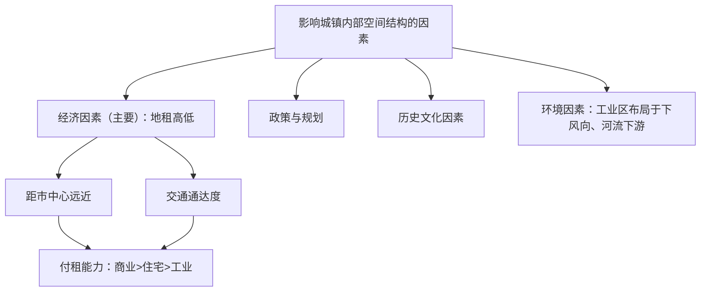

# 第一节 乡村和城镇空间结构

## 核心概念

- **乡村土地利用**：以农业用地（耕地、林地、草地、水域）为主，公共服务设施位于村落中心，住宅围绕其分布。
- **城镇功能区**：城镇土地因利用方式不同形成的功能分区，主要有**居住区、商业区、工业区**，功能区之间**无明确界线**，一个功能区可兼有其他功能。
- **城镇内部空间结构（地域结构）**：各功能区在空间上的分布与组合形式，经济因素（**地租/付租能力**）是影响其形成的主要因素。

## 知识梳理

| 功能区 | 区位特点 | 形态与特征 |
| --- | --- | --- |
| 商业区 | 市中心、交通干线两侧、街角路口 | 点状或条状，占地小，付租能力最强 |
| 居住区 | 商业区与工业区之间 | 占地面积最大，出现中高级与低级住宅分化 |
| 工业区 | 城市外缘、交通干线沿线 | 集聚成片，趋向下风向、河流下游 |

## 重点精讲

1. **地租曲线分析**（高考高频）：距市中心越近、通达度越高，地租越高。商业付租能力随距离衰减最快，故占据市中心；工业衰减最慢，位于外缘；住宅居中。地租相同处以**付租能力最高者**竞得。
2. **工业区布局的环境要求**：大气污染企业布局在**盛行风下风向或最小风频上风向**（季风区布局在与盛行风向垂直的郊外）；水污染企业布局在**河流下游**；居住区与工业区之间设**卫生防护带**（绿化带）。
3. **合理利用城乡空间的意义**：①建设生态廊道、控制开发强度——改善环境；②合理安排居住区、基础设施、公共服务设施——提高土地利用效率，方便生活；③保护历史文化街区（如北京胡同四合院）——传承历史文化。
4. **乡村内部空间结构**：以公共服务设施（祠堂、集市）为中心，住宅环绕，农业用地在外围，呈同心圆式的简单圈层。

## 典型例题

**例1（选择题）** 某城市地租由市中心向外递减，但在环路与放射状干道交会处出现地租次高峰，其主要原因是（　）
A. 距市中心近　B. 交通通达度高　C. 人口密度大　D. 环境质量好
**解析**：地租受"距市中心远近"和"交通通达度"双因素影响，干道交会处通达度高，形成地租次高峰。选 **B**。

**例2（综合题）** 某钢铁厂拟建于季风气候区某城市，该市盛行东南风与西北风。指出钢铁厂的合理布局位置并说明理由。
**解析**：位置：布局于城市**东北或西南郊**（与盛行风向垂直的方位），且位于河流下游、靠近铁路或港口。理由：①钢铁厂有大气污染，垂直于季风风向可避免污染城区；②有废水排放，置于河流下游保护城市水源；③原料燃料运量大，需便利的交通运输；④位于城市外缘，地租低，占地大成本可控。

## 易错点

- 功能区之间**没有明确界线**，"商业区内没有住宅"的说法错误。
- 高级住宅区并非在市中心，而是在**城市外缘、环境优美、与文化区相邻**处；高级与低级住宅区呈**背向发展**。
- 地租最高峰在市中心，**次高峰**在干道交会处，不要混淆。
- 经济因素是**主要**因素而非唯一因素，历史（北京故宫周边无高楼）、政策、环境均有影响。

## 背记要点

1. 三大功能区：商业（点状市中心）、居住（面积最大）、工业（外缘沿线）
2. 地租两因素：距市中心远近+交通通达度
3. 付租能力排序：商业>住宅>工业
4. 污染企业布局：下风向（或最小风频上风向）、河流下游、设防护带
5. **高考视角**：地租曲线图判读、城市规划评价题为常考题型，答题抓"风向、河流流向、交通、地租"四要素。

## 自测题

1. 画出付租能力随距市中心距离变化的示意曲线，并标注三大功能区范围。
2. 为什么居住区是城市中占地面积最大的功能区？
3. 自来水厂与化工厂在河流沿岸应如何分别布局？
4. 保护北京历史文化街区对城市空间结构有何意义？

## 相关知识点

城镇人口与用地的扩张过程见 [[第二节 城镇化]]；地域文化对城乡景观的塑造见 [[第三节 地域文化与城乡景观]]；产业布局原理见 [[第二节 工业区位因素及其变化]]。
