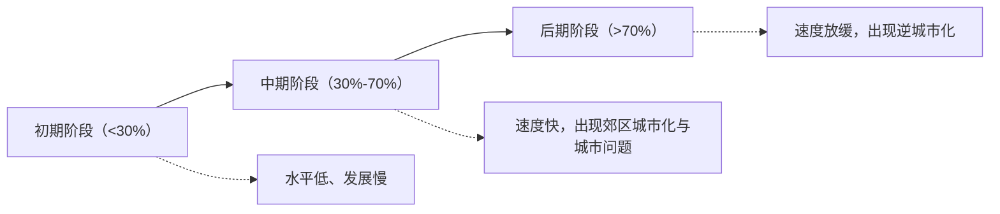

# 第二节 城镇化

## 核心概念

- **城镇化（城市化）**：乡村人口向城镇集聚、乡村地区转变为城镇地区的过程，主要标志有三：**城镇人口增加、城镇人口占总人口比例上升（最重要指标）、城镇建设用地规模扩大**。
- **城镇化动力**：经济发展是主要动力——农业发展提供剩余劳动力与农产品，工业化提供就业岗位（主要动力），服务业吸纳大量就业。
- **逆城市化**：城镇化后期，大城市中心人口向郊区、小城镇乃至乡村迁移，市中心出现衰落的现象（发达国家为主）。

## 知识梳理

| 比较项 | 发达国家 | 发展中国家 |
| --- | --- | --- |
| 起步 | 早（工业革命后） | 晚（二战后） |
| 水平 | 高（多超70%） | 较低但差异大 |
| 速度 | 慢、趋缓 | 快 |
| 现阶段特点 | 后期成熟阶段，逆城市化 | 多处于中期加速阶段，部分虚假/滞后城镇化 |

## 重点精讲

1. **城镇化阶段判读**（高考高频）：看城镇人口比例——<30%初期、30%-70%中期加速、>70%后期。曲线呈**拉平的"S"形**。我国目前处于**中期向后期过渡**阶段（比例超过65%）。
2. **城镇化的意义**：促进区域经济增长；提高资源利用效率（集约用地）；改善城乡居住环境；增强区域社会和谐（公共服务共享、城乡观念趋同）。
3. **城镇化问题及对策**：环境问题（大气、水、垃圾污染）、社会问题（交通拥堵、住房紧张、就业困难）。对策：建设**卫星城**、分散城市职能；合理规划、改善交通；发展**海绵城市、智慧城市**、加强绿化建设生态城市。
4. **地理信息技术应用**：利用RS监测城市用地扩张，GIS分析规划选址，GPS/北斗支撑导航出行，提升城市管理精细化水平。

## 典型例题

**例1（选择题）** 衡量一个地区城镇化水平最重要的指标是（　）
A. 城镇人口数量　B. 城镇用地规模　C. 城镇人口占总人口的比例　D. 城镇经济总量
**解析**：三大标志中，城镇人口占总人口比例最能反映城镇化水平高低。选 **C**。

**例2（综合题）** 20世纪70年代起，伦敦、纽约等大城市出现人口向郊区和小城镇迁移的现象。说明该现象的名称、成因及影响。
**解析**：名称：逆城市化。成因：①大城市中心区环境恶化、地价上涨、交通拥堵（推力）；②乡村与小城镇基础设施完善、环境优美（拉力）；③私人汽车普及与高速公路发展，交通条件改善；④信息技术使远程办公成为可能。影响：市中心出现"空心化"、税收减少、衰落；乡村与小城镇经济活力增强，但也可能侵占农田、带来景观破坏。

## 易错点

- 逆城市化**不是城镇化的倒退**，而是城镇化发展到高水平后城市功能向外扩散的表现。
- 郊区城市化（中期，人口迁往近郊，城市范围扩大）≠逆城市化（后期，迁往远郊乡村小城镇）。
- 城镇化水平高低看**比例**，速度快慢看**曲线斜率**，两者不可混淆：发展中国家速度快但水平低。
- 城镇化问题并非必然，通过合理规划可以避免，"限制城镇化"不是正确对策。

## 背记要点

1. 三大标志：人口增、比例升（核心）、用地扩
2. S形曲线三阶段：初期<30%、中期30%-70%、后期>70%
3. 发达国家：早、高、慢、逆城市化；发展中国家：晚、低、快
4. 治理方向：卫星城分流、生态城市、海绵城市、智慧城市
5. **高考视角**：常给出城镇化率曲线或用地变化遥感图，考查阶段判断、问题分析与"人地协调"对策，注意结合我国新型城镇化战略。

## 自测题

1. 城镇化的三个主要标志是什么？哪个最重要？
2. 比较郊区城市化与逆城市化的发生阶段和人口流向。
3. 简述城镇化过快可能产生的环境问题和社会问题各两个。
4. 建设海绵城市对缓解城市内涝有何作用？

## 相关知识点

城镇内部功能分区见 [[第一节 乡村和城镇空间结构]]；人口向城镇集聚的动因见 [[第二节 人口迁移]]；城镇化中的文化保护见 [[第三节 地域文化与城乡景观]]。
