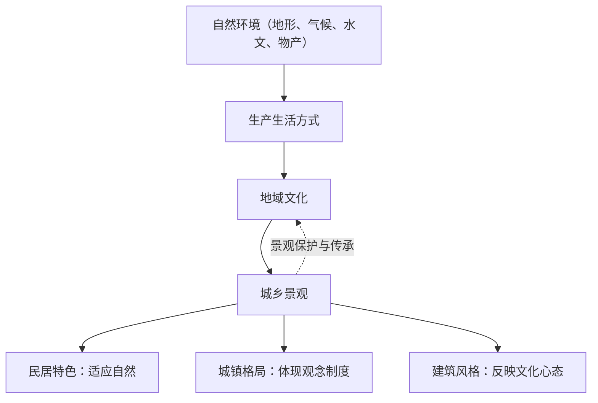

# 第三节 地域文化与城乡景观

## 核心概念

- **地域文化**：在特定地域范围内长期形成的文化传统，包括物质方面（建筑、服饰、饮食）与非物质方面（价值观、制度、习俗），具有**地域性、相对稳定性**。
- **景观**：自然景观（行云飞瀑、高山流水等自然过程形成）与人文景观（文化景观，如农田、村落、矿山、城市，为人类利用自然的产物）。
- **城乡景观**：聚落整体及其内部建筑、道路等所构成的景观，是地域文化的**物质载体与直观体现**。

## 知识梳理

| 案例 | 景观特点 | 反映的地域文化/环境适应 |
| --- | --- | --- |
| 北京四合院 | 对称封闭、坐北朝南、等级分明 | 皇城文化、宗法礼制、防寒采光 |
| 福建土楼 | 环形夯土巨宅、聚族而居 | 客家迁徙文化、防御需要、聚族观念 |
| 江南水乡（周庄） | 粉墙黛瓦、临水而建、小桥流水 | 湿润多雨、水运便利、内敛雅致 |
| 陕北窑洞 | 依黄土坡开凿、冬暖夏凉 | 黄土直立性好、气候干旱、就地取材 |
| 云南哈尼梯田 | 森林—村寨—梯田—水系"四素同构" | 人与自然和谐共生的农耕文化 |

## 重点精讲

1. **地域文化在乡村景观中的体现**：①土地利用——如哈尼梯田体现"人地和谐"；②民居——就地取材、适应气候（斜顶排水多雨区、平顶干旱区、高架楼湿热区）；③村落布局——如祠堂居中体现宗族观念。
2. **地域文化在城镇景观中的体现**：①色调色彩——如江南城镇黑白基调、智利瓦尔帕莱索的彩色房屋；②空间格局——北京老城以**中轴线对称**、皇宫居中，体现皇权至上；美国大城市中心多摩天大楼，体现经济优先；③建筑风格——欧洲老城保留教堂广场，我国古城保留城墙钟鼓楼。
4. **城乡景观保护**：控制老城开发强度（北京旧城限高）、划定历史文化街区、活化利用（胡同文创），处理好**保护与发展**的关系。

## 典型例题

**例1（选择题）** 福建客家土楼建成环形巨宅、聚族而居，反映的主要地域文化特点是（　）
A. 崇尚自然、天人合一　B. 迁徙历史与防御需要下的家族凝聚　C. 商业文化发达　D. 等级礼制森严
**解析**：客家人历经南迁，聚族而居、御外凝内的需要造就了封闭环形的土楼形态。选 **B**。

**例2（综合题）** 北京老城建筑以故宫为中心沿中轴线对称分布，且旧城区建筑限高。分析这种空间格局形成的文化原因及限高的意义。
**解析**：文化原因：①受封建礼制与皇权观念影响，皇宫居城市中心，突出"皇权至上"；②中轴对称体现"居中为尊"、追求秩序和谐的传统哲学。限高意义：①保护故宫及中轴线的天际线与历史风貌；②保护胡同四合院等历史街区的整体景观；③传承古都文化，增强文化认同；④促进旧城功能疏解，与新城协调发展。

## 易错点

- 民居特色首先是对**自然环境的适应**，其次才体现文化观念，答题两方面都要写。
- 地域文化是**相对稳定**而非一成不变的，会随时代发展而演变。
- 城市景观差异不能只归因于经济水平，**价值观念、历史制度**同样重要（如欧美城市中心差异）。
- 保护历史街区不等于"原封不动"，合理**活化利用**也是保护方式。

## 背记要点

1. 地域文化含物质与非物质两方面，城乡景观是其载体
2. 民居逻辑链：自然环境→建材与形态→民居特色
3. 北京中轴线：皇权至上、礼制秩序；水乡民居：临水黑白、内敛雅致
4. 哈尼梯田"四素同构"：森林—村寨—梯田—水系
5. **高考视角**：常以传统民居照片或历史街区改造为素材，考查"景观特点描述+自然与文化成因+保护措施"三段式作答。

## 自测题

1. 从自然环境角度解释陕北窑洞与江南斜顶民居的差异。
2. 举例说明地域文化在城镇空间格局中的体现。
3. 哈尼梯田景观为何被称为人地和谐的典范？
4. 为协调历史文化街区保护与城市发展，可采取哪些措施？

## 相关知识点

城镇功能分区与规划见 [[第一节 乡村和城镇空间结构]]；城镇化对传统景观的冲击见 [[第二节 城镇化]]；人地协调思想见 [[第二节 走向人地协调——可持续发展]]。
