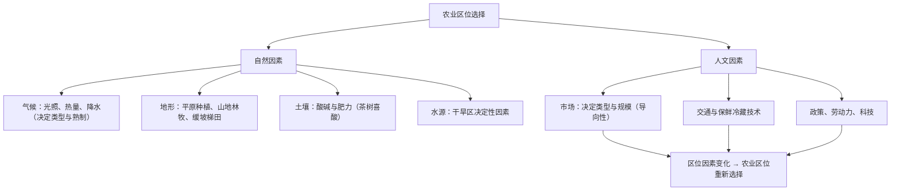

# 第一节 农业区位因素及其变化

## 核心概念

- **农业区位**：一是农业生产所选定的**地理位置**，二是农业与地理环境各因素的**相互联系**。
- **农业区位因素**：影响农业生产选址与类型的因素，分为**自然因素**（气候、地形、土壤、水源）与**人文因素**（市场、交通、政策法规、劳动力、科技、资金等）。
- **区位因素的变化**：自然因素相对稳定，人文因素变化较快；**市场**与**科技**的变化对现代农业区位选择影响最突出。

## 知识梳理

| 农业类型 | 区位指向 | 举例 |
| --- | --- | --- |
| 水稻种植 | 雨热同期、劳动力丰富 | 东亚、东南亚季风区 |
| 乳畜业、园艺业 | 市场（城郊指向） | 大城市周边奶牛场、花卉蔬菜基地 |
| 河谷农业 | 热量（高原区） | 青藏高原雅鲁藏布江谷地 |
| 绿洲农业 | 水源 | 新疆塔里木盆地边缘 |

## 重点精讲

1. **主导因素与限制性因素**：主导因素是对某种农业影响最大的因素（如城郊乳畜业——市场）；限制性因素是区域中不能满足需求的因素（如西北——水源），当其得到满足即转化为主导因素（河西走廊灌溉农业）。
2. **气候要素细分**：光照（新疆瓜果甜——光照强、昼夜温差大）、热量（决定熟制与生长期）、降水（干湿状况）。答题避免笼统写"气候好"。
3. **区位因素的变化**（高考高频）：①市场变化——城市规模扩大使城郊农业从粮食转向蔬菜、花卉、乳肉（市场需求导向）；②交通与冷藏保鲜技术进步——使市场影响范围扩大，形成区域化专业化产区（如海南冬季瓜菜供应全国、荷兰鲜花空运全球）；③科技进步——温室大棚（改造热量）、滴灌（克服缺水）、培育良种（扩大种植界限，如双季稻北移）。
4. **案例：环地中海地区**——时鲜业借助交通改善和保鲜技术面向欧洲腹地市场；我国亚热带沿海"水稻田→甘蔗地→鱼塘→花卉棚"的演变体现市场与城镇化的驱动。

## 典型例题

**例1（选择题）** 近年来海南岛冬季瓜菜大量销往北京，主要得益于（　）
A. 全球气候变暖　B. 交通运输与冷藏保鲜技术的发展　C. 北京耕地减少　D. 海南劳动力丰富
**解析**：交通条件改善与冷藏保鲜技术进步扩大了农产品的销售范围，使热带瓜菜可远距离供应北方市场。选 **B**。

**例2（综合题）** 分析新疆吐鲁番盆地发展葡萄种植的有利自然条件与限制性因素，并说明当地的应对措施。
**解析**：有利条件：①光照充足，昼夜温差大，利于糖分积累；②夏季热量充足；③山麓地带有冰雪融水；④气候干燥，病虫害少。限制性因素：**水源不足（降水稀少）**。措施：修建坎儿井引用地下水与冰雪融水，发展滴灌等节水灌溉技术。

## 易错点

- "主导因素"与"限制性因素"是不同设问：前者问"最重要"，后者问"最短缺"。
- 市场决定农业生产的**类型和规模**，不是交通决定；交通只是扩大市场范围的条件。
- 自然因素可以**改造**（梯田改地形、大棚改热量、灌溉改水源），但须考虑投入与生态代价。
- 分析区位变化题，一定落在**人文因素（市场、交通、科技、政策）**上，自然因素短期基本不变。

## 背记要点

1. 自然因素：气候（光热水）、地形、土壤、水源
2. 人文因素：市场（导向）、交通、政策、劳动力、科技
3. 变化最快：市场需求、交通冷藏、科学技术
4. 经典主导：城郊乳畜—市场；河西走廊—水源；横断山立体农业—地形
5. **高考视角**：区位条件评价（有利+不利）、区位变化原因、农业可持续发展措施是三大常考设问，注意"因地制宜"原则。

## 自测题

1. 分别指出珠三角基塘农业、青藏河谷农业、江南丘陵茶园的主导自然因素。
2. 说明冷藏保鲜技术进步对农业区位选择的影响。
3. 我国将橡胶种植北界推移到北纬22度，依靠的是什么因素？
4. 评价东北平原发展商品粮基地的有利与不利条件。

## 相关知识点

工业布局原理对照见 [[第二节 工业区位因素及其变化]]；农产品流通依托交通见 [[第二节 交通运输布局对区域发展的影响]]；农业开发与环境问题见 [[第一节 人类面临的主要环境问题]]。
