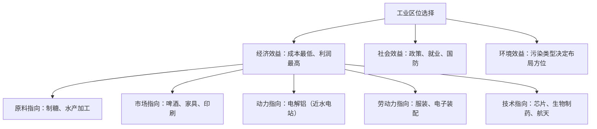

# 第二节 工业区位因素及其变化

## 核心概念

- **工业区位因素**：影响工厂选址的因素，包括自然因素（土地、水源）与人文因素（原料、燃料/动力、市场、交通、劳动力、科技、政策、环境等）；现代工业受**自然条件制约较小**，人文因素占主导。
- **主导区位因素与工业指向类型**：不同工业部门对各因素的依赖程度不同，形成原料、市场、动力、劳动力、技术等**指向型工业**。
- **区位因素的变化**：随科技、交通发展，**原料、动力对区位的影响减弱**，**市场、科技、劳动力素质、环境的影响增强**。

## 知识梳理

| 钢铁工业布局演变 | 主导因素 | 案例 |
| --- | --- | --- |
| 早期：近煤 | 燃料（动力） | 德国鲁尔区、我国山西 |
| 中期：近铁矿 | 原料 | 鞍钢（近鞍山铁矿、抚顺煤） |
| 现代：近市场、近港口 | 市场+交通 | 宝钢（临上海市场，港口进口澳巴铁矿） |

## 重点精讲

1. **指向类型判断技巧**（高考高频）：原料**不便运输或易变质**→原料指向（水果罐头）；产品**不便运输或易变质**→市场指向（啤酒瓶装饮料）；**耗电巨大**→动力指向（电解铝）；**廉价劳动力需求大**→劳动力指向；**研发投入高**→技术指向（近高校科研院所）。
2. **鞍钢与宝钢对比**：鞍钢——"煤铁复合体型"，原料燃料指向；宝钢——"临海型"，凭借便捷海运进口铁矿、面向沪宁杭庞大市场，说明**科技与交通进步使原料地对钢铁工业区位的影响减弱，市场影响增强**。
3. **首钢搬迁曹妃甸**：为改善北京大气环境、疏解非首都功能，首钢迁至河北唐山曹妃甸——体现**环境因素**与**政策因素（京津冀协同发展）**对工业区位的影响增强。
4. **劳动密集型产业转移**：随经济发展工资上涨，服装、电子装配等由发达地区向劳动力廉价地区转移（欧美→亚洲四小龙→中国沿海→中国中西部及东南亚），印证劳动力**价格与素质**因素的动态变化。

## 典型例题

**例1（选择题）** 宝钢建在上海附近，而当地既无铁矿也无煤炭，其布局的主导因素是（　）
A. 原料　B. 动力　C. 市场与交通　D. 劳动力
**解析**：宝钢依托沪宁杭庞大的钢材消费市场，借助海运便利进口澳大利亚、巴西铁矿，属市场+交通指向。选 **C**。

**例2（综合题）** 分析首钢从北京石景山搬迁至河北曹妃甸的原因，并说明搬迁对京冀两地的影响。
**解析**：原因：①钢铁工业污染重、耗水多，加剧北京大气污染与水资源紧张；②北京城市定位调整，疏解非首都功能（政策因素）；③曹妃甸有深水良港，便于进口铁矿石、输出产品；④曹妃甸土地充足、地价低。对北京：改善大气环境质量，腾出发展空间（首钢园区改造为文化创意区），优化产业结构。对河北：增加就业与税收，带动基础设施建设，促进临港工业发展；但需防范污染转移，应同步采用先进环保技术。

## 易错点

- 判断指向类型看**该工业最怕损失什么**，不能死记行业清单；同一行业在不同条件下主导因素可不同。
- 钢铁工业主导因素**随时代变化**：煤→铁矿→市场港口，题目须看清时间背景。
- 环境因素只影响**布局方位**（风向、河流上下游），一般不决定"建不建"。
- 产业转移承接地并非只有好处，须辩证分析（就业增加 vs 污染风险）。

## 背记要点

1. 五大指向：原料、市场、动力、劳动力、技术
2. 变化趋势：原料燃料影响减弱，市场、科技、环境、政策影响增强
3. 鞍钢（煤铁指向）→宝钢（市场港口指向）：钢铁区位的世纪变迁
4. 首钢迁曹妃甸：环境+政策（京津冀协同发展）
5. **高考视角**：常考"某工厂选址评价""区位因素变化原因""产业转移影响"，作答遵循"经济—社会—环境"三效益框架。

## 自测题

1. 甜菜制糖厂与瓶装饮料厂应分别如何布局？说明理由。
2. 比较鞍钢与宝钢区位选择的差异及其反映的区位因素变化。
3. 电子装配厂与芯片研发中心的主导区位因素有何不同？
4. 从三效益角度分析化工厂不宜建在城市盛行风上风向的原因。

## 相关知识点

农业区位分析方法对照见 [[第一节 农业区位因素及其变化]]；第三产业布局见 [[第三节 服务业区位因素及其变化]]；工业污染问题见 [[第一节 人类面临的主要环境问题]]；区域协同战略见 [[第三节 中国国家发展战略举例]]。
