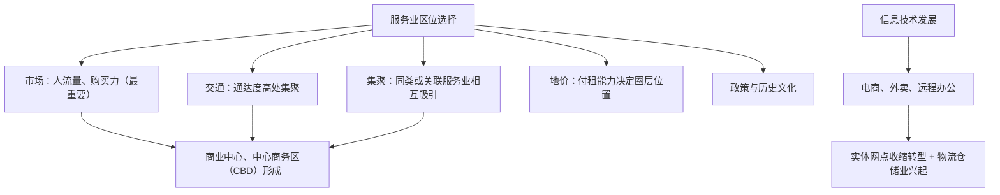

# 第三节 服务业区位因素及其变化

## 核心概念

- **服务业**：不生产物质产品的行业，可分为**商业性服务业**（以营利为目的：零售、餐饮、金融、物流、旅游等）与**非商业性服务业**（政府机构、公共服务：教育、公共医疗等）。
- **服务业区位因素**：自然因素影响相对较小（旅游业除外），主要受**市场（人口与消费能力）、交通、劳动力、政策、集聚、历史文化**等人文因素影响。
- **区位因素的变化**：交通改善、信息技术（电子商务）发展深刻改变服务业布局，部分服务业摆脱对实体店址的依赖。

## 知识梳理

| 服务业类型 | 区位特点 | 举例 |
| --- | --- | --- |
| 零售、餐饮 | 市中心、交通枢纽、居住区附近，人流指向 | 王府井商业街 |
| 金融、总部经济 | 集聚于CBD，信息与人才指向 | 北京金融街、上海陆家嘴 |
| 物流仓储 | 城市外缘交通干线、地价低处 | 机场高速沿线物流园 |
| 旅游服务 | 依托自然人文景观资源 | 黄山、故宫周边 |

## 重点精讲

1. **市场是商业性服务业最重要的区位因素**：人口密度大、消费能力强的地区服务业发达；高档商场需考察居民**购买力结构**，便利店看**人流量**。
2. **集聚效应**：同类服务业集聚（如餐饮一条街）可共享客源、扩大整体影响；关联服务业集聚（商场+影院+餐饮）满足一站式消费。但过度集聚导致竞争激烈、地租攀升。
3. **信息技术的影响**（高考高频）：①电子商务使部分零售摆脱实体店区位限制，网店可布局在地价低的郊区；②带动**快递物流业**大发展，物流园区成为新增长点；③实体商业向**体验式消费**（餐饮、娱乐、亲子）转型；④远程医疗、在线教育扩大服务空间范围。
4. **非商业性服务业布局**：以**社会效益（公平与便利）**为主要原则，如中小学、社区医院按服务半径均衡布局，不追求利润最大化。

## 典型例题

**例1（选择题）** 大型物流仓储中心多布局在城市外缘高速公路出入口附近，主要原因是（　）
A. 环境优美　B. 地价较低且交通便捷　C. 靠近消费人群　D. 劳动力丰富
**解析**：物流仓储占地大、货运量大，城市外缘地价低，高速出入口便于货物集散。选 **B**。

**例2（综合题）** 近年来网络购物迅速发展，分析其对传统实体零售业和城市空间的影响。
**解析**：对实体零售：①分流客源，部分中小实体店铺经营困难、关闭；②促使实体商业转型升级，向体验式、服务式消费（餐饮、影院、亲子娱乐）转变；③线上线下融合（新零售）。对城市空间：①部分商业街区衰落，商业用地功能调整；②城市外缘物流园区、仓储用地大量增加；③快递配送站点深入社区，末端配送体系重塑城市服务网络。

## 易错点

- 服务业并非都"逐利布局"：**非商业性服务业**（学校、公立医院）遵循公平与便利原则。
- 信息技术削弱的是**实体店址**的重要性，而非市场因素本身——市场（消费人群）永远重要。
- 旅游服务业是少数受**自然因素**显著影响的服务业，不可一概而论"服务业与自然无关"。
- 中心商务区（CBD）以金融、商务办公为主，**常住人口少**，昼夜人口差异大。

## 背记要点

1. 分类：商业性（营利）与非商业性（公益）
2. 核心因素：市场（人流+购买力）、交通、集聚、地价、政策
3. 信息技术三大影响：电商冲击实体、物流业兴起、体验式转型
4. 非商业性服务业：按服务半径均衡布局，重公平
5. **高考视角**：常以"新零售""社区养老服务设施选址""夜间经济"为素材，考查服务业区位评价与变化分析，注意区分商业性与公益性布局原则。

## 自测题

1. 便利店与高档珠宝店的选址考虑因素有何异同？
2. 说明餐饮店集聚成"美食街"的利与弊。
3. 信息技术发展对服务业区位选择产生了哪些影响？
4. 社区医院布局应遵循什么原则？与商业银行网点有何不同？

## 相关知识点

服务业集中的商业区区位见 [[第一节 乡村和城镇空间结构]]；与农业、工业区位方法对照见 [[第一节 农业区位因素及其变化]]、[[第二节 工业区位因素及其变化]]；交通对服务业集散的支撑见 [[第二节 交通运输布局对区域发展的影响]]。
