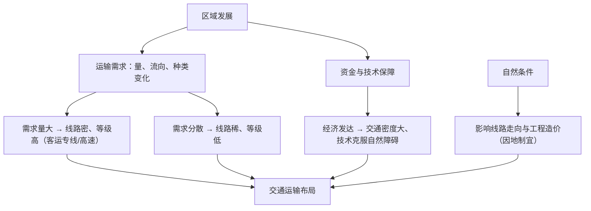

# 第一节 区域发展对交通运输布局的影响

## 核心概念

- **交通运输布局**：对交通运输线（铁路、公路、航道、管道）和点（车站、港口、机场）的规划安排，目的是**满足区域运输需求，服务区域发展**。
- **交通运输需求**：区域经济活动产生的客货运输的数量、种类、方向等要求，是交通布局的**决定性依据**——"需求决定布局"。
- **布局的一般原则**：依据运输需求、适度超前、因地制宜、尽量少占土地、发挥综合运输优势、平衡地区发展（兼顾社会效益）等。

## 知识梳理

| 影响因素 | 对布局的影响 | 案例 |
| --- | --- | --- |
| 运输需求 | 决定线网密度、点的规模等级 | 京沪高铁连接两大城市群，需求量巨大 |
| 经济水平（资金） | 决定建设能力与养护水平 | 东部路网密于西部 |
| 科学技术 | 克服自然障碍，扩大布局空间 | 青藏铁路破解冻土难题、港珠澳大桥 |
| 自然条件 | 影响走向、造价（趋利避害） | 山区公路呈"之"字形、沿河谷延伸 |

## 重点精讲

1. **需求决定布局**（高考高频）：交通线、点的规模与需求量匹配——大城市间开客运专线，资源产地建重载铁路（大秦铁路运煤）；需求的**分布**决定线网格局，城市群内部形成放射+环状密集路网。
2. **区位选择趋"有利"**：交通线尽量连接更多经济据点（但高铁为保速度取直）、避开重大自然灾害区；铁路客运站趋向城市中心或近郊，机场远离市区（噪声+用地）且地形开阔、云雾少。
3. **适度超前原则**：按未来一段时期的需求设计标准，避免刚建成即饱和；但过度超前会造成资金浪费——体现规划的科学性。
4. **案例：川藏铁路**——沿线地形起伏巨大、地质灾害多，需求量本身有限，但布局兼顾**社会效益**（民族团结、国防安全、带动藏区发展），说明交通布局不单纯考虑经济效益。

## 典型例题

**例1（选择题）** 大秦铁路是我国重要的运煤专线，其布局主要体现的原则是（　）
A. 因地制宜　B. 依据运输需求　C. 平衡地区发展　D. 少占耕地
**解析**：山西煤炭外运需求巨大且方向明确（晋煤外运至秦皇岛港下海），运输需求决定了这条重载专线的布局。选 **B**。

**例2（综合题）** 青藏铁路穿越多年冻土区、生态脆弱区。说明其建成通车体现了哪些布局影响因素，并简析该铁路布局考虑的社会效益。
**解析**：影响因素：①科学技术——以桥代路、热棒散热等技术攻克高原冻土难题，说明科技扩大了交通布局的空间；②国家资金实力提供保障；③自然条件仍制约走向与造价（沿柴达木盆地边缘、河谷延伸）。社会效益：①加强西藏与内地联系，巩固国防；②促进民族团结；③带动沿线旅游业与资源开发，促进区域协调发展；④设置野生动物通道，兼顾生态保护。

## 易错点

- 交通布局的决定性因素是**运输需求**，自然条件只是影响走向和造价的条件，科技可以克服自然障碍。
- "适度超前"不是越超前越好，过度超前浪费资金，滞后则制约发展。
- 高铁选线**截弯取直**（保证速度），普通铁路可多绕行联系城镇，两者原则不同。
- 西部地区建设交通线的意义偏重**社会效益与战略意义**，不能只算经济账。

## 背记要点

1. 核心逻辑：区域发展→运输需求变化→交通布局调整
2. 布局原则：依需求、适度超前、因地制宜、少占地、重综合、兼顾公平
3. 科技克服障碍：青藏铁路（冻土）、港珠澳大桥（跨海）
4. 机场区位：远城区、地势开阔平坦、云雾少、地质稳定
5. **高考视角**：常给交通规划图，考查"选线/选址理由"，答题框架为"需求+自然+技术+社会效益"。

## 自测题

1. 为什么说运输需求是交通运输布局的决定性因素？
2. 山区公路多沿等高线呈"之"字形分布的原因是什么？
3. 简述机场选址需要考虑的主要条件。
4. 从社会效益角度说明川藏铁路建设的意义。

## 相关知识点

交通改善反作用于区域见 [[第二节 交通运输布局对区域发展的影响]]；工业原料产品运输需求见 [[第二节 工业区位因素及其变化]]；重大区域战略中的交通一体化见 [[第三节 中国国家发展战略举例]]。
