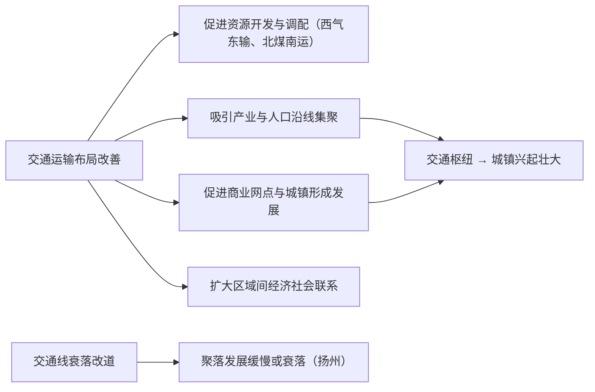

# 第二节 交通运输布局对区域发展的影响

## 核心概念

- **交通对经济发展的促进**：交通线、点的建设可**缩短时空距离**，促进人员、物资、信息流动，带动沿线资源开发与产业发展——"火车一响，黄金万两"。
- **交通对聚落的影响**：交通枢纽往往发展为城镇；交通线的变化引起**聚落兴衰**（如大运河与扬州、京广线与株洲、石家庄"火车拉来的城市"）。
- **交通与区域联系**：交通运输布局决定区域间联系的**广度与深度**，是区域一体化（如京津冀"轨道上的京津冀"）的基础支撑。

## 知识梳理

| 案例 | 交通变化 | 区域影响 |
| --- | --- | --- |
| 石家庄 | 京汉、正太铁路交会 | 由小村庄发展为省会——"火车拉来的城市" |
| 扬州 | 大运河淤塞、海运与京沪铁路兴起 | 运河城市地位下降，发展趋缓 |
| 高铁沿线城市 | 高铁站设立 | 形成高铁新城，同城化效应；也可能产生"虹吸效应" |
| 山区新公路 | 对外通道打通 | 特色农产品外销、旅游扶贫、乡村振兴 |

## 重点精讲

1. **促进区域经济发展的机制**（高考高频）：①降低运输成本，扩大产品市场范围；②促进资源优势转化为经济优势（资源外运）；③吸引投资，带动相关产业（建材、旅游、物流）；④增加就业，加强区域协作与产业分工。
2. **影响聚落发展**：交通枢纽处人流物流集散→商业服务业集聚→城镇形成扩大；城镇空间形态**沿交通干线扩展**（沿江带状、沿铁路轴向）。交通方式衰落则聚落发展变缓。
3. **商业网点布局**：交通便捷处（干道交会、高速出入口）利于商业网点集聚；山区交通闭塞，商业网点**密度小**、多沿谷地公路分布。
4. **辩证看待高铁效应**：正面——同城化、旅游业、要素流动加快；负面——中小城市可能被大城市"**虹吸**"（人才、消费流向中心城市），需依托自身特色承接辐射。

## 典型例题

**例1（选择题）** 石家庄由村庄发展为特大城市，扬州在近代发展趋缓，两者的共同影响因素是（　）
A. 自然资源　B. 交通运输布局的变化　C. 农业基础　D. 国家政策
**解析**：石家庄因铁路交会而兴，扬州因运河衰落、新式交通绕行而缓，都体现交通布局变化对聚落兴衰的影响。选 **B**。

**例2（综合题）** 某山区县城通高速公路后，特色水果种植与乡村旅游迅速发展。分析交通改善对该县发展的促进作用。
**解析**：①缩短运输时间、降低运输成本，鲜果可快速外销，扩大市场范围，促进特色农业规模化；②冷链物流跟进，减少损耗，提高农产品附加值；③游客进入更便捷，带动乡村旅游、餐饮住宿等服务业发展；④吸引外部投资与人才回流，增加就业；⑤加强与区域中心城市联系，承接产业转移，助推乡村振兴。

## 易错点

- 交通对区域发展的影响是**双向的**：既有带动效应，也可能有虹吸效应、过境效应（车流不停留）。
- 聚落兴衰取决于交通**地位的变化**而非交通本身：有交通线不等于必然繁荣。
- 山区商业网点密度小的主因是**交通闭塞+人口稀少购买力低**，不能只答地形。
- "要致富先修路"成立的前提是区域有可开发的资源或产业，交通只是**必要条件**非充分条件。

## 背记要点

1. 促进经济：降成本、扩市场、促开发、带产业、增就业
2. 影响聚落：枢纽兴城（石家庄）、线衰城缓（扬州）、形态沿线扩展
3. 商业网点：交通便捷处密集，山区稀疏
4. 高铁双刃剑：同城化 vs 虹吸效应
5. **高考视角**：常以新建高铁/高速/港口为背景，考查"对区域发展的影响"，按"经济—社会—生态，有利—不利"结构分点作答。

## 自测题

1. 举两例说明交通运输布局变化引起的城市兴衰。
2. 分析交通改善促进区域资源开发的机制。
3. 山区与平原商业网点的密度和分布有何差异？为什么？
4. 高铁开通对沿线中小城市可能产生哪些不利影响？

## 相关知识点

需求如何决定交通布局见 [[第一节 区域发展对交通运输布局的影响]]；城镇形成与空间形态见 [[第一节 乡村和城镇空间结构]]；交通与协同发展战略见 [[第三节 中国国家发展战略举例]]。
