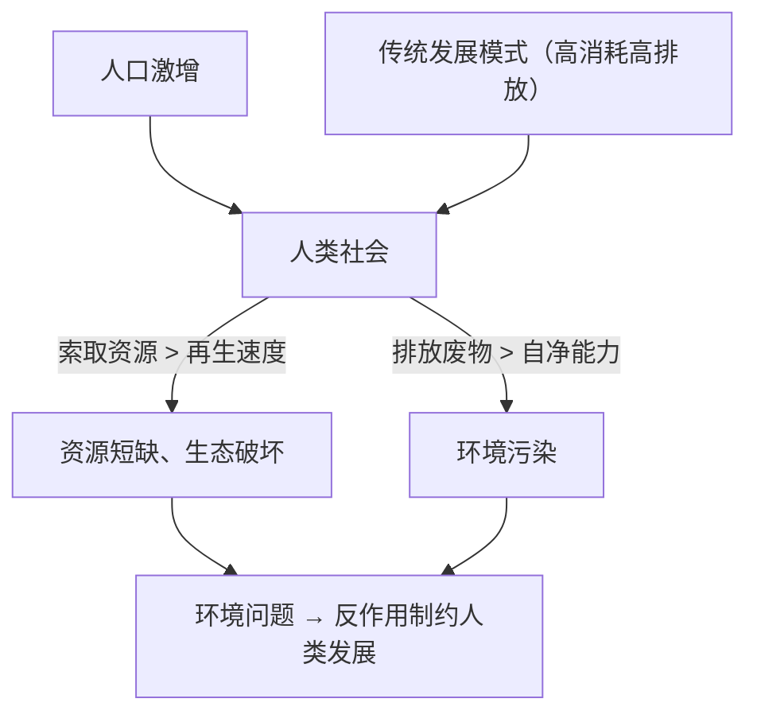

# 第一节 人类面临的主要环境问题

## 核心概念

- **环境问题**：由自然或人为原因引起生态系统破坏、环境质量下降，进而影响人类生存发展的各种问题。
- **产生机制**：人类向环境**索取资源的速度超过资源本身及其替代品的再生速度**→资源短缺、生态破坏；人类向环境**排放废弃物的数量超过环境自净能力**→环境污染。
- **三大类环境问题**：①自然资源枯竭（水、土地、矿产、能源短缺）；②生态破坏（水土流失、荒漠化、生物多样性减少）；③环境污染（大气、水、土壤、固废、噪声污染）。

## 知识梳理

| 空间尺度 | 主要问题 | 分布特点 |
| --- | --- | --- |
| 全球性 | 全球变暖、臭氧层破坏、酸雨、生物多样性锐减 | 跨越国界，影响全人类 |
| 城市地区 | 以**环境污染**为主 | 交通工业集中，排放集中 |
| 乡村地区 | 以**生态破坏**为主 | 资源利用方式不当（滥垦滥牧滥伐） |
| 发达国家 | 过度消费导致人均资源消耗与排放高 | 部分污染产业转移至发展中国家 |
| 发展中国家 | 问题更严峻：承受发展与人口双重压力+承接污染转移 | 生态破坏与污染并存 |

## 重点精讲

1. **环境问题的本质**：人类与环境**物质能量交换失衡**。环境有一定的自我调节能力（自净能力）与资源再生能力，人类活动强度超过其**阈值**即产生环境问题。
2. **区域差异分析**（高考高频）：城市重污染、乡村重生态破坏；发达国家历史上曾经历"先污染"，现主要是消费性问题；发展中国家处于工业化进程，加之污染产业转入，问题更集中更严峻。
3. **全球变暖链条**：燃烧化石燃料+毁林→大气CO₂等温室气体浓度升高→全球气候变暖→冰川消融、海平面上升、极端天气增多→威胁沿海低地与生态系统。
4. **环境问题的关联性**：一种问题常诱发其他问题，如荒漠化→沙尘暴→大气质量下降；水污染→水资源短缺（水质型缺水），分析时注意因果链条。

## 典型例题

**例1（选择题）** 城市地区环境问题以环境污染为主，乡村地区以生态破坏为主，其根本原因是（　）
A. 城乡人口密度不同　B. 城乡经济活动方式与资源利用方式不同　C. 城乡地形差异　D. 环保政策不同
**解析**：城市工业交通集中，排放废弃物多；乡村以农业活动为主，不合理垦殖放牧导致生态破坏，根源在于经济活动与资源利用方式差异。选 **B**。

**例2（综合题）** 我国华北某地过量开采地下水，出现地面沉降、海水入侵等问题。分析其成因并提出治理措施。
**解析**：成因：①华北降水较少且集中，人均水资源匮乏；②人口密集、工农业发达，需水量大；③长期超采地下水，索取速度超过地下水补给（再生）速度，地下水位下降形成漏斗区，引发地面沉降、沿海海水入侵导致水质恶化。措施：①跨流域调水（南水北调）增加供给；②发展节水农业与循环用水，提高水价促节水；③限采地下水并实施人工回灌；④治理水污染，提高再生水利用率。

## 易错点

- 环境问题**不全是人为的**，火山、地震等自然原因也可造成，但当代环境问题主要源于人类不合理活动。
- "资源短缺"与"生态破坏"同源（过度索取）但表现不同，归类时勿混入"环境污染"。
- 发达国家环境质量较好≠没有责任：其**人均排放高**且历史累积排放多，并向外转移污染产业。
- 酸雨、臭氧层破坏、全球变暖成因各异：SO₂/氮氧化物、氟氯烃、温室气体，切勿张冠李戴。

## 背记要点

1. 两条产生机制：索取＞再生→短缺与破坏；排放＞自净→污染
2. 三大类型：资源枯竭、生态破坏、环境污染
3. 空间差异：城市污染、乡村生态；发展中国家更严峻
4. 全球三大问题：变暖（CO₂）、臭氧洞（氟氯烃）、酸雨（SO₂）
5. **高考视角**：常以景观图、漫画或区域案例考查"判断问题类型+分析成因+提出措施"，成因须区分自然与人为两方面。

## 自测题

1. 用"索取—排放"框架说明环境问题的两条产生机制。
2. 比较城市与乡村环境问题的差异及原因。
3. 简述全球变暖的成因链条及其主要危害。
4. 为什么发展中国家环境问题比发达国家更严峻？

## 相关知识点

解决环境问题的根本路径见 [[第二节 走向人地协调——可持续发展]]；国家层面的绿色发展举措见 [[第三节 中国国家发展战略举例]]；人口压力与资源约束见 [[第三节 人口容量]]。
