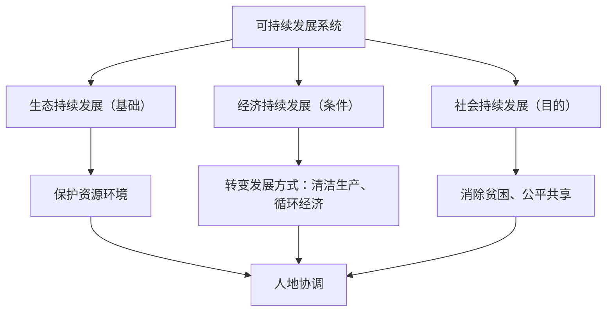

# 第二节 走向人地协调——可持续发展

## 核心概念

- **可持续发展**：既满足**当代人**的需求，又不损害**后代人**满足其需求能力的发展（1987年《我们共同的未来》提出）。
- **三大内涵**：生态持续（基础）、经济持续（条件）、社会持续（目的），三者相互联系、相互制约，构成复合系统。
- **三大原则**：**公平性**（代内、代际、人与物种、国家间公平）、**持续性**（经济活动保持在资源环境承载力之内）、**共同性**（全球问题需全球合作，共同但有区别的责任）。

## 知识梳理

| 实现途径 | 内容 | 案例 |
| --- | --- | --- |
| 消除贫困 | 贫困导致对资源的过度依赖，是实现可持续发展的重要目标 | 我国脱贫攻坚战全面胜利 |
| 发展绿色经济 | 循环经济、清洁生产、低碳经济 | 桑基鱼塘、工业园区废物互用 |
| 可持续消费 | 绿色出行、节水节电、垃圾分类、光盘行动 | 公众参与、简约适度生活 |

## 重点精讲

1. **三原则辨析**（高考高频）：出现"贫富差距、南北关系、保护物种"→公平性；出现"资源开发适度、不超过承载力"→持续性；出现"国际合作、全球公约"→共同性。一个案例可同时体现多原则。
2. **循环经济与清洁生产**：循环经济遵循"减量化、再利用、资源化"（3R）原则；清洁生产从**原料开采—生产—消费—废弃物处理全过程**评估环境影响，区别于只治理末端的传统模式。农业上表现为**生态农业**（如珠三角基塘生产）。
3. **传统发展观 vs 可持续发展观**：前者以经济增长（GDP）为唯一目标、先污染后治理；后者追求经济、社会、生态三效益统一，从源头预防。
4. **公众参与**：可持续发展从观念走向实践，既需政府（法规、规划）、企业（清洁生产），更需**公众**转变消费方式——绿色消费、低碳生活是每个人的责任。

## 典型例题

**例1（选择题）** "共同但有区别的责任"要求发达国家在全球减排中承担更多义务，这主要体现可持续发展的（　）
A. 持续性原则　B. 公平性原则与共同性原则　C. 阶段性原则　D. 效益优先原则
**解析**：全球合作应对气候变化体现共同性；发达国家历史排放多、能力强而多担责任，兼顾国家间公平。选 **B**。

**例2（综合题）** 珠江三角洲的基塘农业将甘蔗、桑叶、蚕沙、塘泥与鱼塘循环利用。说明该模式如何体现可持续发展思想。
**解析**：①物质循环利用：蔗叶桑叶喂蚕（鱼）、蚕沙入塘养鱼、塘泥肥田，废弃物资源化，减少污染排放——生态持续；②多种经营，农产品多样，增加农民收入，抗市场风险能力强——经济持续；③增加就业机会，促进农村发展——社会持续；④资源利用强度控制在环境承载力之内，体现持续性原则，实现经济、社会、生态效益统一。

## 易错点

- 可持续发展**不是不发展**、也不是单纯环保，而是发展与保护的统一，发展中国家尤须坚持发展。
- 三内涵地位不同：生态是**基础**、经济是**条件**、社会是**目的**，排序题常考。
- 代际公平（当代与后代）与代内公平（同代不同人群、国家）都属公平性原则。
- 清洁生产是**全过程控制**，不能理解为"生产过程干净"或只处理废弃物。

## 背记要点

1. 定义关键词：满足当代+不损害后代
2. 三内涵：生态（基础）、经济（条件）、社会（目的）
3. 三原则：公平性、持续性、共同性
4. 途径：消除贫困、绿色经济（3R循环经济、清洁生产）、可持续消费
5. **高考视角**：常以生态农业、工业园区物料流程图为载体，考查"判断体现的原则/内涵+说明效益"，作答扣紧经济、社会、生态三效益。

## 自测题

1. 写出可持续发展的定义及三大内涵的相互关系。
2. 用实例分别说明公平性、持续性、共同性原则。
3. 清洁生产与传统末端治理有何区别？
4. 中学生可以通过哪些行动践行可持续消费？

## 相关知识点

环境问题的表现与成因见 [[第一节 人类面临的主要环境问题]]；可持续发展的中国实践见 [[第三节 中国国家发展战略举例]]；承载力约束见 [[第三节 人口容量]]。
