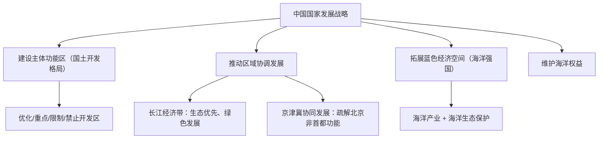

# 第三节 中国国家发展战略举例

## 核心概念

- **主体功能区**：依据资源环境承载能力、现有开发强度、发展潜力，将国土划分为**优化开发、重点开发、限制开发、禁止开发**四类区域，明确各区域的主体功能定位。
- **区域协调发展战略**：包括长江经济带发展（"共抓大保护、不搞大开发"）、京津冀协同发展、粤港澳大湾区建设等，推动生产要素合理流动、区域优势互补。
- **海洋强国与维护海洋权益**：发展海洋经济、保护海洋环境、捍卫**领海、专属经济区（200海里）**等海洋权益，钓鱼岛、南海诸岛是我国固有领土。

## 知识梳理

| 主体功能区 | 定位 | 典型区域 |
| --- | --- | --- |
| 优化开发区 | 开发强度已高，需转型升级 | 京津冀、长三角、珠三角 |
| 重点开发区 | 承载力较强、潜力大，工业化城镇化主战场 | 中西部部分城市群 |
| 限制开发区 | 农产品主产区+重点生态功能区 | 东北平原农区、三江源草原区 |
| 禁止开发区 | 依法保护的自然文化区域 | 自然保护区、国家公园、风景名胜区 |

## 重点精讲

1. **划分主体功能区的依据**（高考高频）：①资源环境承载能力；②现有开发强度（密度）；③未来发展潜力。目的：因地制宜、协调开发与保护，优化国土空间开发格局。
2. **长江经济带**：覆盖11省市，战略定位为**生态文明建设先行示范带**、综合立体交通走廊、协调发展带、对外开放带；核心要求"共抓大保护、不搞大开发"——先治污（化工围江整治）、护岸线、修复生态，再谈发展。
3. **京津冀协同发展**：核心是**疏解北京非首都功能**（一般制造业、区域性批发市场、部分教育医疗机构外迁），建设北京城市副中心（通州）与河北**雄安新区**（集中承载地）；交通一体化（轨道上的京津冀）、生态联防联治、产业协作（首钢迁曹妃甸）为三大先行领域。
4. **海洋权益**：内水与领海（12海里）拥有主权；专属经济区（200海里）享有资源勘探开发等主权权利。维护海洋权益关系国家安全与可持续发展，需坚持主权属我、搁置争议、共同开发原则处理争端。

## 典型例题

**例1（选择题）** 三江源地区被列为限制开发区域中的重点生态功能区，主要原因是（　）
A. 矿产资源贫乏　B. 是重要江河源头，生态屏障作用突出且生态脆弱　C. 交通不便　D. 人口过多
**解析**：三江源是长江、黄河、澜沧江发源地，高寒生态系统脆弱，水源涵养功能关系全国生态安全，故限制大规模开发。选 **B**。

**例2（综合题）** 结合京津冀协同发展战略，说明设立雄安新区的目的及其区位优势。
**解析**：目的：①集中承接北京**非首都功能**疏解，缓解北京"大城市病"（人口拥挤、交通拥堵、房价高企、环境压力）；②培育京津冀新增长极，优化区域空间结构，带动河北发展，缩小区域差距；③探索人口经济密集地区优化开发新模式。区位优势：①地处京津保腹地，距京津约100千米，区位适中；②交通便捷（高铁、高速网络）；③土地、水资源（白洋淀）有一定保障，开发程度低，发展空间大；④生态环境较好，可高起点规划建设绿色智慧新城。

## 易错点

- "限制开发"限制的是**大规模高强度工业化城镇化开发**，并非限制发展，农业与生态旅游仍可发展。
- 长江经济带战略核心是**生态优先**，不能答成"加快沿江重化工业布局"。
- 领海（12海里，主权）与专属经济区（200海里，主权权利）性质不同，勿混淆。
- 疏解北京非首都功能≠迁走首都职能，政治、文化、国际交往、科技创新四大中心职能保留强化。

## 背记要点

1. 主体功能区四类型：优化、重点、限制、禁止
2. 长江经济带：共抓大保护、不搞大开发，生态优先绿色发展
3. 京津冀协同：疏解非首都功能，雄安新区+城市副中心两翼
4. 海洋权益：领海12海里、专属经济区200海里
5. **高考视角**：国家战略是热点常客，常结合区域图考查"战略目的+区位条件+地理意义"，答题注意扣"协调、绿色、安全"等发展理念。

## 自测题

1. 主体功能区划分的三个主要依据是什么？
2. 简述"共抓大保护、不搞大开发"的内涵。
3. 说明疏解北京非首都功能对河北的积极影响。
4. 我国在专属经济区内享有哪些权利？

## 相关知识点

可持续发展理论基础见 [[第二节 走向人地协调——可持续发展]]；环境问题背景见 [[第一节 人类面临的主要环境问题]]；工业疏解案例见 [[第二节 工业区位因素及其变化]]；交通一体化支撑见 [[第二节 交通运输布局对区域发展的影响]]。
