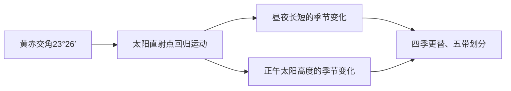

# 第二节 地球运动的地理意义

## 概念定义

- **晨昏线**：昼半球与夜半球的分界线，由晨线（夜→昼）和昏线（昼→夜）组成，始终与太阳光线垂直。
- **地方时**：因经度不同而不同的时刻，经度每差15°地方时差1小时，东早西晚。
- **时区与区时**：全球分24个时区，每区跨经度15°，以中央经线的地方时为**区时**；北京时间=东八区区时=120°E地方时。
- **地转偏向力**：沿地表水平运动的物体发生偏转，**北半球右偏、南半球左偏、赤道不偏**。
- **正午太阳高度**：一天中最大的太阳高度，H = 90° − |当地纬度 ± 直射点纬度|（同减异加，即纬度差）。

## 知识梳理

| 地理意义 | 由何产生 | 规律要点 |
| --- | --- | --- |
| 昼夜交替 | 自转（+不透明球体） | 周期为1个太阳日（24小时） |
| 时差 | 自转 | 东加西减；过日界线（大致180°经线）日期变更：向东减一天，向西加一天 |
| 地转偏向 | 自转 | 北右南左；影响河岸侵蚀、风向、洋流 |
| 昼夜长短变化 | 公转+黄赤交角 | 直射点所在半球昼长夜短，纬度越高昼越长 |
| 正午太阳高度变化 | 公转+黄赤交角 | 由直射点纬度向南北两侧递减 |
| 四季与五带 | 公转+黄赤交角 | 昼夜长短、正午太阳高度的年变化 |

**昼夜长短规律（北半球）**：夏至日昼最长、北极圈内极昼；冬至日昼最短、北极圈内极夜；二分日全球昼夜平分。直射点**北移**期间（冬至→夏至），北半球昼渐长。

**正午太阳高度应用**：楼间距（冬至日最小太阳高度计算）、太阳能热水器倾角（倾角=当地纬度与直射点纬度差）、判断房屋朝向与日影方位。

## 典型例题

**例1（计算题）** 北京时间6月22日12:00时，西五区（纽约附近）的区时是多少？
**解析**：东八区与西五区相差13个时区，纽约在西侧，用减法：12:00 − 13 = −1，即前一日23:00。答：**6月21日23:00**。

**例2（计算题）** 夏至日，北京（40°N）的正午太阳高度是多少？此日北京昼夜状况如何？
**解析**：H = 90° − |40° − 23°26′| = 90° − 16°34′ = **73°26′**。夏至日太阳直射北回归线，北半球各地昼最长夜最短，北京昼长夜短且达一年中最大值（约15小时）。

## 易错点

- 日期变更：**自然日界线**（0时经线）与**人为日界线**（180°经线附近）共同划分新旧两天；新的一天范围=从0时经线向东到180°。
- 地转偏向沿**运动方向**判断左右，不是沿地图方位；赤道上不偏转。
- 正午太阳高度公式中的"纬度差"：直射点与所求点**同半球相减、异半球相加**。
- 昼夜长短变化幅度：赤道全年昼夜等长，纬度越高变化幅度越大。
- 晨昏线上太阳高度为0°；晨昏线与经线重合是二分日，与极圈相切是二至日。

## 背记要点

1. 经度15°=1小时，1°=4分钟；东加西减
2. 过180°日界线：东→西加一天，西→东减一天
3. 地转偏向：北右南左赤道无
4. H = 90° − 纬度差（同减异加）
5. 直射点在哪个半球，该半球昼长夜短；纬度越高昼越长
6. 二分日：晨昏线过极点、全球昼夜平分、太阳正东升正西落

## 自测题

1. 某日120°E为12:00，全球处于同一天，此刻180°经线地方时是多少？（提示：0时经线与180°重合）
2. 计算冬至日广州（23°N）的正午太阳高度。
3. 北半球河流（自南向北流）哪岸侵蚀严重？为什么？
4. 说明北京从秋分到冬至昼夜长短及其变化趋势。

## 相关知识点

自转、公转的基本特征与黄赤交角见 [[第一节 地球的自转和公转]]；地转偏向力对大气运动方向的影响见 [[第二节 气压带和风带]]；对洋流流向的影响见 [[第二节 洋流]]。
