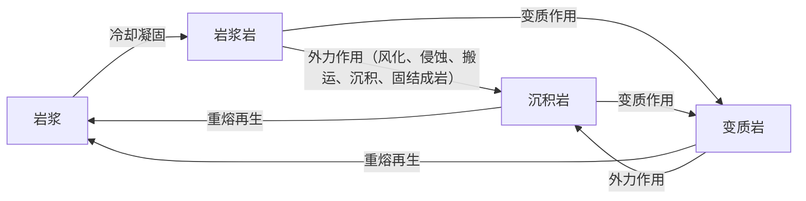

# 第一节 塑造地表形态的力量

## 概念定义

- **内力作用**：能量来自地球内部（放射性元素衰变产生的热能），表现为地壳运动、岩浆活动、变质作用，总趋势是使地表**高低不平**。
- **外力作用**：能量来自地球外部（主要是太阳辐射能），表现为风化、侵蚀、搬运、堆积，总趋势是**削高填低**、使地表趋于平缓。
- **岩石圈物质循环**：岩浆与三大类岩石（岩浆岩、沉积岩、变质岩）之间的相互转化过程。

## 知识梳理

| 外力作用 | 典型地貌 | 分布区 |
| --- | --- | --- |
| 风力侵蚀 | 风蚀蘑菇、雅丹地貌 | 干旱区（西北） |
| 风力堆积 | 沙丘、黄土堆积 | 干旱区边缘、黄土高原 |
| 流水侵蚀 | 峡谷、瀑布、黄土沟壑 | 湿润半湿润区 |
| 流水堆积 | 冲积扇、冲积平原、三角洲 | 山前、河流中下游 |
| 冰川侵蚀 | 角峰、刃脊、U形谷、冰斗 | 高纬高山（挪威峡湾） |
| 海浪侵蚀/堆积 | 海蚀崖、海蚀柱／沙滩 | 基岩海岸／沙质海岸 |

**三大类岩石要点**：岩浆岩分侵入岩（花岗岩，矿物结晶好）与喷出岩（玄武岩，多气孔）；沉积岩具**层理构造、常含化石**（石灰岩、砂岩、页岩）；变质岩由高温高压变质而成（大理岩←石灰岩，板岩←页岩，石英岩←砂岩，片麻岩←花岗岩）。

**判读技巧**：物质循环图中，指向岩浆的箭头为重熔再生；由岩浆发出的箭头只有一个（冷却凝固→岩浆岩）；三进一出者为岩浆，一进三出者为岩浆岩（教材版本以"只有岩浆能生成岩浆岩"为突破口）。

## 典型例题

**例1（选择题）** 大理岩是石灰岩在高温高压条件下形成的，其形成过程属于（　）
A. 岩浆活动　B. 变质作用　C. 固结成岩　D. 风化作用
**解析**：已生成的岩石在高温高压下矿物成分和结构发生改变，属变质作用，产物为变质岩。选 **B**。

**例2（综合题）** 简述黄土高原千沟万壑地表形态的成因。
**解析**：①黄土由**风力堆积**形成（内力抬升为高原基础）；②黄土土质疏松、垂直节理发育；③地处季风区，夏季多暴雨，加之植被破坏，**流水侵蚀**强烈，形成千沟万壑、支离破碎的地表形态。体现"风力堆积成塬、流水侵蚀成沟"。

## 易错点

- 内、外力作用**同时进行**、共同塑造地表，一般内力起主导（但特定区域可能外力显著，如黄土沟壑）。
- 风化作用≠风力作用：风化指岩石在温度、水、生物作用下原地崩解破碎，无搬运。
- 只有沉积岩含化石、具层理；花岗岩是侵入岩（未喷出地表），玄武岩才是喷出岩。
- 冲积扇位于**出山口**（堆积），峡谷位于山区河段（侵蚀），不要混淆位置。

## 背记要点

1. 内力：地壳运动（主要形式）、岩浆活动、变质作用——使地表高低起伏
2. 外力：风化→侵蚀→搬运→堆积→固结成岩——削高填低
3. 岩石圈循环：岩浆→岩浆岩（唯一路径）；各类岩石可变质、可重熔、可外力改造成沉积岩
4. 四组变质对应：石灰岩→大理岩、页岩→板岩、砂岩→石英岩、花岗岩→片麻岩
5. 干旱区看风力、湿润区看流水、高纬高山看冰川、沿海看海浪

## 自测题

1. 列表比较内力作用与外力作用的能量来源、表现形式和对地表的影响。
2. 画出岩石圈物质循环简图并标注各环节名称。
3. 判断：雅丹地貌、三角洲、U形谷、海蚀柱各由何种外力作用形成？
4. 为什么花岗岩常构成陡峻山体（如黄山），而其上又多球状风化地貌？

## 相关知识点

地壳运动形成的褶皱、断层等构造地貌见 [[第二节 构造地貌的形成]]；流水作用塑造的典型地貌见 [[第三节 河流地貌的发育]]。
