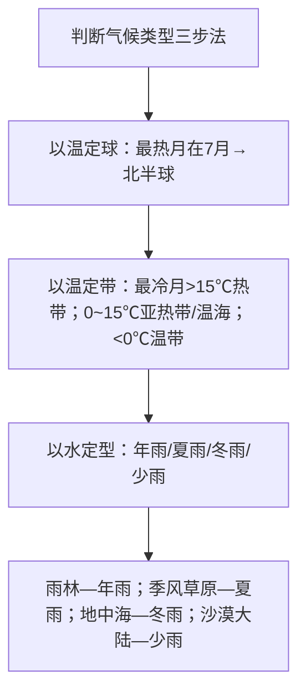

# 第三节 气压带和风带对气候的影响

## 概念定义

- **气候**：某地多年天气的综合状况，由**气温**和**降水**两大要素刻画。
- **单一气压带/风带控制的气候**：全年受同一系统控制，气候特征全年一致（如热带雨林、温带海洋性、热带沙漠气候）。
- **气压带风带交替控制的气候**：随季节移动而交替受两种系统控制，气候有明显干湿/冷热季节（如地中海气候、热带草原气候）。

## 知识梳理

| 气候类型 | 分布规律 | 成因 | 特征 |
| --- | --- | --- | --- |
| 热带雨林气候 | 南北纬10°之间 | 全年赤道低压控制 | 终年高温多雨 |
| 热带草原气候 | 10°~回归线 | 赤道低压与信风交替 | 全年高温，干湿季分明 |
| 热带沙漠气候 | 回归线~30°大陆西岸内部 | 副高或信风控制 | 终年炎热干燥 |
| 热带季风气候 | 南亚、中南半岛 | 气压带风带移动+海陆热力差异 | 全年高温，旱雨两季 |
| 地中海气候 | 30°~40°大陆西岸 | **夏副高、冬西风**交替 | 夏季炎热干燥，冬季温和多雨 |
| 温带海洋性气候 | 40°~60°大陆西岸 | 全年西风控制 | 终年温和湿润 |
| 亚热带季风气候 | 25°~35°大陆东岸 | 海陆热力性质差异 | 夏热多雨，冬温少雨 |
| 温带季风气候 | 35°~55°大陆东岸 | 海陆热力性质差异 | 夏热多雨，冬寒干燥 |
| 温带大陆性气候 | 温带大陆内部 | 深居内陆，远离海洋 | 冬冷夏热，全年少雨 |

**影响气候的主要因素**：纬度（太阳辐射）→大气环流（气压带风带、季风）→海陆位置→洋流→地形。分析某地气候成因时按此顺序逐项检验。

**特殊气候区**（高考常考）：马达加斯加岛东侧、巴西高原东南沿海——虽在回归线附近却为热带雨林气候（信风迎风坡+暖流增湿）；东非高原赤道附近为热带草原气候（地势高、气温低、对流弱）。

## 典型例题

**例1（选择题）** 地中海气候夏季炎热干燥的原因是（　）
A. 受信风带控制　B. 受副热带高压带控制　C. 受西风带控制　D. 受赤道低压带控制
**解析**：夏季气压带风带北移，30°~40°大陆西岸受**副热带高压**控制，盛行下沉气流，炎热干燥；冬季风带南移受**西风**控制，温和多雨。选 **B**。

**例2（综合题）** 欧洲西部温带海洋性气候面积广大且深入内陆，分析其原因。
**解析**：①纬度40°~60°，终年受**盛行西风**控制；②沿岸有**北大西洋暖流**增温增湿；③海岸线曲折，海洋影响深入；④中部为平原，阿尔卑斯山呈**东西走向**，不阻挡西风深入内陆。多因素叠加使温和湿润的气候东伸至波兰一带。

## 易错点

- 热带草原与热带季风气候都分旱雨两季：季风气候**雨季降水更集中、月降水可超600mm**，且分布于亚洲；草原气候降水相对和缓。
- 地中海气候是**冬雨型**（唯一雨热不同期的常考类型），别写成夏雨。
- 温带海洋性气候与温带季风气候区分：前者最冷月>0℃、降水均匀；后者最冷月<0℃、降水集中夏季。
- 季风气候成因是海陆热力差异（南亚加风带移动），不能答"气压带风带交替控制"。
- 同纬度大陆东西岸气候不同，说明**大气环流+洋流**的作用，不能只考虑纬度。

## 背记要点

1. 单一控制：雨林（赤低）、沙漠（副高/信风）、温海（西风）
2. 交替控制：草原（赤低+信风）、地中海（副高+西风）
3. 三种季风气候在大陆东岸；地中海、温海在大陆西岸
4. 判读口诀：以温定球、以温定带、以水定型
5. 最冷月：>15℃热带，0~15℃亚热带与温海，<0℃温带
6. 特殊区：马岛东侧雨林、东非高原草原、巴塔哥尼亚沙漠（安第斯山雨影）

## 自测题

1. 说明热带草原气候干湿两季的形成原因。
2. 比较地中海气候与亚热带季风气候的分布位置和降水季节差异。
3. 某地最冷月2℃、降水集中冬季，判断其气候类型与南北半球依据。
4. 分析东非高原赤道地区未形成热带雨林气候的原因。

## 相关知识点

气压带风带的分布与移动规律见 [[第二节 气压带和风带]]；具体天气过程的系统分析见 [[第一节 常见天气系统]]；洋流对沿岸气候的影响见 [[第二节 洋流]]；气候作为要素参与自然环境整体性见 [[第一节 自然环境的整体性]]。
