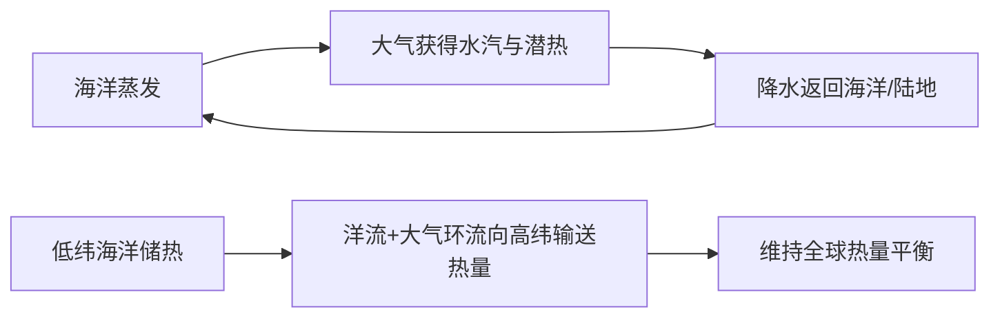

# 第三节 海—气相互作用

## 概念定义

- **海—气相互作用**：海洋与大气之间进行**水分**和**热量**交换的过程，共同维持全球水热平衡。海洋是大气最主要的水汽来源（约86%的大气水汽来自海洋蒸发）和热量储存库。
- **沃克环流**：正常年份赤道太平洋上空的热力环流——西暖东冷，西侧（澳大利亚—印尼一带）上升多雨，东侧（南美西岸）下沉少雨。
- **厄尔尼诺**：赤道中东太平洋海水**异常升温**的现象；**拉尼娜**：赤道中东太平洋海水**异常降温**的现象。

## 知识梳理

| 项目 | 正常年份 | 厄尔尼诺年 | 拉尼娜年 |
| --- | --- | --- | --- |
| 东南信风 | 正常 | **减弱** | 增强 |
| 赤道太平洋水温 | 西暖东冷 | 东部异常**升温** | 东部异常**降温**（西暖东冷加剧） |
| 沃克环流 | 正常 | 减弱甚至反向 | 增强 |
| 秘鲁沿岸 | 上升流强，渔场繁盛 | 上升流减弱，**渔业减产**、鸟类死亡，多**暴雨洪涝** | 更加干燥 |
| 澳、印尼一带 | 多雨 | **干旱、森林火灾** | 降水偏多、洪涝 |
| 对我国影响（一般倾向） | —— | 夏季风偏弱、南涝北旱、台风偏少、暖冬 | 夏季风偏强、北涝南旱、台风偏多、冷冬 |

**海洋对大气的调节**：海水热容量大，升温慢降温慢，使沿海地区**气温年较差、日较差小**；海洋通过蒸发向大气输送水汽和潜热，是大气运动的重要能量来源。

**水热平衡意义**：低纬度海洋获得的热量盈余，通过**大气环流和大洋环流**输送到高纬度，使全球高低纬间热量收支趋于平衡；海—气间的水分交换构成全球水循环的主体环节。

## 典型例题

**例1（选择题)** 厄尔尼诺发生时，下列现象可信的是（　）
A. 秘鲁沿岸渔获量大增　B. 印度尼西亚多发森林大火　C. 东南信风显著增强　D. 赤道东太平洋水温异常偏低
**解析**：厄尔尼诺年东南信风减弱，暖水东移，东太平洋升温、上升流减弱，秘鲁渔业**减产**；西太平洋（印尼、澳大利亚）下沉气流增强，**干旱少雨易发森林火灾**。选 **B**。

**例2（综合题）** 从海—气相互作用角度，说明厄尔尼诺现象的形成过程及其对秘鲁沿岸的影响。
**解析**：形成：东南信风**减弱**→赤道表层暖海水向西输送减少并向东回流→赤道中东太平洋水温**异常升高**→沃克环流减弱。影响：①秘鲁沿岸上升补偿流减弱，营养盐上泛减少，浮游生物与鱼类锐减，渔业减产；②沿岸海温升高，空气对流增强，原本干旱的沿岸出现**暴雨洪涝**灾害。体现海洋水温异常通过改变大气环流引发气候异常。

## 易错点

- 厄尔尼诺的根源是**海—气耦合异常**（信风减弱与海温升高互为因果），不能简单说"洋流方向改变"导致一切。
- 厄尔尼诺≠全球变暖：前者是年际尺度的海温**异常波动**，后者是长期趋势；但两者都会引发极端天气。
- 拉尼娜不是"正常状态"，而是正常状态（西暖东冷）的**加剧**版本。
- 厄尔尼诺对我国的影响是**概率性倾向**（夏季风偏弱、南涝北旱等），答题时宜加"往往、可能"等限定词。
- 海洋对大气"调节"体现为热容量大→温差小，别答成"海洋升温快"。

## 背记要点

1. 海—气交换两大内容：水分（蒸发—降水）+热量（潜热输送）
2. 热量盈余由低纬→高纬：靠大气环流+大洋环流两条"传送带"
3. 正常沃克环流：西升东沉、西湿东干
4. 厄尔尼诺：信风弱→东太平洋暖→秘鲁涝渔减、印尼澳旱
5. 拉尼娜：信风强→东太平洋更冷→影响大致相反
6. 我国倾向：厄尔尼诺年夏季风弱、南涝北旱；拉尼娜年相反

## 自测题

1. 说明海洋对大气温度的调节作用及其原理。
2. 画出正常年份沃克环流示意图，并说明厄尔尼诺年其如何变化。
3. 比较厄尔尼诺与拉尼娜发生时赤道太平洋东西两岸的天气差异。
4. 为什么说海—气相互作用维持了全球的水热平衡？

## 相关知识点

秘鲁寒流与上升流渔场见 [[第二节 洋流]]；信风带的成因与分布见 [[第二节 气压带和风带]]；陆地水循环环节见 [[第一节 陆地水体及其相互关系]]；气候异常牵一发而动全身，体现 [[第一节 自然环境的整体性]]。
