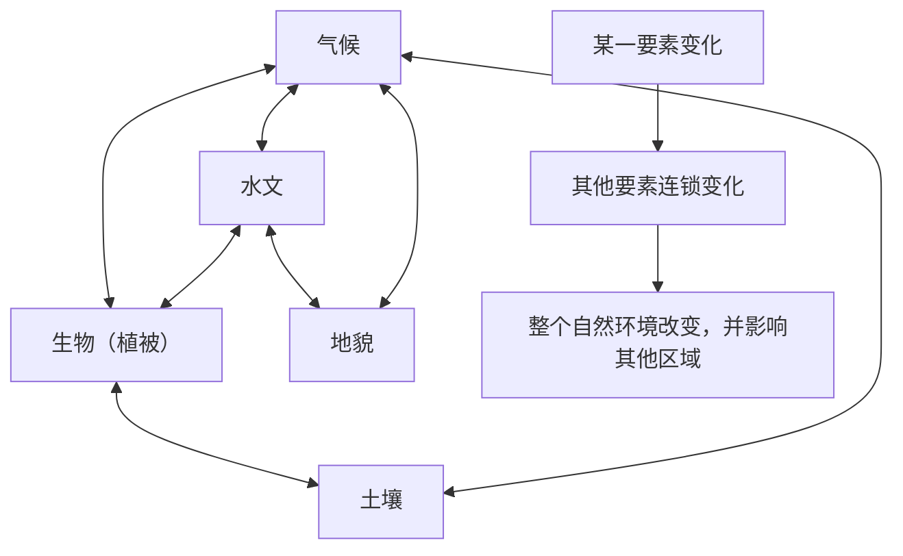

# 第一节 自然环境的整体性

## 概念定义

- **自然环境要素**：大气、水、土壤、生物、岩石（地貌）等，通过**水循环、生物循环、岩石圈物质循环**进行物质迁移和能量交换。
- **整体性**：各自然环境要素相互联系、相互制约，组成有机整体；表现为要素间协调统一、"**牵一发而动全身**"、区域之间相互联系。
- **自然环境的功能**：整体大于部分之和，包括**生产功能**（合成有机物，主要靠植物光合作用）和**稳定功能**（要素相互作用消除干扰，保持性质稳定，如碳氧平衡）。

## 知识梳理

| 整体性表现 | 含义 | 案例 |
| --- | --- | --- |
| 要素协调统一 | 各要素与环境总体特征一致 | 我国西北：干旱→河流少内流河、植被荒漠、土壤发育差、风沙地貌 |
| 牵一发而动全身 | 某要素变化引起其他要素乃至全局变化 | 滥伐森林→水土流失→河湖淤积→旱涝加剧→气候恶化 |
| 区域间相互联系 | 一个区域的变化影响其他区域 | 黄土高原水土流失→黄河下游"地上河"、三角洲扩展；青藏高原隆升→东亚季风增强、西北更干旱 |

**演化的整体性**：各要素统一演化，一个要素的演化伴随其他要素的演化（如湖泊萎缩：水面缩小→气候变干→水生生物减少→湖底出露、盐碱化→最终演变为陆地）。

**分析模板**（北京卷高频）：某要素变化→依次分析对气候（局地温湿）、水文（径流含沙量）、地貌（侵蚀堆积）、土壤（肥力）、生物（多样性）的影响，最后落到"整体环境退化/改善"。

## 典型例题

**例1（选择题）** 修建水库后，库区周围空气湿度增大、雾日增多，土壤趋于湿润，鸟类增多。这体现了自然环境的（　）
A. 差异性　B. 整体性　C. 稳定功能丧失　D. 生产功能增强
**解析**：水文要素改变（蓄水）引起大气、土壤、生物等要素连锁变化，"牵一发而动全身"，体现**整体性**。选 **B**。

**例2（综合题）** 运用整体性原理，分析大量开采地下水引发的环境连锁变化。
**解析**：过量开采地下水→**地下水位下降**→①地表植被因缺水退化，土地荒漠化/盐渍化加剧；②河湖因失去地下水补给而径流减少甚至干涸；③地面沉降、沿海地区**海水入侵**、水质恶化；④土壤干化、肥力下降；⑤局地气候更趋干燥。一个要素（水）的变化引起生物、土壤、地貌、气候等要素连锁恶化，说明自然环境是相互制约的整体。

## 易错点

- 整体性≠各要素简单相加：自然环境具有**生产功能、稳定功能**等整体功能，"整体大于部分之和"。
- 稳定功能是指自然环境通过要素相互作用**削减外界干扰**（如海洋和植被吸收CO₂缓解升温），不是"环境永不改变"。
- 分析连锁影响要按因果链条**逐环推导**，不能罗列无逻辑关系的要素。
- 区域间联系易被忽略：上游破坏影响下游、青藏高原隆升影响东亚气候等都属于整体性表现。
- 整体性与差异性并不矛盾：整体性讲要素间联系，差异性讲空间上的分异。

## 背记要点

1. 五大要素：气候、水文、地貌、生物、土壤（岩石）
2. 三大物质循环：水循环、生物循环、岩石圈物质循环
3. 两大功能：生产功能（光合作用合成有机物）、稳定功能（碳氧平衡）
4. 三个表现：要素协调统一、牵一发而动全身、区域间相互联系
5. 案例储备：西北干旱环境要素组合、森林破坏连锁反应、湖泊演化为陆地

## 自测题

1. 以我国西北地区为例，说明自然环境各要素如何体现"协调统一"。
2. 什么是自然环境的稳定功能？以大气CO₂浓度为例说明。
3. 用整体性原理分析黄土高原植树种草对当地和黄河下游的影响。
4. 举例说明"一个区域的变化不可避免地影响其他区域"。

## 相关知识点

自然环境在空间上的分异规律见 [[第二节 自然环境的地域差异性]]；岩石圈物质循环见 [[第一节 塑造地表形态的力量]]；水循环与水体转化见 [[第一节 陆地水体及其相互关系]]；海—气间的物质能量交换见 [[第三节 海—气相互作用]]。
