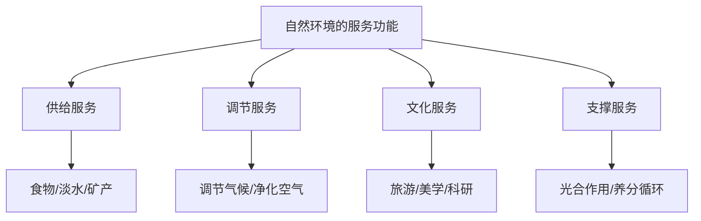

# 第一节 自然环境的服务功能

## 核心概念

**自然环境的服务功能**：自然环境为人类生存和发展所提供的各种服务，主要包括**供给服务**、**调节服务**、**文化服务**和**支撑服务**。

**供给服务**：提供食物、淡水、矿产、木材等物质和能量。

**调节服务**：调节气候、净化空气和水、涵养水源、防风固沙等。

**文化服务**：提供休闲娱乐、美学欣赏、精神文化等价值。

**支撑服务**：维持地球生命系统的基础功能，如养分循环、光合作用、水循环等。

## 知识梳理

| 服务类型 | 主要内容 | 举例 |
| --- | --- | --- |
| 供给服务 | 提供物质和能量 | 粮食、淡水、木材 |
| 调节服务 | 调节环境 | 调节气候、净化空气 |
| 文化服务 | 精神文化价值 | 旅游、美学、科研 |
| 支撑服务 | 维持生命系统 | 光合作用、养分循环 |

## 重点探究

**探究**：为什么说支撑服务是其他服务的基础？

**解**：支撑服务如光合作用、养分循环、水循环等，是维持地球生命系统正常运转的基础，没有支撑服务，供给、调节、文化服务都无法实现。

**探究**：人类活动如何影响自然环境的服务功能？

**解**：合理利用可维持服务功能；过度开发（如滥伐森林、过度捕捞）会削弱甚至破坏服务功能，导致生态退化。

## 易错点

- 供给服务提供的是**物质和能量**，调节服务是**调节环境**，二者易混淆。
- 支撑服务是**基础性**的，常被忽略但最重要。
- 文化服务强调**精神文化价值**，不是物质供给。
- 服务功能会因人类不合理活动而**退化**。

## 背记要点

1. 四大服务：供给、调节、文化、支撑。
2. 支撑服务是其他服务的基础。
3. 供给—物质能量；调节—环境；文化—精神；支撑—生命系统。
4. 合理利用，保护服务功能。

## 自测题

1. 自然环境的服务功能包括____、____、____、____四类。
2. 提供粮食属于____服务。
3. 调节气候属于____服务。
4. 光合作用属于____服务。

## 相关知识点

自然资源见 [[第二节 自然资源及其利用]]；环境问题见 [[第三节 环境问题及其危害]]。
