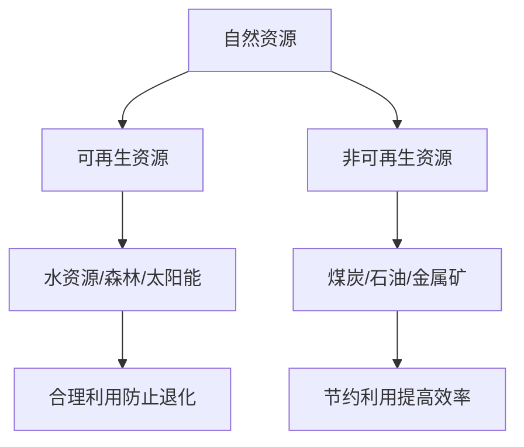

# 第二节 自然资源及其利用

## 核心概念

**自然资源**：在一定经济技术条件下，自然界中对人类有用、能被人类利用的物质和能量的总称。

**自然资源的属性**：具有**有限性**、**整体性**、**地域性**、**多用性**等特征。

**自然资源的分类**：按能否再生分为**可再生资源**（如水资源、森林资源）和**非可再生资源**（如矿产资源、化石燃料）。

## 知识梳理

| 分类 | 特点 | 举例 | 利用注意 |
| --- | --- | --- | --- |
| 可再生资源 | 可更新、循环 | 水、森林、太阳能 | 合理利用、防止退化 |
| 非可再生资源 | 有限、不可再生 | 煤、石油、金属矿 | 节约、提高利用率 |

## 重点探究

**探究**：为什么说自然资源具有有限性？

**解**：非可再生资源储量有限、用一点少一点；可再生资源若利用速度超过其再生速度，也会枯竭，因此自然资源总体是有限的。

**探究**：如何实现自然资源的可持续利用？

**解**：节约资源、提高利用率、开发新能源、保护可再生资源，实现资源利用与生态保护的协调。

## 易错点

- 可再生资源**并非取之不尽**，过度利用会退化甚至枯竭。
- 非可再生资源用一点少一点，具有**有限性**。
- 自然资源具有**地域性**，分布不均。
- 判断是否为自然资源，需同时满足"有用"和"能被利用"。

## 背记要点

1. 自然资源属性：有限性、整体性、地域性、多用性。
2. 可再生资源：水、森林、太阳能；非可再生：煤、石油、矿。
3. 可再生资源也要合理利用，防止退化。
4. 可持续利用：节约、提效、开发新能源。

## 自测题

1. 自然资源按能否再生分为____和____。
2. 煤炭属于____资源。
3. 太阳能属于____资源。
4. 自然资源具有____、____等属性。

## 相关知识点

资源安全见 [[第一节 资源安全对国家安全的影响]]；能源安全见 [[第二节 中国的能源安全]]。
