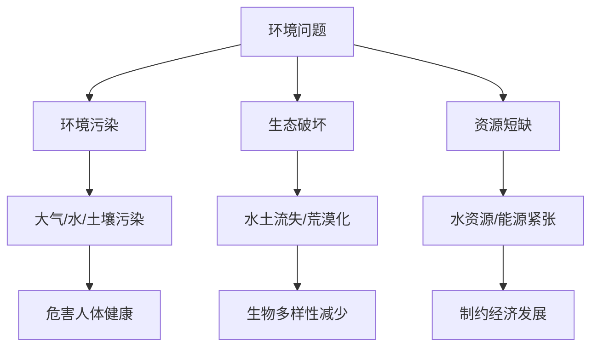

# 第三节 环境问题及其危害

## 核心概念

**环境问题**：由于人类活动或自然原因使环境质量下降、生态平衡遭到破坏的现象。

**环境问题的类型**：主要包括**环境污染**（大气、水、土壤污染）和**生态破坏**（水土流失、土地荒漠化、生物多样性减少）。

**环境问题的危害**：危害人体健康、破坏生态系统、制约经济发展、威胁国家安全。

## 知识梳理

| 类型 | 表现 | 危害 |
| --- | --- | --- |
| 环境污染 | 大气、水、土壤污染 | 危害健康、影响生产 |
| 生态破坏 | 水土流失、荒漠化 | 生态退化、生物多样性减少 |
| 资源短缺 | 水资源、能源紧张 | 制约发展、引发冲突 |

## 重点探究

**探究**：环境问题产生的主要原因是什么？

**解**：主要是**人类不合理活动**，如过度排放污染物、过度开发资源、破坏植被等，超过了环境的自净能力和承载能力。

**探究**：环境问题对国家安全有何影响？

**解**：环境问题会危害人民健康、破坏生态、制约经济，甚至引发资源争夺和冲突，从而威胁国家安全。

## 易错点

- 环境污染与生态破坏是**不同类型**的环境问题，不能混为一谈。
- 环境问题既有**人为原因**，也有自然原因，但以人为为主。
- 环境问题具有**全球性**（如气候变化）和**区域性**。
- 环境问题的危害是多方面的，包括健康、生态、经济、安全。

## 背记要点

1. 环境问题：环境污染、生态破坏、资源短缺。
2. 主要原因是人类不合理活动。
3. 危害：健康、生态、经济、国家安全。
4. 环境污染—大气/水/土壤；生态破坏—水土流失/荒漠化。

## 自测题

1. 环境问题主要包括____、____、____三类。
2. 水土流失属于____问题。
3. 大气污染属于____问题。
4. 环境问题产生的主要原因是____。

## 相关知识点

环境安全见 [[第一节 环境安全对国家安全的影响]]；环境污染见 [[第二节 环境污染与国家安全]]。
