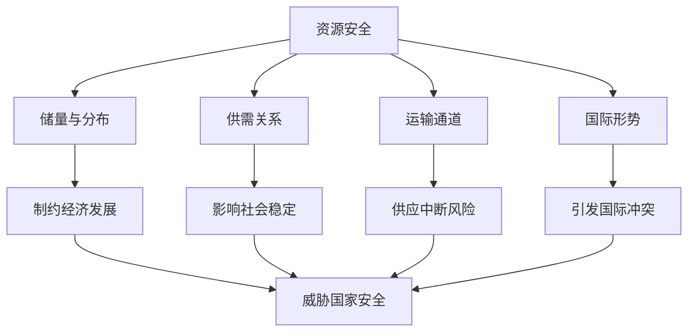

# 第一节 资源安全对国家安全的影响

## 核心概念

**资源安全**：一个国家或地区能够持续、稳定、及时、足量地获得所需资源的状态，是国家安全的重要组成部分。

**资源安全的影响因素**：资源的**储量与分布**、**供需关系**、**运输通道**、**国际形势**等。

**资源安全对国家安全的影响**：资源短缺会制约经济发展、影响社会稳定、引发国际冲突，从而威胁国家安全。

## 知识梳理

| 影响因素 | 具体表现 | 对国家安全的影响 |
| --- | --- | --- |
| 资源储量 | 储量有限、分布不均 | 制约发展 |
| 供需关系 | 供不应求 | 影响稳定 |
| 运输通道 | 通道受阻 | 供应中断 |
| 国际形势 | 资源争夺 | 引发冲突 |

## 重点探究

**探究**：为什么资源安全是国家安全的重要基础？

**解**：资源是经济社会发展的物质基础，资源短缺会制约经济发展、影响人民生活、引发社会动荡和国际冲突，因此资源安全直接关系国家安全。

**探究**：如何保障资源安全？

**解**：开源（开发新能源、进口多元化）、节流（节约资源、提高利用率）、建立战略储备、保障运输通道安全。

## 易错点

- 资源安全不仅指"有资源"，还包括**持续、稳定、及时、足量**地获得。
- 资源安全受**储量、供需、运输、国际形势**多重因素影响。
- 资源短缺会引发**国际冲突**，威胁国家安全。
- 保障资源安全需开源与节流并举。

## 背记要点

1. 资源安全：持续、稳定、及时、足量获得资源。
2. 影响因素：储量、供需、运输、国际形势。
3. 资源短缺→制约经济、影响稳定、引发冲突。
4. 保障措施：开源、节流、战略储备、通道安全。

## 自测题

1. 资源安全是指____、____、____、____地获得所需资源。
2. 影响资源安全的因素有____、____等。
3. 资源短缺会引发____。
4. 保障资源安全的措施有____、____。

## 相关知识点

能源安全见 [[第二节 中国的能源安全]]；粮食安全见 [[第三节 中国的耕地资源与粮食安全]]。
