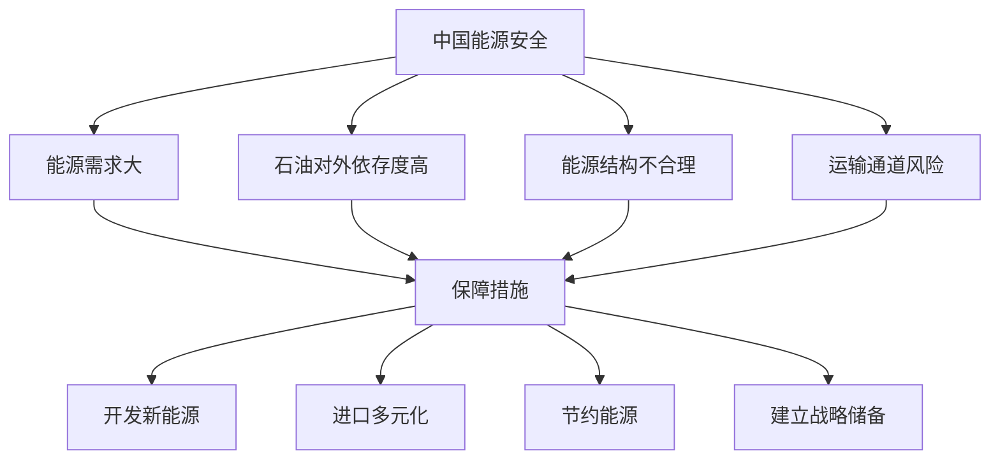

# 第二节 中国的能源安全

## 核心概念

**能源安全**：一个国家能够持续、稳定、经济地获得所需能源的状态。

**中国的能源结构**：以**煤炭**为主，石油、天然气、水电、核电、新能源等多元发展。

**中国能源安全面临的挑战**：能源需求量大、石油对外依存度高、能源结构不合理、运输通道风险等。

## 知识梳理

| 能源类型 | 特点 | 中国现状 |
| --- | --- | --- |
| 煤炭 | 储量丰富、污染大 | 消费占比高 |
| 石油 | 需求大、对外依存高 | 进口依赖 |
| 天然气 | 较清洁 | 占比上升 |
| 新能源 | 清洁可再生 | 快速发展 |

## 重点探究

**探究**：中国为什么要大力发展新能源？

**解**：我国能源需求大、煤炭占比高、石油对外依存度高，发展新能源（风能、太阳能、核能等）可优化能源结构、减少污染、降低对外依赖，保障能源安全。

**探究**：如何保障中国的能源安全？

**解**：开源（开发新能源、进口多元化）、节流（节约能源、提高能效）、建立战略石油储备、保障运输通道安全。

## 易错点

- 中国能源结构以**煤炭**为主，不是石油。
- 石油**对外依存度高**是中国能源安全的主要挑战之一。
- 发展新能源可**优化结构、减少污染、降低对外依赖**。
- 能源安全需开源与节流并举。

## 背记要点

1. 中国能源结构以煤炭为主，多元发展。
2. 挑战：需求大、石油对外依存高、结构不合理。
3. 措施：开发新能源、进口多元化、节约、战略储备。
4. 新能源：风能、太阳能、核能等。

## 自测题

1. 中国能源消费以____为主。
2. 中国能源安全的主要挑战之一是石油____高。
3. 发展新能源的意义是____、____。
4. 保障能源安全的措施有____、____。

## 相关知识点

资源安全见 [[第一节 资源安全对国家安全的影响]]；耕地与粮食安全见 [[第三节 中国的耕地资源与粮食安全]]。
