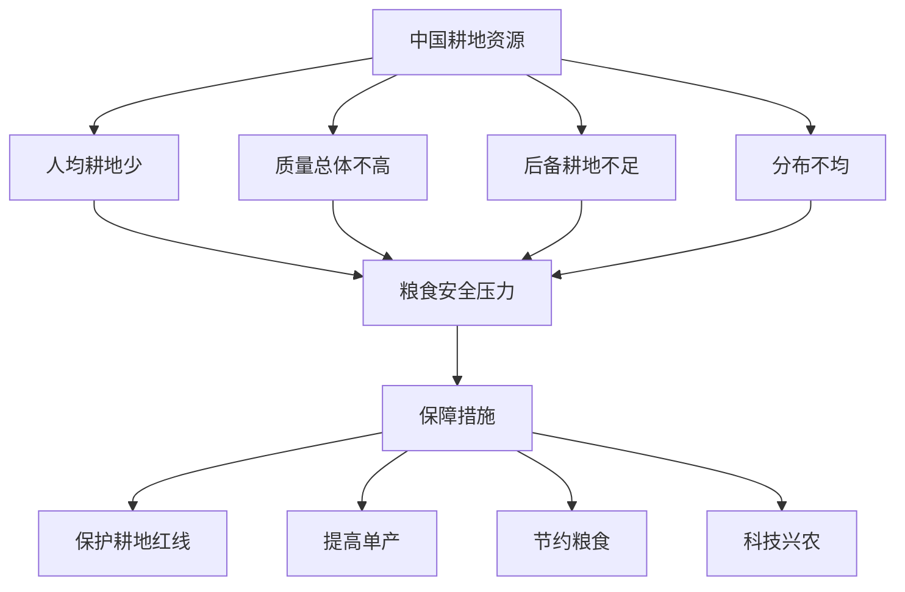

# 第三节 中国的耕地资源与粮食安全

## 核心概念

**耕地资源**：用于种植农作物的土地资源，是粮食生产的基础。

**粮食安全**：一个国家能够持续、稳定地保障人民基本粮食需求的状态。

**中国耕地资源的特点**：总量大、人均少、质量总体不高、后备耕地资源不足、分布不均。

## 知识梳理

| 特点 | 表现 | 影响 |
| --- | --- | --- |
| 人均耕地少 | 人均耕地低于世界平均 | 粮食压力大 |
| 质量不高 | 中低产田比重大 | 单产受限 |
| 后备不足 | 可开垦耕地有限 | 增产受限 |
| 分布不均 | 东部多、西部少 | 区域不平衡 |

## 重点探究

**探究**：为什么说"中国人的饭碗要牢牢端在自己手中"？

**解**：我国人口众多、人均耕地少，粮食安全关系国计民生。只有保障粮食自给，才能维护社会稳定和国家安全，因此必须守住耕地红线、保障粮食安全。

**探究**：如何保障中国的粮食安全？

**解**：严格保护耕地（守住 18 亿亩耕地红线）、提高单产（科技兴农）、节约粮食、完善储备和流通体系。

## 易错点

- 中国耕地**总量大但人均少**，这是基本国情。
- 粮食安全的核心是**自给自足**，不能过度依赖进口。
- 保护耕地要守住**18 亿亩耕地红线**。
- 提高单产靠**科技兴农**，不能靠盲目扩大开垦。

## 背记要点

1. 耕地特点：总量大、人均少、质量不高、后备不足、分布不均。
2. 粮食安全：持续稳定保障基本粮食需求。
3. 保障措施：保护耕地红线、提高单产、节约粮食。
4. 18 亿亩耕地红线。

## 自测题

1. 中国耕地资源的特点是____、____。
2. 保障粮食安全要守住____亿亩耕地红线。
3. 提高粮食单产主要依靠____。
4. 粮食安全的核心是____。

## 相关知识点

资源安全见 [[第一节 资源安全对国家安全的影响]]；海洋资源见 [[第四节 海洋空间资源开发与国家安全]]。
