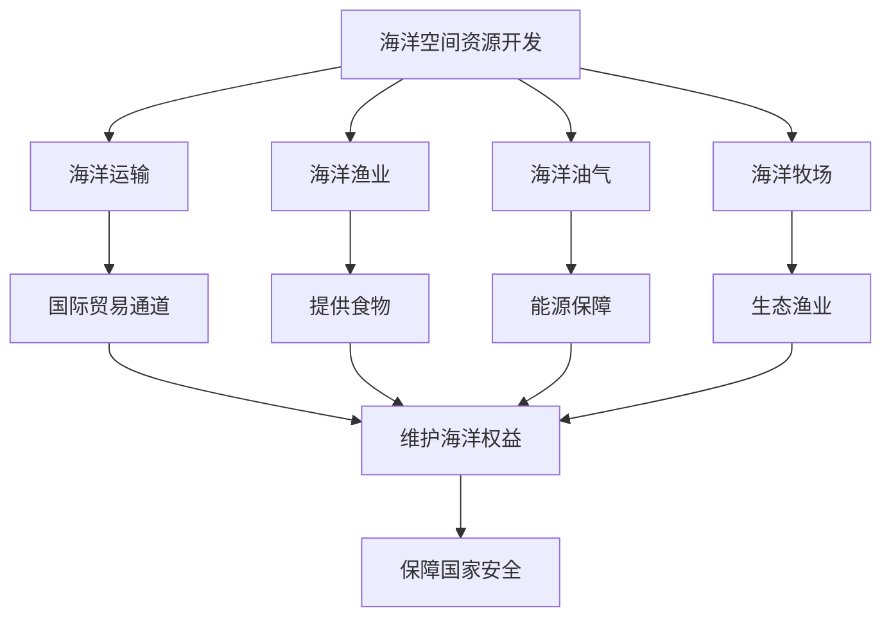

# 第四节 海洋空间资源开发与国家安全

## 核心概念

**海洋空间资源**：海洋水体、海底、海岸带等空间及其承载的资源，包括海洋生物资源、矿产资源、空间资源等。

**海洋空间资源开发**：对海洋空间进行开发利用，如海洋运输、海洋渔业、海洋油气开采、海洋旅游、海洋牧场等。

**海洋权益**：国家在海洋上享有的主权、管辖权等权利，包括领海、专属经济区、大陆架等。

## 知识梳理

| 开发领域 | 内容 | 意义 |
| --- | --- | --- |
| 海洋运输 | 港口、航道 | 国际贸易通道 |
| 海洋渔业 | 捕捞、养殖 | 提供食物 |
| 海洋油气 | 海底油气开采 | 能源保障 |
| 海洋牧场 | 人工养殖 | 生态渔业 |

## 重点探究

**探究**：为什么海洋空间资源开发关系国家安全？

**解**：海洋蕴藏丰富的生物、矿产和能源资源，开发海洋空间可保障能源和食物供给、拓展发展空间；同时维护海洋权益、保卫海洋国土，直接关系国家安全。

**探究**：如何维护我国的海洋权益？

**解**：加强海洋立法、增强海洋意识、发展海洋经济、加强海洋执法和军事力量，坚决维护领海、专属经济区等海洋权益。

## 易错点

- 海洋空间资源包括**水体、海底、海岸带**等空间。
- 海洋权益包括**领海、专属经济区、大陆架**等。
- 海洋开发要**合理、可持续**，防止过度捕捞和污染。
- 维护海洋权益是国家安全的重要内容。

## 背记要点

1. 海洋空间资源：水体、海底、海岸带。
2. 开发领域：运输、渔业、油气、牧场。
3. 海洋权益：领海、专属经济区、大陆架。
4. 海洋开发关系能源、食物、国土安全。

## 自测题

1. 海洋空间资源包括____、____、____。
2. 海洋权益包括____、____等。
3. 海洋油气开采的意义是____。
4. 海洋开发要____、____。

## 相关知识点

资源安全见 [[第一节 资源安全对国家安全的影响]]；生态保护见 [[第三节 生态保护与国家安全]]。
