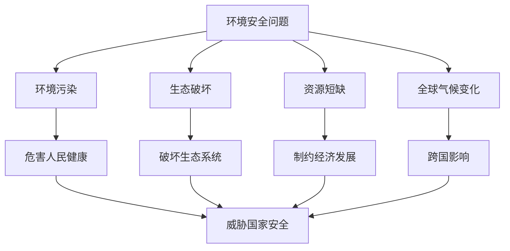

# 第一节 环境安全对国家安全的影响

## 核心概念

**环境安全**：一个国家或地区环境质量良好、生态系统稳定，能够保障人民健康和经济社会持续发展的状态。

**环境安全问题**：当环境问题严重到威胁人民健康、破坏生态系统、影响经济社会发展时，就上升为环境安全问题。

**环境安全对国家安全的影响**：环境恶化会危害健康、破坏生态、制约经济、引发社会动荡和国际争端，威胁国家安全。

## 知识梳理

| 环境安全问题 | 表现 | 对国家安全的影响 |
| --- | --- | --- |
| 环境污染 | 大气、水污染 | 危害健康 |
| 生态破坏 | 荒漠化、水土流失 | 生态退化 |
| 资源短缺 | 水资源、能源紧张 | 制约发展 |
| 全球性问题 | 气候变化 | 跨国影响 |

## 重点探究

**探究**：环境安全问题与一般环境问题有何区别？

**解**：一般环境问题影响范围小、程度轻；当环境问题严重到**威胁人民健康、破坏生态系统、影响经济社会发展**时，就上升为环境安全问题，关系国家安全。

**探究**：如何防范环境安全问题？

**解**：加强环境保护、防治污染、保护生态、节约资源、应对气候变化，从源头上减少环境问题的发生。

## 易错点

- 环境安全问题是指**严重到威胁国家安全**的环境问题。
- 环境安全问题具有**跨国性**（如气候变化、跨境污染）。
- 环境安全是国家安全的重要组成部分。
- 防范环境安全问题需**预防为主、防治结合**。

## 背记要点

1. 环境安全：环境良好、生态稳定、保障发展。
2. 环境安全问题：威胁健康、破坏生态、影响发展。
3. 影响：健康、生态、经济、国际争端。
4. 防范：预防为主、防治结合。

## 自测题

1. 环境安全问题是指____的环境问题。
2. 环境安全问题具有____性。
3. 环境恶化会____、____。
4. 防范环境安全问题要____。

## 相关知识点

环境污染见 [[第二节 环境污染与国家安全]]；生态保护见 [[第三节 生态保护与国家安全]]。
