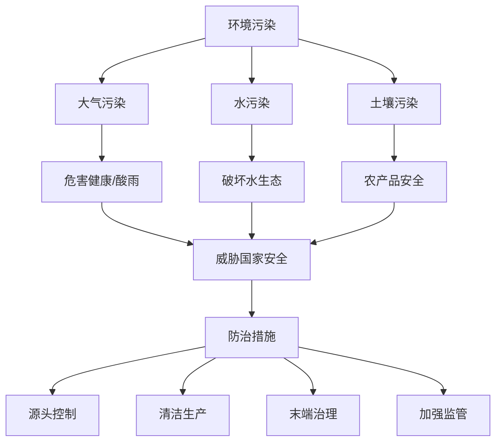

# 第二节 环境污染与国家安全

## 核心概念

**环境污染**：人类活动排放的污染物超过环境自净能力，导致环境质量下降的现象，包括大气污染、水污染、土壤污染等。

**环境污染对国家安全的影响**：危害人民健康、破坏生态系统、影响经济发展，严重的跨国污染还会引发国际争端。

**环境污染的防治**：源头控制、清洁生产、末端治理、加强监管。

## 知识梳理

| 污染类型 | 主要来源 | 危害 |
| --- | --- | --- |
| 大气污染 | 工业废气、汽车尾气 | 危害呼吸系统、酸雨 |
| 水污染 | 工业废水、生活污水 | 危害健康、破坏水生态 |
| 土壤污染 | 农药、重金属 | 影响农产品安全 |

## 重点探究

**探究**：为什么环境污染会威胁国家安全？

**解**：环境污染危害人民健康、破坏生态系统、制约经济发展，严重的跨国污染（如跨境河流污染、大气污染）还会引发国际争端，从而威胁国家安全。

**探究**：如何防治环境污染？

**解**：从源头控制污染物排放、推行清洁生产、加强末端治理、完善环保法规和监管，实现经济发展与环境保护协调。

## 易错点

- 环境污染是**污染物超过环境自净能力**造成的。
- 环境污染具有**跨国性**，可引发国际争端。
- 防治要**源头控制、防治结合**，不能只靠末端治理。
- 环境污染危害健康、生态、经济、安全多方面。

## 背记要点

1. 污染类型：大气、水、土壤污染。
2. 危害：健康、生态、经济、国际争端。
3. 防治：源头控制、清洁生产、末端治理、监管。
4. 环境污染可跨国传播。

## 自测题

1. 环境污染包括____、____、____。
2. 大气污染的主要来源是____。
3. 环境污染具有____性。
4. 防治环境污染要____、____。

## 相关知识点

环境安全见 [[第一节 环境安全对国家安全的影响]]；生态保护见 [[第三节 生态保护与国家安全]]。
