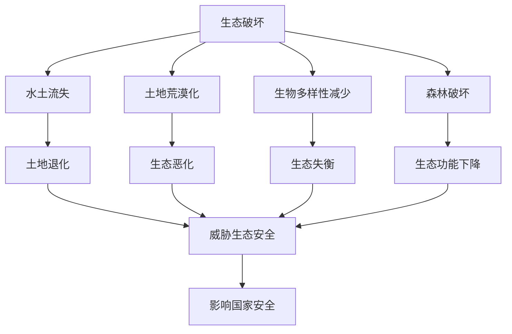

# 第三节 生态保护与国家安全

## 核心概念

**生态保护**：采取各种措施保护生态系统、维护生态平衡、保障生态安全的活动。

**生态安全**：生态系统结构完整、功能正常，能够持续为人类提供服务的状态。

**生态保护与国家安全**：生态破坏会引发水土流失、荒漠化、生物多样性减少等，威胁生态安全，进而影响国家安全。

## 知识梳理

| 生态问题 | 表现 | 危害 |
| --- | --- | --- |
| 水土流失 | 土壤侵蚀 | 土地退化 |
| 土地荒漠化 | 植被破坏、沙化 | 生态恶化 |
| 生物多样性减少 | 物种灭绝 | 生态失衡 |
| 森林破坏 | 滥伐 | 生态功能下降 |

## 重点探究

**探究**：为什么生态保护关系国家安全？

**解**：生态系统为人类提供食物、水源、气候调节等服务，生态破坏会导致水土流失、荒漠化、生物多样性减少，威胁生态安全，进而影响经济社会发展和国家安全。

**探究**：如何加强生态保护？

**解**：建立自然保护区、退耕还林还草、防治荒漠化、保护生物多样性、实施生态修复工程。

## 易错点

- 生态保护的核心是维护**生态平衡和生态安全**。
- 生态破坏具有**累积性和不可逆性**，一旦破坏难以恢复。
- 生态保护要**预防为主、保护优先**。
- 生态安全是国家安全的重要基础。

## 背记要点

1. 生态问题：水土流失、荒漠化、生物多样性减少、森林破坏。
2. 生态安全：结构完整、功能正常。
3. 保护措施：自然保护区、退耕还林、生态修复。
4. 生态破坏具有累积性和不可逆性。

## 自测题

1. 生态问题包括____、____等。
2. 生态安全是指____、____。
3. 保护生态的措施有____、____。
4. 生态破坏具有____性。

## 相关知识点

环境安全见 [[第一节 环境安全对国家安全的影响]]；生态文明见 [[第一节 走向生态文明]]。
