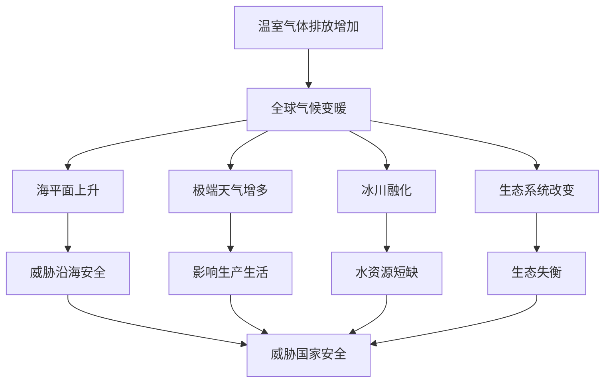

# 第四节 全球气候变化与国家安全

## 核心概念

**全球气候变化**：主要指全球气候变暖，由温室气体（CO₂、甲烷等）排放增加引起。

**全球变暖的原因**：人类大量燃烧化石燃料、毁林等，导致大气中温室气体浓度升高，温室效应增强。

**全球变暖的影响**：海平面上升、极端天气增多、冰川融化、生态系统改变、威胁粮食和水安全。

## 知识梳理

| 影响方面 | 具体表现 | 对国家安全的影响 |
| --- | --- | --- |
| 海平面上升 | 沿海地区被淹 | 威胁沿海安全 |
| 极端天气 | 洪涝、干旱增多 | 影响生产生活 |
| 冰川融化 | 淡水资源减少 | 水资源短缺 |
| 生态系统 | 物种迁移、灭绝 | 生态失衡 |

## 重点探究

**探究**：全球气候变化为什么是国家安全问题？

**解**：全球变暖导致海平面上升、极端天气增多、水资源短缺、生态失衡，威胁沿海地区安全、粮食和水安全，且具有全球性，需要国际合作应对，因此关系国家安全。

**探究**：如何应对全球气候变化？

**解**：减少温室气体排放（发展清洁能源、节能减排）、增加碳汇（植树造林）、适应气候变化、加强国际合作（如《巴黎协定》）。

## 易错点

- 全球变暖的主要原因是**温室气体排放增加**。
- 全球气候变化具有**全球性**，需国际合作应对。
- 应对措施包括**减缓**（减排）和**适应**两方面。
- 海平面上升威胁**沿海地区**安全。

## 背记要点

1. 全球变暖原因：温室气体排放增加。
2. 影响：海平面上升、极端天气、冰川融化、生态改变。
3. 应对：减排、增汇、适应、国际合作。
4. 全球性问题需国际合作。

## 自测题

1. 全球变暖的主要原因是____。
2. 全球变暖导致____上升。
3. 应对气候变化的措施有____、____。
4. 全球气候变化具有____性。

## 相关知识点

环境安全见 [[第一节 环境安全对国家安全的影响]]；国际合作见 [[第三节 国际合作]]。
