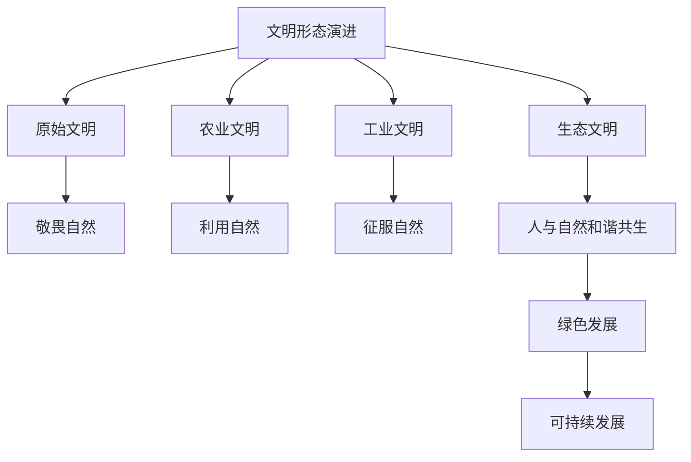

# 第一节 走向生态文明

## 核心概念

**生态文明**：人类遵循人、自然、社会和谐发展规律而取得的物质与精神成果的总和，是继原始文明、农业文明、工业文明之后的新型文明形态。

**生态文明理念**：尊重自然、顺应自然、保护自然，坚持人与自然和谐共生。

**生态文明建设**：将生态文明理念贯穿于经济、政治、文化、社会建设各方面，实现绿色发展。

## 知识梳理

| 文明形态 | 特征 | 人与自然关系 |
| --- | --- | --- |
| 原始文明 | 依赖自然 | 敬畏自然 |
| 农业文明 | 改造自然 | 利用自然 |
| 工业文明 | 征服自然 | 破坏自然 |
| 生态文明 | 和谐共生 | 尊重保护自然 |

## 重点探究

**探究**：为什么说生态文明建设关系中华民族永续发展？

**解**：工业文明过度开发导致资源枯竭、环境恶化，威胁人类生存发展。建设生态文明，坚持人与自然和谐共生，才能实现经济社会可持续发展，保障中华民族永续发展。

**探究**：如何走向生态文明？

**解**：树立生态文明理念、转变发展方式（绿色发展）、节约资源保护环境、加强生态修复、完善制度保障。

## 易错点

- 生态文明是**新型文明形态**，强调人与自然和谐共生。
- 生态文明理念：尊重自然、顺应自然、保护自然。
- 生态文明建设要**贯穿于各方面**，实现绿色发展。
- 生态文明是可持续发展的必然要求。

## 背记要点

1. 生态文明理念：尊重、顺应、保护自然。
2. 生态文明是继工业文明后的新型文明。
3. 核心：人与自然和谐共生。
4. 建设：绿色发展、节约资源、生态修复。

## 自测题

1. 生态文明理念是____、____、____。
2. 生态文明的核心是____。
3. 生态文明是继____之后的新型文明。
4. 走向生态文明要____。

## 相关知识点

国家战略见 [[第二节 国家战略与政策]]；国际合作见 [[第三节 国际合作]]。
