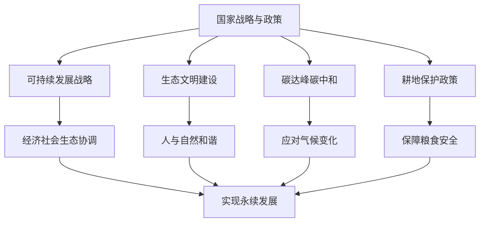

# 第二节 国家战略与政策

## 核心概念

**国家战略**：国家为实现长远发展目标而制定的全局性、长远性谋划，如可持续发展战略、科教兴国战略等。

**国家政策**：国家为实现战略目标而制定的具体措施和规定，如环境保护政策、资源节约政策等。

**我国的相关战略与政策**：可持续发展战略、生态文明建设、碳达峰碳中和目标、耕地保护政策等。

## 知识梳理

| 战略/政策 | 内容 | 意义 |
| --- | --- | --- |
| 可持续发展战略 | 经济、社会、生态协调 | 永续发展 |
| 生态文明建设 | 人与自然和谐 | 绿色发展 |
| 碳达峰碳中和 | 控制温室气体排放 | 应对气候变化 |
| 耕地保护 | 守住耕地红线 | 粮食安全 |

## 重点探究

**探究**：为什么国家要制定可持续发展战略？

**解**：传统发展方式导致资源枯竭、环境恶化，威胁人类生存。可持续发展战略强调经济、社会、生态协调发展，既满足当代人需求，又不损害后代人利益，是实现永续发展的必然选择。

**探究**：我国提出碳达峰碳中和目标有何意义？

**解**：体现我国应对气候变化的决心和责任，推动能源结构转型和绿色发展，为全球气候治理作出贡献。

## 易错点

- 国家战略是**全局性、长远性**谋划，政策是具体措施。
- 可持续发展要**经济、社会、生态**三者协调。
- 碳达峰碳中和是应对**气候变化**的目标。
- 耕地保护政策保障**粮食安全**。

## 背记要点

1. 国家战略：全局性、长远性谋划。
2. 可持续发展：经济、社会、生态协调。
3. 碳达峰碳中和：应对气候变化。
4. 耕地保护：守住红线、保障粮食安全。

## 自测题

1. 国家战略是____、____的谋划。
2. 可持续发展强调____、____、____协调。
3. 碳达峰碳中和是应对____的目标。
4. 耕地保护政策保障____。

## 相关知识点

生态文明见 [[第一节 走向生态文明]]；国际合作见 [[第三节 国际合作]]。
