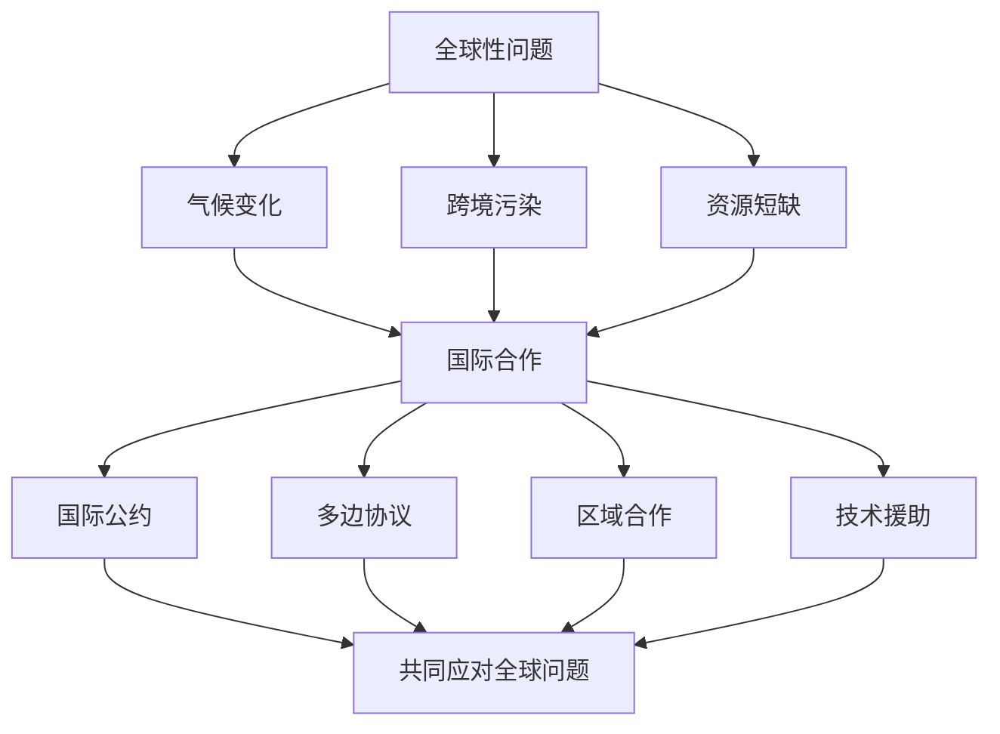

# 第三节 国际合作

## 核心概念

**国际合作**：国家之间在资源、环境、气候等领域开展的协调与合作，共同应对全球性问题。

**国际合作的原因**：许多环境与资源问题具有**全球性**（如气候变化、跨境污染），单靠一个国家无法解决，需要国际合作。

**国际合作的形式**：国际公约、多边协议、区域合作、技术援助等。

## 知识梳理

| 合作领域 | 主要形式 | 代表 |
| --- | --- | --- |
| 气候变化 | 国际公约 | 《巴黎协定》 |
| 环境保护 | 多边协议 | 《生物多样性公约》 |
| 资源开发 | 区域合作 | 一带一路 |
| 技术援助 | 技术转让 | 清洁能源合作 |

## 重点探究

**探究**：为什么全球性问题需要国际合作？

**解**：气候变化、跨境污染等全球性问题影响范围广、单靠一个国家无法解决，且各国利益相互关联，只有通过国际合作、共同承担责任，才能有效应对。

**探究**：中国在国际合作中发挥什么作用？

**解**：中国积极参与全球环境治理，履行国际公约，推动绿色"一带一路"建设，为全球可持续发展贡献中国智慧和中国方案。

## 易错点

- 国际合作的原因是问题的**全球性**。
- 国际合作形式多样：公约、协议、区域合作、技术援助。
- 中国积极参与全球治理，承担大国责任。
- 全球性问题需**共同但有区别的责任**。

## 背记要点

1. 国际合作原因：问题具有全球性。
2. 形式：国际公约、多边协议、区域合作、技术援助。
3. 代表：《巴黎协定》《生物多样性公约》。
4. 中国：参与全球治理、贡献中国方案。

## 自测题

1. 国际合作的原因是问题具有____性。
2. 应对气候变化的国际公约是____。
3. 国际合作的形式有____、____。
4. 中国在国际合作中____。

## 相关知识点

全球气候变化见 [[第四节 全球气候变化与国家安全]]；国家战略见 [[第二节 国家战略与政策]]。
