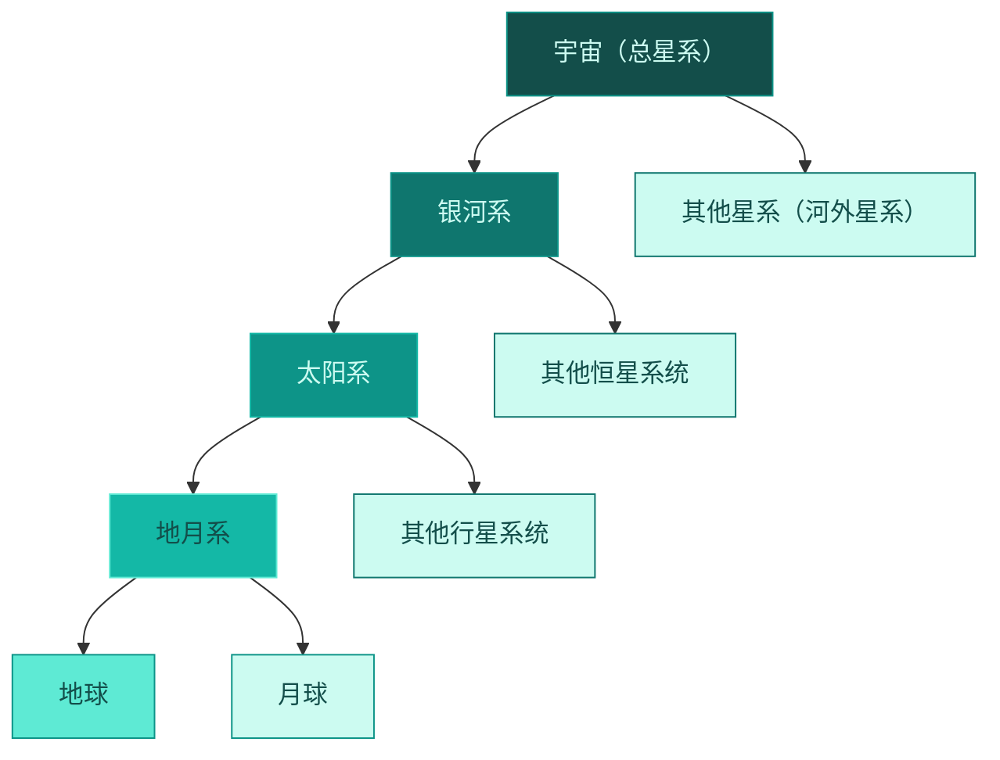

# 第一节 宇宙中的地球

标签：#认识地球 #宇宙环境 #太阳系

## 一、本节定位

中图版·北京版地理七年级上册 **第一章 认识地球 · 第一节**。本节把地球放到宇宙背景中去认识：地球在太阳系中的位置、地球是一颗怎样的行星、为什么地球上有生命。这是整册地理学习的起点。

## 二、核心概念

| 术语 | 定义 |
|---|---|
| 天体 | 宇宙中各种星球和星际物质的统称，如恒星、行星、卫星、彗星等 |
| 恒星 | 自身能发光发热的天体，如太阳 |
| 行星 | 围绕恒星运转、自身不发光的天体，如地球 |
| 卫星 | 围绕行星运转的天体，如月球 |
| 太阳系 | 以太阳为中心，包括八大行星及其卫星、小行星、彗星等组成的天体系统 |
| 银河系 | 太阳系所在的更大的天体系统，包含数千亿颗恒星 |

## 三、知识梳理

### 1. 地球在宇宙中的位置

- 天体系统层级（由小到大）：**地月系 → 太阳系 → 银河系 → 可观测宇宙**。
- 太阳系八大行星按距太阳由近到远：**水星、金星、地球、火星、木星、土星、天王星、海王星**。速记口诀："水金地火木土天海"。
- 地球是距太阳**第三近**的行星，离太阳较近、体积较小、有固体表面。
- 月球是地球唯一的**天然卫星**，与地球组成地月系。

<svg viewBox="0 0 900 500" xmlns="http://www.w3.org/2000/svg" font-family="sans-serif">
  <!-- Background -->
  <rect width="900" height="500" fill="#0c1222" rx="12"/>
  <!-- Sun -->
  <circle cx="80" cy="250" r="45" fill="#fbbf24" stroke="#f59e0b" stroke-width="2"/>
  <text x="80" y="255" text-anchor="middle" fill="#78350f" font-size="14" font-weight="bold">太阳</text>
  <!-- Orbits -->
  <ellipse cx="80" cy="250" rx="100" ry="60" fill="none" stroke="#334155" stroke-width="0.8" stroke-dasharray="4,3"/>
  <ellipse cx="80" cy="250" rx="155" ry="95" fill="none" stroke="#334155" stroke-width="0.8" stroke-dasharray="4,3"/>
  <ellipse cx="80" cy="250" rx="220" ry="130" fill="none" stroke="#5eead4" stroke-width="1.5" stroke-dasharray="5,3"/>
  <ellipse cx="80" cy="250" rx="295" ry="165" fill="none" stroke="#334155" stroke-width="0.8" stroke-dasharray="4,3"/>
  <ellipse cx="80" cy="250" rx="400" ry="195" fill="none" stroke="#334155" stroke-width="0.8" stroke-dasharray="4,3"/>
  <ellipse cx="80" cy="250" rx="510" ry="210" fill="none" stroke="#334155" stroke-width="0.8" stroke-dasharray="4,3"/>
  <ellipse cx="80" cy="250" rx="620" ry="220" fill="none" stroke="#334155" stroke-width="0.8" stroke-dasharray="4,3"/>
  <ellipse cx="80" cy="250" rx="740" ry="230" fill="none" stroke="#334155" stroke-width="0.8" stroke-dasharray="4,3"/>
  <!-- Asteroid belt hint -->
  <ellipse cx="80" cy="250" rx="345" ry="180" fill="none" stroke="#64748b" stroke-width="6" stroke-dasharray="2,8" opacity="0.4"/>
  <!-- Mercury -->
  <circle cx="175" cy="220" r="7" fill="#94a3b8"/>
  <text x="175" y="205" text-anchor="middle" fill="#cbd5e1" font-size="11">水星</text>
  <!-- Venus -->
  <circle cx="225" cy="175" r="10" fill="#fcd34d"/>
  <text x="225" y="158" text-anchor="middle" fill="#cbd5e1" font-size="11">金星</text>
  <!-- Earth (highlighted) -->
  <circle cx="295" cy="150" r="12" fill="#14b8a6" stroke="#5eead4" stroke-width="2.5"/>
  <text x="295" y="130" text-anchor="middle" fill="#5eead4" font-size="13" font-weight="bold">地球 ★</text>
  <text x="295" y="115" text-anchor="middle" fill="#5eead4" font-size="10">（第3位）</text>
  <!-- Mars -->
  <circle cx="365" cy="130" r="9" fill="#ef4444"/>
  <text x="365" y="113" text-anchor="middle" fill="#cbd5e1" font-size="11">火星</text>
  <!-- Jupiter -->
  <circle cx="470" cy="100" r="22" fill="#d97706" stroke="#b45309" stroke-width="1.5"/>
  <text x="470" y="70" text-anchor="middle" fill="#cbd5e1" font-size="11">木星</text>
  <!-- Saturn -->
  <circle cx="580" cy="85" r="18" fill="#a78bfa"/>
  <ellipse cx="580" cy="85" rx="30" ry="7" fill="none" stroke="#c4b5fd" stroke-width="1.5"/>
  <text x="580" y="55" text-anchor="middle" fill="#cbd5e1" font-size="11">土星</text>
  <!-- Uranus -->
  <circle cx="690" cy="75" r="14" fill="#67e8f9"/>
  <text x="690" y="55" text-anchor="middle" fill="#cbd5e1" font-size="11">天王星</text>
  <!-- Neptune -->
  <circle cx="805" cy="70" r="13" fill="#3b82f6"/>
  <text x="805" y="52" text-anchor="middle" fill="#cbd5e1" font-size="11">海王星</text>
  <!-- Asteroid belt label -->
  <text x="420" y="460" text-anchor="middle" fill="#64748b" font-size="10">← 小行星带（火星与木星之间）→</text>
  <!-- Legend -->
  <rect x="620" y="420" width="260" height="60" fill="#1e293b" rx="8" opacity="0.8"/>
  <text x="640" y="445" fill="#5eead4" font-size="12" font-weight="bold">太阳系八大行星顺序：</text>
  <text x="640" y="468" fill="#ccfbf1" font-size="11">水 → 金 → 地 → 火 → 木 → 土 → 天 → 海</text>
</svg>

### 2. 地球——一颗适合生命存在的行星

| 条件 | 具体表现 |
|---|---|
| 日地距离适中 | 约 1.5 亿千米，地表平均温度约 15℃，液态水得以存在 |
| 体积质量适中 | 引力能吸住大气，形成适合生物呼吸的大气层 |
| 有液态水 | 生命起源和维持的必要条件 |
| 宇宙环境安全 | 大小行星各行其道、互不干扰，太阳光照稳定 |

### 3. 地球的普通性与特殊性

- **普通性**：地球在太阳系中只是一颗普通行星，外观和运动方式与其他行星类似。
- **特殊性**：地球是目前已知**唯一存在生命**的天体。

## 四、读图与技能：太阳系示意图判读

1. 先找**太阳**——位于中心、体积最大、自身发光。
2. 按轨道由内向外数行星，第三条轨道上的就是**地球**。
3. 记住小行星带的位置：**火星与木星轨道之间**。
4. 判断冷热：行星离太阳越远，获得的光热越少，表面温度越低。

## 五、易混辨析

| 对比项 | 恒星 | 行星 | 卫星 |
|---|---|---|---|
| 是否发光 | 自身发光发热 | 不发光，反射恒星光 | 不发光 |
| 绕转对象 | —— | 绕恒星转 | 绕行星转 |
| 举例 | 太阳 | 地球、火星 | 月球 |

## 六、背记要点

1. 天体系统层级：地月系→太阳系→银河系→宇宙。
2. 八大行星顺序：水金地火木土天海。
3. 地球是距太阳第三近的行星。
4. 月球是地球唯一的天然卫星。
5. 地球有生命的四个条件：日地距离适中、体积质量适中、有液态水、宇宙环境安全。
6. 地球既普通（一颗普通行星）又特殊（唯一有生命）。

## 七、自测小题

1. 太阳系的中心天体是______。
2. 八大行星中距太阳最近的是______，地球位于第______位。
3. 月球属于（A. 恒星 B. 行星 C. 卫星）。
4. 地球上存在液态水，主要因为（A. 体积大 B. 日地距离适中 C. 有卫星）。
5. 小行星带位于______与______的轨道之间。
6. 判断：太阳是一颗行星。（对/错）

**答案**：1. 太阳 2. 水星；三 3. C 4. B 5. 火星；木星 6. 错（太阳是恒星）

相关：[[第二节 太空探索]] ｜ [[第四节 地球在运动]]
