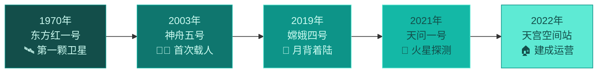

# 第二节 太空探索

标签：#认识地球 #太空探索 #中国航天

## 一、本节定位

中图版·北京版地理七年级上册 **第一章 认识地球 · 第二节**。本节了解人类探索太空的历程、主要工具，以及中国航天事业的成就，感受太空探索对认识地球的意义。

## 二、核心概念

| 术语 | 定义 |
|---|---|
| 人造卫星 | 人类发射到太空、绕地球运行的航天器，用于通信、导航、气象观测等 |
| 载人航天 | 航天员乘航天器进入太空并安全返回的航天活动 |
| 空间站 | 长期在近地轨道运行、可供航天员生活和工作的大型航天器 |
| 探月工程 | 对月球进行探测的系列航天任务，我国的探月工程称"嫦娥工程" |
| 深空探测 | 对月球及更远天体（如火星）进行的探测活动 |

## 三、知识梳理

### 1. 人类太空探索的主要历程

| 时间 | 事件 |
|---|---|
| 1957 年 | 苏联发射世界第一颗人造地球卫星 |
| 1961 年 | 苏联航天员加加林成为进入太空第一人 |
| 1969 年 | 美国"阿波罗 11 号"实现人类首次登月 |
| 1970 年 | 中国发射第一颗人造卫星"东方红一号" |
| 2003 年 | "神舟五号"载着杨利伟升空，中国首次载人航天成功 |

### 2. 中国航天的代表性成就

- **神舟系列**：载人飞船，实现中国人进入太空、出舱活动、交会对接。
- **嫦娥工程**：探月。嫦娥四号实现人类首次**月球背面**软着陆；嫦娥五号带回月壤样品。
- **天宫空间站**：中国自主建造的空间站，长期有航天员在轨工作。
- **天问一号**：中国首次火星探测任务，"祝融号"火星车成功着陆火星。
- **北斗卫星导航系统**：中国自主建设的全球卫星导航系统。

<svg viewBox="0 0 800 280" xmlns="http://www.w3.org/2000/svg" font-family="sans-serif">
  <rect width="800" height="280" fill="#f0fdfa" rx="12"/>
  <text x="400" y="30" text-anchor="middle" font-size="16" font-weight="bold" fill="#134e4a">中国航天代表性成就时间轴</text>
  <!-- Timeline bar -->
  <line x1="60" y1="120" x2="740" y2="120" stroke="#0d9488" stroke-width="3"/>
  <polygon points="740,115 755,120 740,125" fill="#0d9488"/>
  <!-- Node 1: 东方红一号 1970 -->
  <circle cx="110" cy="120" r="14" fill="#134e4a" stroke="#5eead4" stroke-width="2.5"/>
  <text x="110" y="95" text-anchor="middle" font-size="11" font-weight="bold" fill="#134e4a">1970年</text>
  <text x="110" y="108" text-anchor="middle" font-size="10" fill="#0f766e">东方红一号</text>
  <text x="110" y="150" text-anchor="middle" font-size="10" fill="#134e4a">第一颗</text>
  <text x="110" y="163" text-anchor="middle" font-size="10" fill="#134e4a">人造卫星</text>
  <!-- Node 2: 神舟五号 2003 -->
  <circle cx="260" cy="120" r="14" fill="#0f766e" stroke="#5eead4" stroke-width="2.5"/>
  <text x="260" y="95" text-anchor="middle" font-size="11" font-weight="bold" fill="#134e4a">2003年</text>
  <text x="260" y="108" text-anchor="middle" font-size="10" fill="#0f766e">神舟五号</text>
  <text x="260" y="150" text-anchor="middle" font-size="10" fill="#134e4a">首次载人</text>
  <text x="260" y="163" text-anchor="middle" font-size="10" fill="#134e4a">杨利伟</text>
  <!-- Node 3: 嫦娥四号 2019 -->
  <circle cx="430" cy="120" r="14" fill="#0d9488" stroke="#5eead4" stroke-width="2.5"/>
  <text x="430" y="95" text-anchor="middle" font-size="11" font-weight="bold" fill="#134e4a">2019年</text>
  <text x="430" y="108" text-anchor="middle" font-size="10" fill="#0f766e">嫦娥四号</text>
  <text x="430" y="150" text-anchor="middle" font-size="10" fill="#134e4a">首次月背</text>
  <text x="430" y="163" text-anchor="middle" font-size="10" fill="#134e4a">软着陆</text>
  <!-- Node 4: 天问一号 2021 -->
  <circle cx="580" cy="120" r="14" fill="#14b8a6" stroke="#0d9488" stroke-width="2.5"/>
  <text x="580" y="95" text-anchor="middle" font-size="11" font-weight="bold" fill="#134e4a">2021年</text>
  <text x="580" y="108" text-anchor="middle" font-size="10" fill="#0f766e">天问一号</text>
  <text x="580" y="150" text-anchor="middle" font-size="10" fill="#134e4a">火星探测</text>
  <text x="580" y="163" text-anchor="middle" font-size="10" fill="#134e4a">祝融号</text>
  <!-- Node 5: 天宫空间站 2022 -->
  <circle cx="710" cy="120" r="14" fill="#5eead4" stroke="#0d9488" stroke-width="2.5"/>
  <text x="710" y="95" text-anchor="middle" font-size="11" font-weight="bold" fill="#134e4a">2022年</text>
  <text x="710" y="108" text-anchor="middle" font-size="10" fill="#0f766e">天宫空间站</text>
  <text x="710" y="150" text-anchor="middle" font-size="10" fill="#134e4a">建成运营</text>
  <text x="710" y="163" text-anchor="middle" font-size="10" fill="#134e4a">长期驻人</text>
  <!-- 卫星服务图例 -->
  <rect x="60" y="195" width="680" height="60" rx="8" fill="#ccfbf1" stroke="#0d9488" stroke-width="1.5"/>
  <text x="400" y="218" text-anchor="middle" font-size="12" font-weight="bold" fill="#134e4a">卫星服务生活 → 天气预报 | 导航定位 | 通信转播 | 灾害监测</text>
  <text x="400" y="242" text-anchor="middle" font-size="11" fill="#0f766e">口诀：探月嫦娥  探火天问/祝融  空间站天宫  导航北斗</text>
</svg>

### 3. 太空探索的意义

- 帮助人类更好地认识地球和宇宙（如从太空看到地球是蓝色的"水的行星"）。
- 卫星服务生活：天气预报、导航定位、通信转播、灾害监测。
- 带动科技进步，探索资源与人类未来发展空间。

## 四、读图与技能：认识航天器图片资料

1. 看外形辨类型：带太阳能帆板绕地飞行的多为**人造卫星**；舱段组合、体积大的是**空间站**；有着陆支架和车轮的是**着陆器与巡视车（月球车/火星车）**。
2. 读新闻材料时抓三要素：**任务名称、探测目标（地球轨道/月球/火星）、取得的成果**。

## 五、易混辨析

| 对比项 | 人造卫星 | 载人飞船 | 空间站 |
|---|---|---|---|
| 是否载人 | 否 | 是（短期） | 是（长期驻留） |
| 主要功能 | 通信、导航、观测 | 天地往返运输 | 太空实验与生活平台 |
| 我国代表 | 东方红一号、北斗 | 神舟系列 | 天宫空间站 |

## 六、背记要点

1. 世界第一颗人造卫星：1957 年苏联发射。
2. 进入太空第一人：加加林（1961 年）。
3. 人类首次登月：1969 年美国"阿波罗 11 号"。
4. 中国第一颗人造卫星：1970 年"东方红一号"。
5. 中国首位航天员：杨利伟（2003 年，神舟五号）。
6. 探月—嫦娥，探火—天问/祝融，空间站—天宫，导航—北斗。
7. 太空探索的意义：认识地球宇宙、服务生活、推动科技。

## 七、自测小题

1. 中国第一颗人造地球卫星的名称是______。
2. 中国首次载人航天飞行的航天员是______。
3. 实现人类首次月球背面软着陆的探测器是（A. 嫦娥四号 B. 嫦娥五号 C. 天问一号）。
4. 中国首次火星探测任务的名称是______，火星车叫______。
5. 下列不属于卫星服务生活的是（A. 天气预报 B. 导航定位 C. 地面公交驾驶）。
6. 判断：天宫空间站可供航天员长期在轨工作。（对/错）

**答案**：1. 东方红一号 2. 杨利伟 3. A 4. 天问一号；祝融号 5. C 6. 对

相关：[[第一节 宇宙中的地球]] ｜ [[主题探究：畅想"地球2.0"]]
