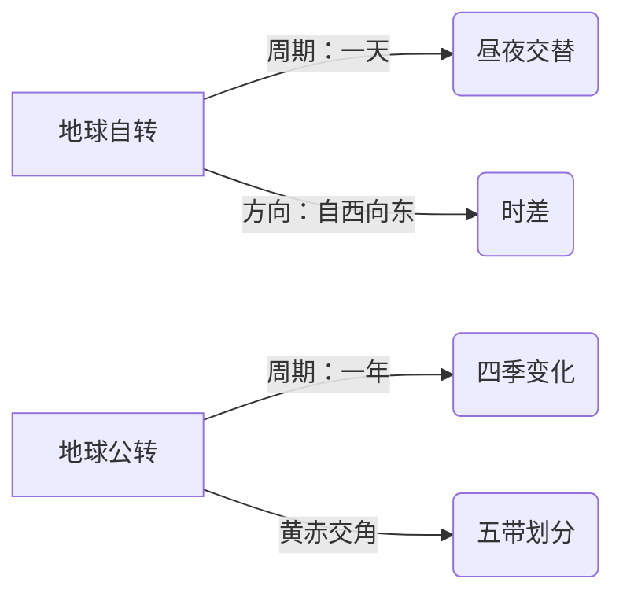

# 第三节 地球的模型

标签：#认识地球 #地球仪 #经纬网

## 一、本节定位

中图版·北京版地理七年级上册 **第一章 认识地球 · 第三节**。本节认识地球的形状与大小，学会使用地球的模型——地球仪，掌握经线、纬线和经纬网定位，这是初中地理最重要的基本功之一。

## 二、核心概念

| 术语 | 定义 |
|---|---|
| 地球仪 | 按一定比例缩小制作的地球模型 |
| 地轴 | 地球仪上表示地球自转轴的假想轴，穿过南北两极 |
| 纬线 | 与赤道平行、环绕地球一周的圆圈 |
| 经线 | 连接南北两极、与纬线垂直相交的半圆，又叫子午线 |
| 赤道 | 最长的纬线（0° 纬线），把地球分为南北半球 |
| 本初子午线 | 0° 经线，经过英国伦敦格林尼治天文台旧址 |
| 经纬网 | 经线和纬线交织成的网络，用于确定地球表面任意点的位置 |

## 三、知识梳理

### 1. 地球的形状与大小

- 认识过程：天圆地方 → 根据太阳月亮推测球体 → 麦哲伦船队**环球航行**证实 → 卫星照片确证。
- 地球的真实形状：**两极稍扁、赤道略鼓的不规则球体**。
- 大小数据：平均半径约 **6371 千米**；赤道周长约 **4 万千米**；表面积约 **5.1 亿平方千米**。速记："庐山起义（6371）、坐地日行八万里（4 万千米）"。

### 2. 纬线与纬度

- 纬线特点：都是**圆圈**（除极点）；长度**不相等**，赤道最长，向两极递减为点；指示**东西方向**。
- 纬度划分：赤道为 0°，向南北各分 90°；北纬用 **N**，南纬用 **S**。
- 判断规律：纬度数值**向北增大是北纬 N，向南增大是南纬 S**。
- 特殊纬线：赤道 0°、南北回归线 23.5°、南北极圈 66.5°、极点 90°。
- 低中高纬度划分：0°–30° 低纬度，30°–60° 中纬度，60°–90° 高纬度。
- 南北半球分界：**赤道**。

### 3. 经线与经度

- 经线特点：都是**半圆**；长度**都相等**；指示**南北方向**。
- 经度划分：本初子午线为 0°，向东向西各分 180°；东经用 **E**，西经用 **W**。
- 判断规律：经度数值**向东增大是东经 E，向西增大是西经 W**。
- 东西半球分界：**20°W 和 160°E** 组成的经线圈（不是 0° 和 180°！）。
- 口诀：小于 20°W 或小于 160°E 一侧为东半球——"小小为东，大大为西"（度数小于 20° 全在东半球，大于 160° 全在西半球）。

## 四、读图与技能：经纬网定位三步法

1. **辨线**：横向（或圆圈）为纬线，纵向（或放射状）为经线。
2. **定度**：看数值变化方向——向北增大为 N，向南增大为 S；向东增大为 E，向西增大为 W。
3. **写坐标**：先纬后经（也可先经后纬，但要带字母），如北京约为（40°N，116°E）。
4. 判半球：纬度看 N/S 定南北半球；经度用 20°W—160°E 定东西半球。

## 五、易混辨析

| 对比项 | 经线 | 纬线 |
|---|---|---|
| 形状 | 半圆 | 圆圈 |
| 长度 | 全部相等 | 不相等，赤道最长 |
| 指示方向 | 南北 | 东西 |
| 度数范围 | 0°—180° | 0°—90° |
| 0° 线 | 本初子午线 | 赤道 |
| 半球分界 | 20°W 和 160°E 分东西半球 | 赤道分南北半球 |

## 六、背记要点

1. 地球形状：两极稍扁、赤道略鼓的不规则球体。
2. 平均半径 6371 千米，赤道周长约 4 万千米，表面积 5.1 亿平方千米。
3. 麦哲伦环球航行首次证实地球是球体。
4. 经线半圆等长指南北；纬线圆圈不等长指东西。
5. 0° 经线是本初子午线，0° 纬线是赤道。
6. 南北半球分界是赤道；东西半球分界是 20°W 和 160°E。
7. 向北增大是北纬，向东增大是东经。
8. 0°–30° 低纬，30°–60° 中纬，60°–90° 高纬。

## 七、自测小题

1. 首次证实地球是球体的航海活动是______船队的环球航行。
2. 地球的平均半径约______千米，赤道周长约______千米。
3. 关于经线的说法正确的是（A. 长度不等 B. 指示东西方向 C. 都是半圆）。
4. 东西半球的分界线是（A. 0° 和 180° 经线 B. 20°W 和 160°E C. 赤道）。
5. 某点位于（30°S，120°E），它在______半球（南/北）、______半球（东/西）、______纬度（低/中/高）。
6. 写出坐标：某点在赤道上，位于本初子午线以东 20°，坐标是______。

**答案**：1. 麦哲伦 2. 6371；4 万 3. C 4. B 5. 南；东；低（30° 恰为低中纬分界，教材按 0°–30° 为低纬度处理） 6.（0°，20°E）

相关：[[第四节 地球在运动]] ｜ [[第一节 认识地图]]

### 地理示意图：地球运动

