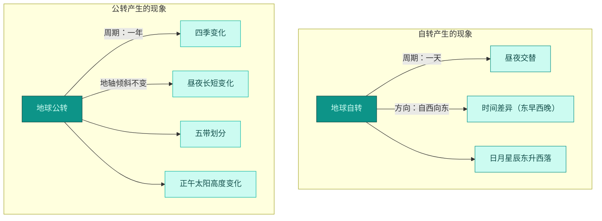

# 第四节 地球在运动

标签：#认识地球 #地球自转 #地球公转

## 一、本节定位

中图版·北京版地理七年级上册 **第一章 认识地球 · 第四节**。本节学习地球的两种基本运动——自转与公转，理解昼夜交替、时间差异、四季变化和五带划分的成因，是第一章的重点与难点。

## 二、核心概念

| 术语 | 定义 |
|---|---|
| 地球自转 | 地球绕地轴不停地旋转 |
| 地球公转 | 地球绕太阳不停地运转 |
| 昼夜交替 | 由于地球自转，同一地点昼与夜不断更替的现象 |
| 时间差异 | 因自转，东边地点比西边地点先看到日出，时刻更早 |
| 二分二至 | 春分、夏至、秋分、冬至四个特殊节气位置 |
| 五带 | 依据获得太阳光热的多少划分的热带、南北温带、南北寒带 |

## 三、知识梳理

### 1. 地球自转

| 项目 | 内容 |
|---|---|
| 绕转中心 | 地轴 |
| 方向 | 自西向东（北极上空看**逆时针**，南极上空看顺时针） |
| 周期 | 约 24 小时（一天） |
| 产生现象 | 昼夜交替、时间差异（东早西晚）、日月星辰东升西落 |

- 注意：**昼夜现象**是因为地球不透明、不发光；**昼夜交替**才是自转产生的。

### 2. 地球公转

| 项目 | 内容 |
|---|---|
| 绕转中心 | 太阳 |
| 方向 | 自西向东 |
| 周期 | 约一年 |
| 特点 | 公转时**地轴倾斜**，且空间指向保持不变（北端指向北极星附近） |
| 产生现象 | 四季变化、昼夜长短变化、五带划分、正午太阳高度变化 |

### 3. 二分二至（以北半球为例）

| 节气 | 日期（前后） | 太阳直射 | 北半球昼夜 |
|---|---|---|---|
| 春分 | 3 月 21 日 | 赤道 | 昼夜等长 |
| 夏至 | 6 月 21 日 | 北回归线（23.5°N） | 昼最长夜最短 |
| 秋分 | 9 月 23 日 | 赤道 | 昼夜等长 |
| 冬至 | 12 月 22 日 | 南回归线（23.5°S） | 昼最短夜最长 |

- 北半球四季：3–5 月春，6–8 月夏，9–11 月秋，12–2 月冬；**南半球季节与北半球相反**。

<svg viewBox="0 0 860 600" xmlns="http://www.w3.org/2000/svg" font-family="sans-serif">
  <!-- Background -->
  <rect width="860" height="600" fill="#f0fdfa" rx="12"/>
  <!-- Title -->
  <text x="430" y="35" text-anchor="middle" fill="#134e4a" font-size="16" font-weight="bold">地球公转与二分二至示意图</text>
  <!-- Orbit ellipse -->
  <ellipse cx="430" cy="320" rx="320" ry="200" fill="none" stroke="#0d9488" stroke-width="2" stroke-dasharray="8,4"/>
  <!-- Orbit direction arrow -->
  <polygon points="750,310 755,320 745,320" fill="#0d9488" transform="rotate(-10,750,320)"/>
  <text x="770" y="290" fill="#0d9488" font-size="11">公转方向</text>
  <!-- Sun at center -->
  <circle cx="430" cy="320" r="35" fill="#fbbf24" stroke="#f59e0b" stroke-width="2"/>
  <text x="430" y="325" text-anchor="middle" fill="#78350f" font-size="13" font-weight="bold">太阳</text>
  <!-- Spring Equinox (right) - March 21 -->
  <circle cx="750" cy="320" r="20" fill="#14b8a6" stroke="#0d9488" stroke-width="2"/>
  <line x1="750" y1="298" x2="750" y2="342" stroke="#134e4a" stroke-width="1.5"/>
  <text x="750" y="365" text-anchor="middle" fill="#134e4a" font-size="13" font-weight="bold">春分</text>
  <text x="750" y="383" text-anchor="middle" fill="#0f766e" font-size="11">3月21日</text>
  <text x="750" y="400" text-anchor="middle" fill="#0f766e" font-size="10">直射赤道</text>
  <!-- Summer Solstice (top) - June 21 -->
  <circle cx="430" cy="120" r="20" fill="#14b8a6" stroke="#0d9488" stroke-width="2"/>
  <line x1="423" y1="98" x2="437" y2="142" stroke="#134e4a" stroke-width="1.5"/>
  <text x="430" y="85" text-anchor="middle" fill="#134e4a" font-size="13" font-weight="bold">夏至</text>
  <text x="430" y="68" text-anchor="middle" fill="#0f766e" font-size="11">6月21日</text>
  <text x="430" y="52" text-anchor="middle" fill="#0f766e" font-size="10">直射北回归线</text>
  <!-- Autumn Equinox (left) - Sept 23 -->
  <circle cx="110" cy="320" r="20" fill="#14b8a6" stroke="#0d9488" stroke-width="2"/>
  <line x1="110" y1="298" x2="110" y2="342" stroke="#134e4a" stroke-width="1.5"/>
  <text x="110" y="365" text-anchor="middle" fill="#134e4a" font-size="13" font-weight="bold">秋分</text>
  <text x="110" y="383" text-anchor="middle" fill="#0f766e" font-size="11">9月23日</text>
  <text x="110" y="400" text-anchor="middle" fill="#0f766e" font-size="10">直射赤道</text>
  <!-- Winter Solstice (bottom) - Dec 22 -->
  <circle cx="430" cy="520" r="20" fill="#14b8a6" stroke="#0d9488" stroke-width="2"/>
  <line x1="423" y1="498" x2="437" y2="542" stroke="#134e4a" stroke-width="1.5"/>
  <text x="430" y="555" text-anchor="middle" fill="#134e4a" font-size="13" font-weight="bold">冬至</text>
  <text x="430" y="572" text-anchor="middle" fill="#0f766e" font-size="11">12月22日</text>
  <text x="430" y="588" text-anchor="middle" fill="#0f766e" font-size="10">直射南回归线</text>
  <!-- Axis tilt indicators on each Earth -->
  <!-- Summer: tilt toward sun (north pole toward sun) -->
  <circle cx="427" cy="108" r="3" fill="#134e4a"/>
  <text x="440" y="97" fill="#134e4a" font-size="9">N</text>
  <!-- Winter: tilt away from sun -->
  <circle cx="433" cy="532" r="3" fill="#134e4a"/>
  <text x="440" y="545" fill="#134e4a" font-size="9">N</text>
  <!-- Season labels in corners -->
  <rect x="580" y="140" width="120" height="40" fill="#0d9488" rx="6" opacity="0.9"/>
  <text x="640" y="165" text-anchor="middle" fill="#ccfbf1" font-size="12">北半球：夏季</text>
  <rect x="580" y="430" width="120" height="40" fill="#134e4a" rx="6" opacity="0.9"/>
  <text x="640" y="455" text-anchor="middle" fill="#ccfbf1" font-size="12">北半球：冬季</text>
  <rect x="160" y="140" width="120" height="40" fill="#0f766e" rx="6" opacity="0.9"/>
  <text x="220" y="165" text-anchor="middle" fill="#ccfbf1" font-size="12">北半球：秋季</text>
  <rect x="160" y="430" width="120" height="40" fill="#0f766e" rx="6" opacity="0.9"/>
  <text x="220" y="455" text-anchor="middle" fill="#ccfbf1" font-size="12">北半球：春季</text>
</svg>

### 4. 五带的划分

| 温度带 | 范围 | 特点 |
|---|---|---|
| 热带 | 南北回归线之间 | 有太阳直射现象，终年炎热 |
| 北温带 / 南温带 | 回归线到极圈之间 | 无直射无极昼极夜，四季分明 |
| 北寒带 / 南寒带 | 极圈到极点 | 有极昼极夜现象，终年寒冷 |

- 北京位于**北温带**。

## 四、读图与技能：公转示意图判读

1. 先看地轴倾斜方向，找**太阳直射点**：直射北回归线为北半球夏至，直射南回归线为冬至，直射赤道为春分或秋分。
2. 春分与秋分的区分：按公转方向（自西向东）推，夏至之前是春分、之后是秋分。
3. 判昼夜长短：直射哪个半球，哪个半球昼长夜短。
4. 判节气对应现象题（如"北京昼最长"→夏至）。

## 五、易混辨析

| 对比项 | 自转 | 公转 |
|---|---|---|
| 绕转中心 | 地轴 | 太阳 |
| 周期 | 一天（约 24 小时） | 一年 |
| 方向 | 自西向东 | 自西向东 |
| 产生现象 | 昼夜交替、时间差异 | 四季变化、昼夜长短变化、五带 |

## 六、背记要点

1. 自转绕地轴，方向自西向东，周期一天；产生昼夜交替和时间差异。
2. 北极上空看自转呈逆时针，南极上空看呈顺时针。
3. 公转绕太阳，方向自西向东，周期一年；地轴倾斜且指向不变。
4. 夏至直射北回归线，冬至直射南回归线，二分直射赤道。
5. 北半球夏至昼最长，冬至昼最短，二分昼夜平分。
6. 五带分界线：南北回归线（23.5°）、南北极圈（66.5°）。
7. 热带有直射，寒带有极昼极夜，温带四季分明；南北半球季节相反。

## 七、自测小题

1. 地球自转的周期是______，公转的周期是______。
2. 昼夜交替现象是由地球______（自转/公转）产生的。
3. 北京时间比乌鲁木齐时间早，原因是（A. 公转 B. 自转，东早西晚 C. 纬度不同）。
4. 太阳直射北回归线时，北半球的节气是______，此时昼夜状况是______。
5. 有极昼极夜现象的温度带是（A. 热带 B. 温带 C. 寒带）。
6. 北京位于五带中的______带。
7. 判断：南半球的夏季是 6—8 月。（对/错）

**答案**：1. 一天（约 24 小时）；一年 2. 自转 3. B 4. 夏至；昼最长夜最短 5. C 6. 北温 7. 错（南半球夏季为 12—2 月，与北半球相反）

相关：[[第三节 地球的模型]] ｜ [[第二节 气温和降水]]
