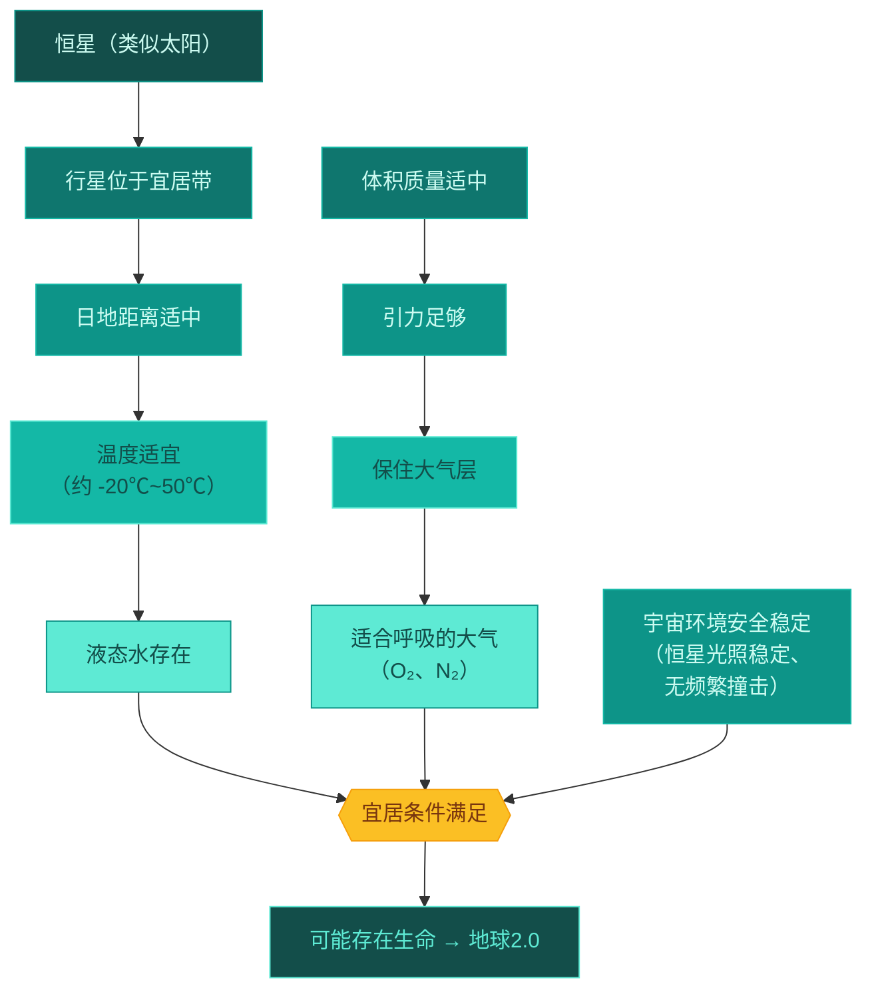

# 主题探究：畅想"地球2.0"

标签：#认识地球 #主题探究 #宜居行星

## 一、本节定位

中图版·北京版地理七年级上册 **第一章 认识地球 · 主题探究**。本探究综合运用本章所学（地球的宇宙环境、形状大小、运动规律），畅想寻找或设想一颗像地球一样适合人类生存的行星——"地球 2.0"，训练综合思维与表达能力。

## 二、核心概念

| 术语 | 定义 |
|---|---|
| 宜居行星 | 具备生命存在和人类生存条件的行星 |
| 宜居带 | 恒星周围温度适宜、可能存在液态水的区域 |
| 系外行星 | 太阳系以外、围绕其他恒星运行的行星 |
| "地球 2.0" | 人们对与地球条件高度相似的宜居行星的形象说法 |

## 三、探究思路梳理

### 1. 明确问题："地球 2.0"需要具备哪些条件？

从地球的宜居条件反推（对应第一节所学）：

| 条件 | 为什么必需 |
|---|---|
| 与恒星距离适中 | 温度适宜，保证液态水存在 |
| 体积质量适中 | 引力能保住大气层 |
| 有液态水 | 生命之源 |
| 有适合呼吸的大气 | 提供氧气，阻挡有害辐射 |
| 稳定安全的宇宙环境 | 恒星光照稳定、少受撞击 |

<svg viewBox="0 0 780 340" xmlns="http://www.w3.org/2000/svg" font-family="sans-serif">
  <rect width="780" height="340" fill="#f0fdfa" rx="12"/>
  <text x="390" y="28" text-anchor="middle" font-size="16" font-weight="bold" fill="#134e4a">宜居带与行星宜居条件示意图</text>
  <circle cx="80" cy="175" r="48" fill="#fbbf24" stroke="#f59e0b" stroke-width="2"/>
  <text x="80" y="171" text-anchor="middle" font-size="12" font-weight="bold" fill="#78350f">恒星</text>
  <text x="80" y="187" text-anchor="middle" font-size="10" fill="#78350f">类太阳</text>
  <ellipse cx="400" cy="175" rx="310" ry="130" fill="none" stroke="#5eead4" stroke-width="2" stroke-dasharray="6,3" opacity="0.7"/>
  <path d="M250,55 Q380,45 500,75 Q560,110 570,175 Q560,240 500,275 Q380,305 250,295 Q190,255 195,175 Q190,95 250,55 Z" fill="#5eead4" opacity="0.25"/>
  <text x="400" y="165" text-anchor="middle" font-size="14" font-weight="bold" fill="#0f766e">宜居带</text>
  <text x="400" y="183" text-anchor="middle" font-size="11" fill="#0f766e">温度适宜，可能存在液态水</text>
  <circle cx="350" cy="130" r="15" fill="#14b8a6" stroke="#0d9488" stroke-width="2"/>
  <text x="350" y="115" text-anchor="middle" font-size="10" font-weight="bold" fill="#0d9488">地球</text>
  <text x="350" y="100" text-anchor="middle" font-size="9" fill="#0f766e">第3颗行星★</text>
  <rect x="160" y="248" width="130" height="50" rx="6" fill="#fca5a5" opacity="0.7" stroke="#dc2626" stroke-width="1"/>
  <text x="225" y="270" text-anchor="middle" font-size="11" fill="#dc2626">内侧过热区</text>
  <text x="225" y="286" text-anchor="middle" font-size="10" fill="#dc2626">距恒星过近→过热</text>
  <rect x="530" y="248" width="130" height="50" rx="6" fill="#bfdbfe" opacity="0.7" stroke="#1d4ed8" stroke-width="1"/>
  <text x="595" y="270" text-anchor="middle" font-size="11" fill="#1d4ed8">外侧过冷区</text>
  <text x="595" y="286" text-anchor="middle" font-size="10" fill="#1d4ed8">距恒星过远→过冷</text>
  <rect x="50" y="260" width="95" height="65" rx="6" fill="#ccfbf1" stroke="#0d9488" stroke-width="1.2"/>
  <text x="97" y="279" text-anchor="middle" font-size="10" font-weight="bold" fill="#134e4a">宜居5条件</text>
  <text x="97" y="294" text-anchor="middle" font-size="9" fill="#0f766e">①距离适中</text>
  <text x="97" y="308" text-anchor="middle" font-size="9" fill="#0f766e">②体积质量适中</text>
  <text x="97" y="322" text-anchor="middle" font-size="9" fill="#0f766e">③液态水 ④大气 ⑤安全</text>
</svg>

### 2. 收集资料：人类怎样寻找"地球 2.0"

- 用**天文望远镜**（地面和太空望远镜）观测遥远恒星周围的行星。
- 重点搜索位于恒星**宜居带**内、大小与地球相近的岩质行星。
- 我国的探月工程、天问探火等深空探测，也是研究行星宜居性的重要途径。

### 3. 分析讨论：畅想设计

- 描述你心目中的"地球 2.0"：与恒星的距离、大小、有无水和大气、自转公转情况（自转决定昼夜节律，公转与地轴倾斜决定四季）。
- 思考：即使找到"地球 2.0"，距离动辄几光年，人类目前难以到达。

### 4. 得出结论

- 完全符合条件的"地球 2.0"至今**尚未找到**；
- 地球是目前人类**唯一的家园**，探索太空的同时更要**珍惜和保护地球**。

## 四、方法与技能：主题探究的一般步骤

1. **提出问题**：什么样的行星才算"地球 2.0"？
2. **搜集资料**：教材、科普书籍、航天新闻等。
3. **整理分析**：列条件清单、做对比表。
4. **展示交流**：用图文海报、演讲等形式呈现设想。
5. **反思延伸**：从"找新家"回到"护家园"。

## 五、易混辨析

| 对比项 | 地球 | 理想中的"地球 2.0" |
|---|---|---|
| 是否确认存在生命 | 是（唯一已知） | 未知 |
| 液态水 | 有 | 需具备 |
| 可达性 | 人类家园 | 距离遥远，目前无法到达 |
| 对人类的意义 | 必须珍惜保护 | 科学探索目标 |

## 六、背记要点

1. "地球 2.0"指条件与地球高度相似的宜居行星。
2. 宜居五条件：距离适中、体积质量适中、液态水、大气、宇宙环境安全稳定。
3. 宜居带是恒星周围可能存在液态水的区域。
4. 目前尚未发现完全符合条件的"地球 2.0"。
5. 探究结论落脚点：地球是唯一家园，要珍惜保护。

## 七、自测小题

1. 恒星周围温度适宜、可能存在液态水的区域叫______。
2. 下列不属于宜居行星必要条件的是（A. 液态水 B. 有天然卫星 C. 适宜的温度）。
3. 寻找系外行星的主要工具是______。
4. "地球 2.0"即使被发现，人类目前也难以移居，主要原因是（A. 距离太遥远 B. 没有大气 C. 温度太低）。
5. 本探究给我们的最重要启示是：______。

**答案**：1. 宜居带 2. B 3. 天文望远镜 4. A 5. 地球是人类唯一的家园，要珍惜和保护地球

相关：[[第一节 宇宙中的地球]] ｜ [[第二节 太空探索]]
