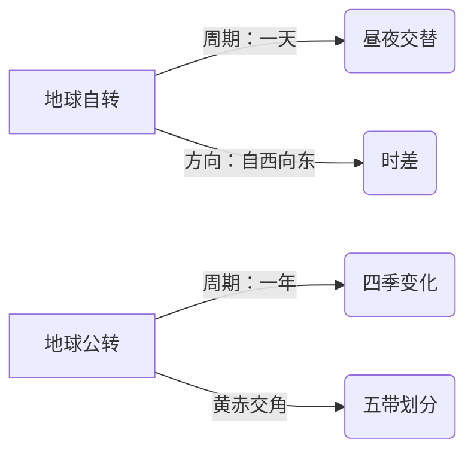

# 第一节 认识地图

标签：#学用地图 #地图三要素 #比例尺

## 一、本节定位

中图版·北京版地理七年级上册 **第二章 学用地图 · 第一节**。本节学习地图的"语言"——比例尺、方向、图例（地图三要素），并学会根据需要选择合适的地图，是地理读图能力的基础。

## 二、核心概念

| 术语 | 定义 |
|---|---|
| 地图 | 按一定比例，运用符号把地理事物缩小表示在平面上的图 |
| 比例尺 | 图上距离与实地距离之比，即 比例尺＝图上距离÷实地距离 |
| 图例 | 地图上表示各种地理事物的符号和文字说明 |
| 指向标 | 地图上指示方向的箭头，箭头一般指向北方 |
| 电子地图 | 以数字形式呈现、可缩放查询导航的地图 |

## 三、知识梳理

### 1. 比例尺

- 三种表示形式：

| 形式 | 示例 |
|---|---|
| 数字式 | 1∶100 000 |
| 文字式 | 图上 1 厘米代表实地距离 1 千米 |
| 线段式 | 一条标注"0—1—2 千米"的线段 |

- 换算关键：1 千米＝100 000 厘米（去掉 5 个 0）。
- 大小比较：分母越**小**，比例尺越**大**。
- 规律：图幅相同时，**比例尺越大→范围越小→内容越详细**；比例尺越小→范围越大→内容越简略。

### 2. 地图上的方向（三种定向法）

| 情况 | 判向方法 |
|---|---|
| 有经纬网 | 经线指示南北，纬线指示东西（最准确） |
| 有指向标 | 箭头所指为北方，平移指向标判向 |
| 都没有 | "上北下南，左西右东" |

### 3. 图例与注记

- 常见图例要认识：国界、铁路、公路、河流、湖泊、山峰、城市等。
- **注记**是地图上的文字和数字（如地名、高程数值）。

### 4. 选择合适的地图

- 去公园游览→导游图；外出确定路线→交通图（或电子地图导航）；了解国家位置→世界政区图。
- 范围要求大（如世界地图）选**小比例尺**；要求细（如校园平面图）选**大比例尺**。

## 四、读图与技能：量算实地距离

1. 用直尺量出两地**图上距离**。
2. 读出比例尺，统一单位。
3. 实地距离＝图上距离÷比例尺（即图上距离×比例尺分母）。
4. 例：比例尺 1∶500 000，图上量得 3 厘米，实地距离＝3×500 000 厘米＝15 千米。

## 五、易混辨析

| 对比项 | 大比例尺地图 | 小比例尺地图 |
|---|---|---|
| 分母 | 小 | 大 |
| 表示范围 | 小 | 大 |
| 内容详略 | 详细 | 简略 |
| 举例 | 校园平面图 | 世界地图 |

## 六、背记要点

1. 地图三要素：比例尺、方向、图例。
2. 比例尺＝图上距离÷实地距离，有数字式、文字式、线段式三种。
3. 分母越小比例尺越大；比例尺越大范围越小、内容越详。
4. 判向优先级：经纬网＞指向标＞"上北下南，左西右东"。
5. 指向标箭头指北。
6. 1 千米＝100 000 厘米。
7. 按用途选图：游览用导游图，出行用交通图/电子地图。

## 七、自测小题

1. 地图三要素是______、______、______。
2. 比例尺 1∶1 000 000 表示图上 1 厘米代表实地______千米。
3. 下列比例尺最大的是（A. 1∶100 000 B. 1∶1 000 000 C. 1∶10 000）。
4. 有指向标的地图上，指向标箭头指向______方。
5. 绘制校园平面图应选用比例尺较______（大/小）的地图。
6. 图上 4 厘米，比例尺 1∶200 000，实地距离是______千米。
7. 想了解北京在中国的位置，应查阅（A. 北京市交通图 B. 中国政区图 C. 校园平面图）。

**答案**：1. 比例尺；方向；图例 2. 10 3. C 4. 北 5. 大 6. 8 7. B

相关：[[第二节 地形图的判读]] ｜ [[第三节 地球的模型]]

### 地理示意图：地球运动

