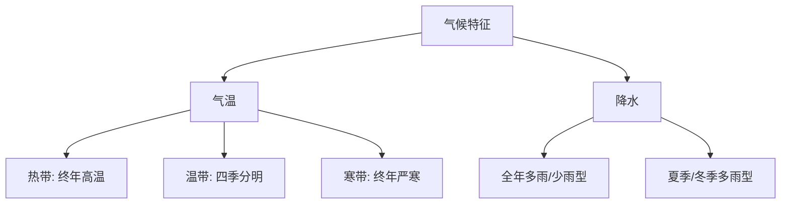

# 主题探究：为小鸟筑巢

标签：#天气与气候 #主题探究 #实践活动

## 一、本节定位

中图版·北京版地理七年级上册 **第四章 认识天气与气候 · 主题探究**。本探究为校园或社区的小鸟设计并安放一个鸟巢（人工巢箱），需要综合运用天气、气温、降水、风等知识选材料、定朝向、选位置，体验"用地理眼光解决真实问题"。

## 二、核心概念

| 术语 | 定义 |
|---|---|
| 人工巢箱 | 人为制作、供鸟类栖息繁殖的巢箱 |
| 朝向 | 巢箱开口面对的方向，影响采光、避风、避雨 |
| 小气候 | 局部小范围内（如树荫下、墙角处）的气候状况 |

## 三、探究梳理

### 1. 明确问题

- 小鸟需要什么样的"家"？——**避风、避雨、避晒、保温、安全**。
- 转化为地理问题：如何利用当地天气气候特点，确定巢箱的**材料、朝向、安放位置与高度**。

### 2. 调查当地气候特点（以北京为例）

| 气候要素 | 北京特点（温带季风气候） | 对筑巢的要求 |
|---|---|---|
| 气温 | 冬寒夏热，年较差大 | 材料要保温隔热（木板优于金属） |
| 降水 | 夏季多雨 | 巢顶做坡面、开口避开雨水方向 |
| 风 | 冬春多**偏北风**（风沙） | 开口避开盛行风向，宜朝**东南** |
| 光照 | 冬季太阳偏南、高度低 | 朝东南可冬季采光取暖、又避正午暴晒 |

### 3. 设计与制作要点

- **材料**：天然木板保温透气，不易反光惊鸟；避免金属（夏烫冬冷）。
- **结构**：巢顶倾斜利于排水；出入口大小适中防天敌；底部留小孔透气排湿。
- **朝向**：开口朝**东南方向**——避冬季偏北风、迎温暖阳光、躲午后西晒。
- **位置**：安放在树干或屋檐下等有遮蔽处，高度足够防止猫等天敌，避开人流嘈杂处。

### 4. 观察与反思

- 记录不同天气（雨天、大风、高温日）巢箱使用情况，检验设计是否合理。
- 反思改进：如雨后箱内潮湿→加大顶檐；夏季过热→加通风孔或移至树荫。

## 四、方法与技能：把气候知识用于设计类问题

1. 列出当地**气候特征**（气温、降水、风向、光照）。
2. 逐项推出设计要求（保温/排水/避风/采光）。
3. 说明理由时用"因为……（气候特点），所以……（设计做法）"的句式作答。

## 五、易混辨析

| 对比项 | 大范围气候 | 小气候 |
|---|---|---|
| 范围 | 一个地区 | 树下、墙角等局部 |
| 对筑巢的意义 | 决定总体设计（保温、排水） | 决定具体安放点（背风、遮荫处） |

## 六、背记要点

1. 筑巢考虑四要素：气温（保温）、降水（排水防雨）、风（避盛行风）、光照（采光避晒）。
2. 北京冬春多偏北风，巢箱开口宜朝东南。
3. 木质材料保温透气优于金属。
4. 巢顶做坡面利于排水。
5. 安放要背风、有遮蔽、够高、防天敌。
6. 设计后要观察记录、不断改进——探究的完整闭环。

## 七、自测小题

1. 北京冬季的盛行风向是______风，所以巢箱开口应避开该方向，宜朝______。
2. 制作巢箱宜选用______（木板/铁皮），原因是______。
3. 巢顶做成坡面主要是为了应对（A. 大风 B. 降水 C. 高温）。
4. 巢箱开口朝东南，冬季还能获得较好的______，有利于保暖。
5. 判断：巢箱安放位置只需考虑美观，不必考虑风向和遮蔽。（对/错）

**答案**：1. 偏北；东南 2. 木板；保温隔热、不易过冷过热 3. B 4. 阳光（光照） 5. 错

相关：[[第一节 感知天气]] ｜ [[第四节 气候与人类活动]]

### 气候类型分布与特征

