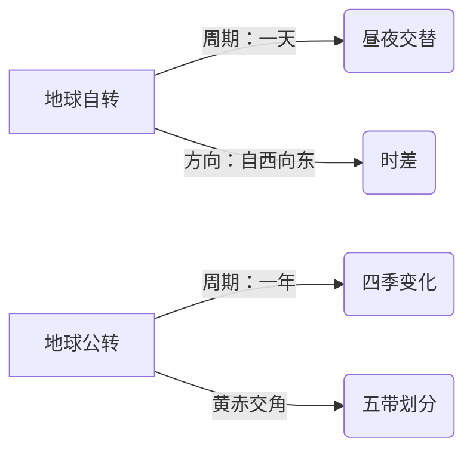

# 第四节 极地地区

标签：#认识地区 #极地 #科学考察

## 一、本节定位

中图版·北京版地理七年级下册 **第七章 认识地区 · 第四节**。极地地区是地球上最特殊的区域：认识南极与北极的位置差异、酷寒环境、代表动物与科学考察，并树立极地环境保护意识。

## 二、核心概念

| 术语 | 含义 |
|---|---|
| 北极地区 | 北极圈（66.5°N）以北的区域，中心是北冰洋 |
| 南极地区 | 南极圈（66.5°S）以南的区域，中心是南极大陆 |
| 极昼极夜 | 极圈内太阳终日不落或终日不出的现象 |
| 冰盖 | 覆盖大陆的巨厚冰层，南极冰盖平均厚度约2000米 |

## 三、两极对比总表

| 对比项 | 北极地区 | 南极地区 |
|---|---|---|
| 中心 | 北冰洋（海洋） | 南极大陆（陆地） |
| 周围 | 亚、欧、北美三洲环绕 | 太平洋、大西洋、印度洋环绕 |
| 气温 | 寒冷（较南极温和） | **酷寒**，世界最冷（最低约-89℃） |
| 降水与风 | 相对较多 | 干燥（"白色荒漠"）、烈风（"风库"） |
| 代表动物 | 北极熊 | 企鹅 |
| 居民 | 因纽特人等 | 无常住居民 |

## 四、知识梳理

### 1. 南极地区——三大"世界之最"

- **酷寒**：纬度高、冰雪反射强、海拔高（平均海拔最高的大洲）。
- **干燥**：年降水量极少，被称为"白色荒漠"。
- **烈风**：风速大、风日多，被称为"风库"。

### 2. 资源与科考价值

- 南极：淡水资源（冰川占全球淡水大部分）、矿产（煤、铁）、海洋生物（磷虾）；是天然科学实验室。
- 我国南极科考站：**长城站、中山站、昆仑站、泰山站、秦岭站**（长城站位于南极圈外、无极昼极夜）。
- 我国北极科考站：**黄河站**。

### 3. 极地保护

- 问题：全球变暖导致冰川消融、海平面上升；过度捕捞、污染。
- 措施：《南极条约》——和平利用、禁止军事活动；科考应环保先行。

## 五、地图要素判读：极地俯视图

1. 判中心：中间是海洋 → 北极；中间是陆地 → 南极。
2. 判自转方向：北极上空看**逆时针**，南极上空看**顺时针**（"北逆南顺"）。
3. 判方向：站在南极点，四周都是**北方**；站在北极点，四周都是南方。
4. 经线呈放射状，纬线呈同心圆。

## 六、科考时间选择

- 去南极科考的最佳时间：**11月至次年3月**（南半球暖季，且有极昼，气温相对较高、白昼长）。

## 七、背记要点

1. 北极中心是北冰洋，南极中心是南极大陆。
2. 南极三大特征：酷寒、干燥、烈风。
3. 南极是平均海拔最高的大洲；冰盖储存大量淡水。
4. 北极熊在北极，企鹅在南极，不可混淆。
5. 我国南极站：长城、中山、昆仑、泰山、秦岭；北极站：黄河。
6. 极点方向判断：南极点四周皆北，北极点四周皆南。

## 八、自测小题

1. 北极地区的中心是______洋，南极地区的中心是______大陆。
2. 南极气候的三大特征：______、干燥、______。
3. 南极的代表动物是______，北极的代表动物是______。
4. 我国第一个南极科学考察站是（A. 中山站 B. 长城站 C. 昆仑站）。
5. 去南极科考最佳时间是______月至次年______月。
6. 判断：站在南极点上，前后左右都是北方。（对/错）

**答案**：1. 北冰；南极 2. 酷寒；烈风 3. 企鹅；北极熊 4. B 5. 11；3 6. 对

相关：[[第三节 欧洲西部]] ｜ [[主题探究：设计旅行方案]] ｜ [[主题探究：模拟联合国气候变化大会]]

### 地理示意图：地球运动

